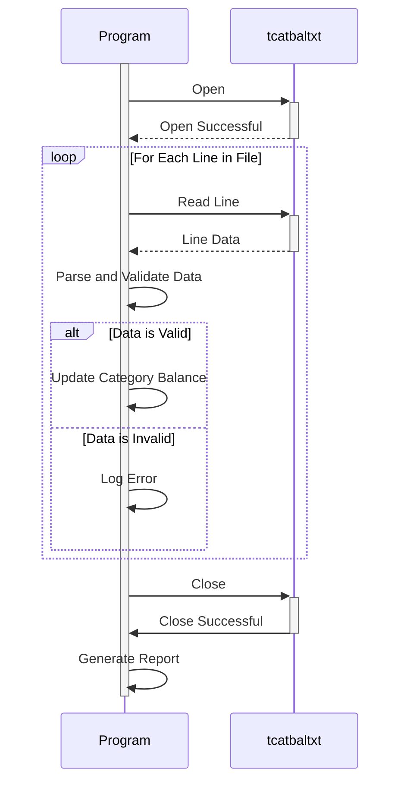

Gerado em: 1º de outubro de 2024

**Título do Documento:** Processador de Arquivo de Saldo de Categoria de Transação

**Descrição Resumida:** Este programa processa um arquivo contendo saldos de categoria de transação, valida os dados e gera um relatório resumindo os saldos para cada categoria.

**Histórias de Usuário:** Como um analista de dados, preciso garantir que apenas registros válidos de saldo de categoria de transação sejam usados para fins de análise e relatório.

**Épico Relacionado:** 10 - Gerenciamento de Arquivos de Dados

**Requisitos Funcionais:**

*   O programa deve ler dados de um arquivo chamado "tcatbal.txt."
*   Cada linha no arquivo representa um registro de saldo de categoria de transação.
*   O programa deve analisar cada registro e extrair os seguintes campos:
    *   **ID da Categoria:** Um identificador numérico de 10 dígitos para a categoria de transação.
    *   **Campo Desconhecido:** Um campo de 4 dígitos (sempre "1000").
    *   **Saldo:** Um valor numérico de 10 dígitos representando o saldo da categoria (sempre "1000000000").
    *   **Dados Desconhecidos:** Um campo de 30 dígitos (sempre uma sequência de "0"s).
*   O programa deve validar o seguinte:
    *   **Estrutura do Arquivo:** O arquivo deve estar em conformidade com o formato de largura fixa esperado.
    *   **Tipos de Dados:** ID da Categoria e Saldo devem ser numéricos.
    *   **Regra de Negócio:** Se o ID da Categoria for maior que 100, ele deverá ser considerado inválido.
*   O programa deve gerar um relatório resumindo os saldos para cada categoria de transação válida.

**Requisitos Não Funcionais:**

*   **Desempenho:** O programa deve processar o arquivo e gerar o relatório em tempo hábil, mesmo para arquivos grandes.
*   **Confiabilidade:** O programa deve ser confiável e lidar com erros graciosamente sem travar.
*   **Manutenibilidade:** O programa deve ser bem estruturado, documentado e fácil de manter e modificar.

**Critérios de Aceitação:**

*   O programa lê e analisa com sucesso o arquivo de saldo de categoria de transação.
*   O programa valida corretamente a estrutura do arquivo, os tipos de dados e as regras de negócios.
*   O programa gera um relatório preciso resumindo os saldos para cada categoria de transação válida.
*   O programa lida com erros graciosamente e fornece mensagens de erro informativas.

**Melhorias de Código:**

*   Implementar um mecanismo de registro para registrar erros, avisos e outras informações relevantes durante a execução do programa.
*   Adicionar tratamento de erros para lidar graciosamente com dados inválidos ou erros de formato de arquivo.
*   Criar funções reutilizáveis para tarefas comuns, como ler o arquivo, analisar registros e validar dados.
*   Usar um formato de dados estruturado como JSON ou XML para o relatório de saída para melhorar a legibilidade e compatibilidade com outros sistemas.

**Melhorias de Segurança:**

*   Implementar mecanismos de controle de acesso para restringir o acesso ao arquivo de saldo de categoria de transação e ao relatório gerado.
*   Se os dados forem confidenciais, considere criptografar o arquivo ou usar uma solução de armazenamento segura.
*   Auditar regularmente os logs de acesso do programa para detectar quaisquer tentativas de acesso não autorizado.

**Diagrama Conceitual:**

--Made by "Smart Engineering" (by Compass.UOL)--