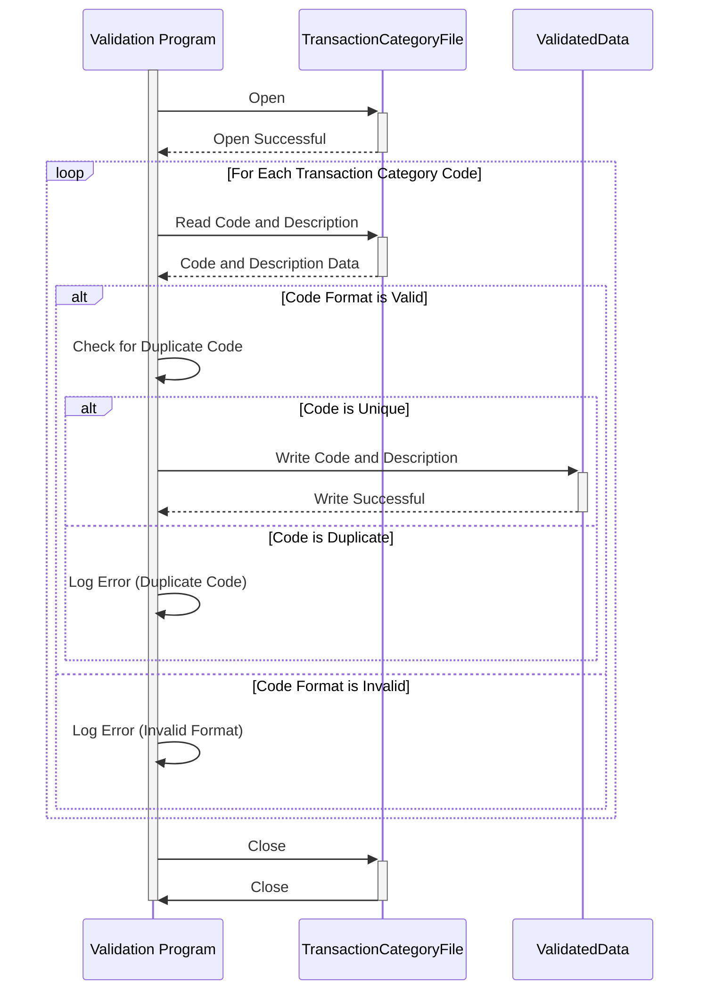

Gerado em: 1º de outubro de 2024

# **Título do Documento:** Programa de Validação e Processamento de Código de Categoria de Transação de Cartão de Crédito

# **Descrição Resumida:**

Este programa valida e processa códigos de categoria de transação de cartão de crédito de um arquivo ("trancatg.txt"). Ele garante que cada código seja exclusivo e siga um formato específico e, em seguida, gera os dados validados para um novo arquivo ou sistema.

# **Histórias do Usuário:**

Como analista financeiro, preciso garantir que todos os códigos de categoria de transação sejam válidos e estejam formatados corretamente para garantir relatórios e análises precisos.

# **Epic Relacionado:**

4 - Processamento de Transações

# **Requisitos Funcionais:**

1. **Ler Códigos de Transação:** O programa deve ler códigos de categoria de transação e descrições do arquivo de entrada ("trancatg.txt").
2. **Validar Formato do Código:** Cada código deve ser validado para garantir que siga um formato específico (por exemplo, seis dígitos). Se um código violar este formato, o programa deverá registrar um erro e pular para o próximo código.
3. **Validar Exclusividade do Código:** O programa deve verificar se há códigos de transação duplicados. Se um código duplicado for encontrado, o programa deverá registrar um erro e continuar processando outros códigos.
4. **Gerar Dados Validados:** O programa deve gerar os códigos de categoria de transação validados e suas descrições. Essa saída pode ser direcionada para um novo arquivo ou integrada a outro sistema, dependendo dos requisitos específicos.

# **Requisitos Não Funcionais:**

* **Desempenho:** O programa deve processar os códigos de transação com eficiência, especialmente para arquivos de entrada grandes.
* **Confiabilidade:** O programa deve ser confiável na validação e processamento dos dados, garantindo que todos os códigos válidos sejam capturados e os erros sejam tratados adequadamente.
* **Manutenibilidade:** O código do programa deve ser bem estruturado, documentado e fácil de entender para futuras manutenções e atualizações.
* **Tratamento de Erros:** O programa deve incluir tratamento de erros robusto para registrar e relatar quaisquer dados inválidos ou situações inesperadas encontradas durante o processamento.

# **Critérios de Aceitação:**

* O programa lê e processa com sucesso todos os códigos de categoria de transação do arquivo de entrada.
* O programa valida com precisão o formato e a exclusividade de cada código de categoria de transação.
* O programa registra e relata quaisquer erros encontrados durante a validação.
* O programa gera um arquivo de saída ou fluxo de dados contendo apenas códigos de categoria de transação válidos e suas descrições.

# **Melhorias de Código:**

* Implementar uma estrutura de logging para registrar informações detalhadas sobre o processo de validação, incluindo erros e avisos.
* Adicionar testes de unidade para verificar funções individuais do programa e garantir a qualidade do código.
* Considere usar um banco de dados para armazenar os códigos de categoria de transação validados para pesquisa e gerenciamento mais eficientes.

# **Melhorias de Segurança:**

* Proteja os arquivos de entrada e saída que contêm dados de transações para evitar acesso não autorizado ou modificação.
* Implemente controles de acesso adequados para restringir a modificação das regras de validação e da lógica do programa.

# **Diagrama Conceitual:**

--Made by "Smart Engineering" (by Compass.UOL)--