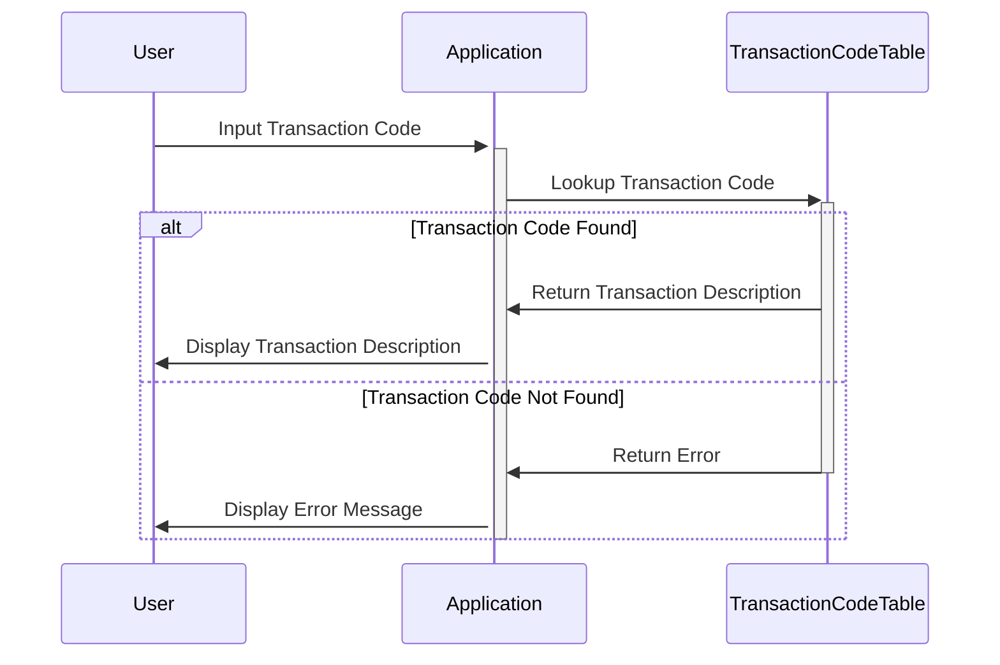

Gerado em: 1º de outubro de 2024

# **Título do Documento:** Tradutor de Código de Tipo de Transação

# **Descrição Resumida:**
Este documento descreve a funcionalidade de um programa projetado para traduzir códigos numéricos de transação em descrições amigáveis ​​ao usuário. Este programa visa melhorar a clareza e transparência dos dados de transações para vários usuários, incluindo clientes, analistas e representantes de atendimento ao cliente.

# **Histórias de Usuário:**
Como analista de dados, preciso ser capaz de entender o significado dos códigos de transação para analisar com precisão os dados de transações.

# **Épico Relacionado:**
**4 - Processamento de Transações** - Este épico visa processar vários tipos de transações de forma eficiente, precisa e segura, garantindo a integridade dos dados e conformidade regulatória.

# **Requisitos Funcionais:**

1.  **Entrada de Código de Transação:** O sistema deve fornecer um mecanismo para inserir um código de transação.
2.  **Pesquisa de Código:** O sistema deve ser capaz de pesquisar a descrição de um código de transação em uma lista predefinida.
3.  **Saída de Descrição:** O sistema deve exibir a descrição associada ao código de transação inserido.
    *   **Regra de Negócio:** Se o código de transação inserido não existir na lista predefinida, o sistema deverá exibir uma mensagem de erro.

# **Requisitos Não Funcionais:**

1.  **Desempenho:** O sistema deve responder a pesquisas de código de transação rapidamente (dentro de um tempo aceitável definido).
2.  **Disponibilidade:** O sistema deve estar disponível durante o horário comercial para tradução do código de transação.
3.  **Manutenibilidade:** O sistema deve ser projetado de forma a permitir atualizações fáceis na lista de códigos de transação.

# **Critérios de Aceitação:**

1.  O sistema traduz com precisão todos os códigos de transação definidos para suas descrições correspondentes.
2.  O sistema exibe uma mensagem de erro apropriada para códigos de transação inválidos ou indefinidos.
3.  O tempo de resposta do sistema para pesquisa de código está dentro dos limites aceitáveis.

# **Melhorias de Código:**

1.  Implementar o registro de erros para rastrear pesquisas de código inválidas ou outros problemas potenciais.
2.  Adicionar funcionalidade para permitir que usuários autorizados atualizem a lista de códigos de transação.
3.  Implementar um mecanismo de cache para códigos acessados ​​com frequência para melhorar o desempenho.

# **Melhorias de Segurança:**

1.  Restringir o acesso à lista de códigos de transação e quaisquer funções de modificação apenas ao pessoal autorizado.
2.  Implementar o registro de auditoria para rastrear todos os acessos e alterações feitas nos dados do código de transação.

# **Diagrama Conceitual:**

--Made by "Smart Engineering" (by Compass.UOL)--