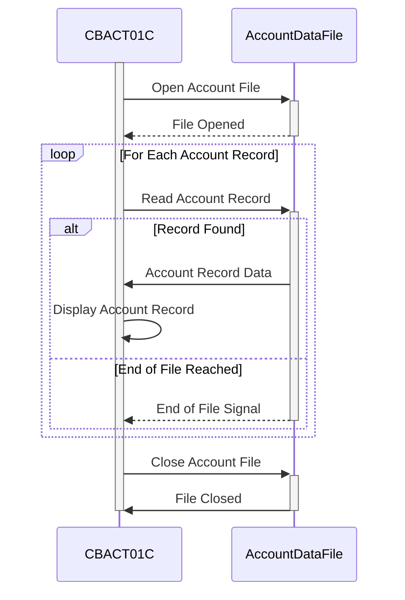

Gerado em: 2 de outubro de 2024

**Título do Documento:** CardDemo Application - Especificação do Programa de Processamento em Lote de Dados de Conta

**Descrição Resumida:**
O programa de Processamento em Lote de Dados de Conta CardDemo foi projetado para ler e exibir informações de conta de um arquivo seguro. Ele processa cada registro de conta sequencialmente, apresentando um resumo dos detalhes da conta.

**Histórias do Usuário:**
Como analista de dados, preciso garantir que todos os registros de conta sejam processados e exibidos com precisão para que eu possa usar essas informações para análises e relatórios adicionais.

**Épico Relacionado:**
7 - Processamento em Lote

**Requisitos técnicos:**
- **Leitura de Arquivo de Conta:** Lê dados de conta sequencialmente de um arquivo VSAM KSDS chamado `ACCTDAT`.
- **Exibição de Dados:** Exibe o conteúdo de cada registro de conta no console do sistema.

- **Abrir Arquivo de Conta**: Este método abre o arquivo de dados da conta para leitura e verifica se há algum erro durante o processo.
  - Entrada: Nenhuma
  - Validação: Se o status do arquivo for `00` (bem-sucedido), prossiga para a próxima etapa. Caso contrário, registre o erro, exiba o status do arquivo e encerre o programa.
  - Resultado: Arquivo de conta aberto com sucesso ou um erro é encontrado.

- **Ler Registro de Conta**: Este método lê o próximo registro de conta do arquivo e verifica se há fim de arquivo ou erros.
  - Entrada: Nenhuma
  - Validação: Se o status do arquivo for `00` (bem-sucedido), mova os dados para `ACCOUNT-RECORD`. Se o status for `10` (fim do arquivo), defina o sinalizador `END-OF-FILE` como 'Y'. Se houver qualquer outro status, registre o erro, exiba o status do arquivo e encerre o programa.
  - Resultado: `ACCOUNT-RECORD` preenchido com dados da conta ou sinalizador `END-OF-FILE` definido ou um erro é encontrado.

- **Exibir Registro de Conta**: Este método formata e exibe os detalhes da conta do `ACCOUNT-RECORD`.
  - Entrada: `ACCOUNT-RECORD`
  - Validação: Nenhuma
  - Resultado: Detalhes da conta exibidos no console.

- **Fechar Arquivo de Conta**: Este método fecha o arquivo de dados da conta e verifica se há algum erro durante o processo.
  - Entrada: Nenhuma
  - Validação: Se o status do arquivo não for `00` (bem-sucedido), registre o erro, exiba o status do arquivo e encerre o programa.
  - Resultado: Arquivo de conta fechado com sucesso ou um erro é encontrado.

**Modelos Relacionados**
- **Registro de Conta:**
  - `ACCT-ID` `PIC 9(11)`: Identificador da conta.
  - `ACCT-ACTIVE-STATUS`: Status da conta (por exemplo, ativa, encerrada).
  - `ACCT-CURR-BAL`: Saldo atual da conta.
  - `ACCT-CREDIT-LIMIT`: Limite de crédito da conta.
  - `ACCT-CASH-CREDIT-LIMIT`: Limite de crédito em dinheiro da conta.
  - `ACCT-OPEN-DATE`: Data de abertura da conta.
  - `ACCT-EXPIRATION-DATE`: Data de expiração da conta.
  - `ACCT-REISSUE-DATE`: Data da última reemissão da conta.
  - `ACCT-CURR-CYC-CREDIT`: Crédito do ciclo atual.
  - `ACCT-CURR-CYC-DEBIT`: Débito do ciclo atual.
  - `ACCT-GROUP-ID`: Identificador do grupo da conta.

**Configurações:**
- **`CBACT01C.cbl`**
  - `ACCTFILE-FNAME`: `"ACCTDAT"`
	- Descrição: Nome do arquivo para o arquivo de dados da conta.

**Melhorias de Código:**
- **Tratamento de Erros:** Implemente um mecanismo de tratamento de erros mais robusto. Em vez de apenas exibir mensagens de erro e encerrar o programa abruptamente, considere registrar erros em um arquivo, gravá-los em uma fila de erros ou empregar uma rotina dedicada ao tratamento de erros.
- **Log:** Incorpore o log detalhado em todo o programa para rastrear a execução do programa, operações de arquivo e quaisquer erros encontrados. Isso ajudará na depuração e monitoramento da atividade do programa.
- **Modularidade:** Divida o programa em parágrafos ou seções menores e mais gerenciáveis para melhorar a legibilidade e a manutenção do código. Por exemplo, parágrafos separados para abrir/fechar arquivos, ler registros e processar dados podem melhorar a organização do código.
- **Flexibilidade de Saída:** Forneça opções para direcionar a saída para destinos diferentes do console, como um arquivo ou uma tabela de banco de dados. Isso permite maior flexibilidade na forma como os dados processados são usados.
- **Tratamento de Data e Hora:** Considere o uso de funções COBOL intrínsecas para obter e formatar a data e hora atuais, em vez de depender apenas de utilitários externos ou métodos dependentes do sistema.

**Melhorias de Segurança:**
- **Controle de Acesso a Arquivos:** Implemente restrições de acesso a arquivos apropriadas para garantir que apenas usuários ou processos autorizados possam ler o arquivo de dados da conta. Isso pode envolver a definição de permissões de arquivo no nível do sistema operacional ou o uso de software de segurança para gerenciar listas de controle de acesso (ACLs).
- **Criptografia de Dados:** Se o arquivo de dados da conta contiver informações confidenciais, considere criptografar os dados em repouso e em trânsito. Isso adiciona uma camada extra de segurança, tornando mais difícil para indivíduos não autorizados acessarem os dados, mesmo que obtenham acesso ao sistema de arquivos.
- **Log de Auditoria:** Implemente o log de auditoria para rastrear todos os acessos ao arquivo de dados da conta, registrando IDs de usuário, timestamps e ações executadas. Isso ajuda a identificar e investigar quaisquer tentativas de acesso não autorizado ou violações de dados.

**Diagrama Conceitual:**

--Made by "Smart Engineering" (by Compass.UOL)--