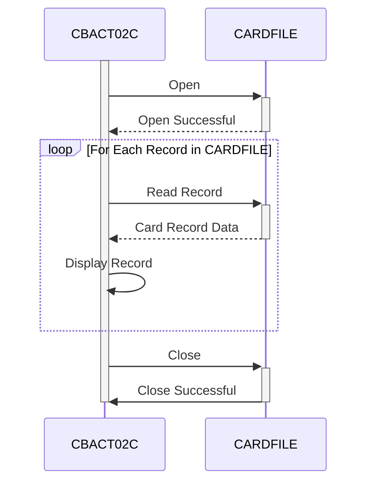

Gerado em: 2 de outubro de 2024

**Título do Documento:** CardDemo Application - Especificação do Processador de Lotes de Arquivos de Dados de Cartão

**Descrição Resumida:**
Este documento descreve as especificações do programa "CBACT02C", um componente de processamento em lote dentro da aplicação CardDemo. Este programa é responsável por ler sequencialmente e exibir informações de cartão de crédito armazenadas em um arquivo VSAM KSDS chamado "CARDFILE".

**Histórias do Usuário:**
Como Analista de Dados, preciso ser capaz de visualizar o conteúdo do arquivo de dados do cartão de crédito para verificar sua estrutura, validar a precisão dos dados e identificar potenciais problemas de qualidade dos dados. Esta informação é crucial para garantir que apenas dados confiáveis e precisos sejam usados para fins de análise e relatórios.

**Epic Relacionado:** 7 - Processamento em Lote

**Requisitos Técnicos:**

- `Read Card File Sequentially` (Ler Arquivo de Cartão Sequencialmente): Este método abre o `CARDFILE`, lê cada registro sequencialmente e exibe seu conteúdo.
  - Entrada: Nenhuma (lê dados do `CARDFILE`).
  - Processamento: Abre o `CARDFILE`, recupera cada registro com base na chave `FD-CARD-NUM` em um loop até que o final do arquivo seja atingido.
  - Saída: Exibe o conteúdo de cada registro recuperado (formato não especificado, assume-se que seja uma exibição simples).
- `Open Card File` (Abrir Arquivo de Cartão): Este método abre o `CARDFILE` para entrada.
  - Entrada: Nenhuma.
  - Processamento: Tenta abrir o `CARDFILE` no modo de entrada.
  - Resultado: `CARDFILE-STATUS` indica o sucesso (`'00'`) ou falha da operação.
- `Close Card File` (Fechar Arquivo de Cartão): Este método fecha o `CARDFILE`.
  - Entrada: Nenhuma.
  - Processamento: Tenta fechar o `CARDFILE`.
  - Resultado: `CARDFILE-STATUS` indica o sucesso (`'00'`) ou falha da operação.
- `Display I/O Status` (Exibir Status de E/S): Este método exibe o status do arquivo.
  - Entrada: `IO-STATUS`.
  - Processamento: Formata o `IO-STATUS` em um formato legível por humanos.
  - Saída: Exibe a mensagem de status do arquivo formatada.
- `Abend Program` (Finalizar Programa Anormalmente): Este método trata o término anormal do programa.
  - Entrada: Nenhuma.
  - Processamento: Define o código de abend para `999` e chama a rotina `CEE3ABD` para finalizar o programa anormalmente.
  - Saída: Nenhuma.

**Modelos Relacionados**

- `CARD-RECORD`
  - `FD-CARD-NUM` `PIC X(16)`: Número do cartão de crédito (campo chave).
  - `FD-CARD-DATA` `PIC X(134)`: Dados restantes do cartão de crédito (detalhes não especificados no código fornecido).

**Configurações:**

- `CBACT02C.cbl`
  - `CARDFILE-FNAME`: `"CARDDAT"`
	- Descrição:  Nome do arquivo para o arquivo de dados do cartão.

**Melhorias de Código:**

- **Tratamento de Erros:** Implementar um mecanismo de tratamento de erros mais robusto que inclua:
    - Registrar erros em um arquivo ou banco de dados para análise posterior.
    - Fornecer mensagens de erro mais informativas ao usuário, potencialmente incluindo o código de erro específico e uma breve descrição.
    - Implementar um mecanismo de repetição para erros recuperáveis, como problemas temporários do sistema de arquivos.
- **Log:** Adicionar instruções de log para capturar eventos chave durante a execução do programa, como:
    - O início e o fim do programa.
    - O número de registros processados.
    - Quaisquer erros encontrados.
- **Desempenho:** Nenhuma melhoria de desempenho significativa é aparente no trecho de código, pois a lógica do programa é relativamente simples. No entanto, considere estes aspectos se o desempenho se tornar um problema:
    - Revisar os métodos de acesso a arquivos e otimizar se possível.
    - Se o programa processa grandes volumes de dados, explore técnicas para otimizar as operações de E/S.
- **Documentação:** Adicionar comentários ao código para explicar o propósito de diferentes seções, variáveis e lógica. Isso tornará o código mais fácil de entender e manter no futuro.

**Melhorias de Segurança:**

- **Controle de Acesso a Arquivos:** Implementar medidas de controle de acesso apropriadas para restringir o acesso não autorizado ao `CARDFILE`. Isso pode envolver o uso de permissões de nível de sistema operacional ou software de segurança para controlar quem pode ler ou modificar o arquivo.
- **Criptografia de Dados:** Considerar criptografar dados confidenciais dentro do `CARDFILE`, especialmente se ele contém informações de identificação pessoal (PII) ou outros dados confidenciais.
- **Log de Auditoria:** Implementar o log de auditoria para rastrear quem acessa ou modifica o `CARDFILE` e quando. Essas informações podem ser inestimáveis para investigação de incidentes de segurança e relatórios de conformidade.

**Diagrama Conceitual:**

--Made by "Smart Engineering" (by Compass.UOL)--