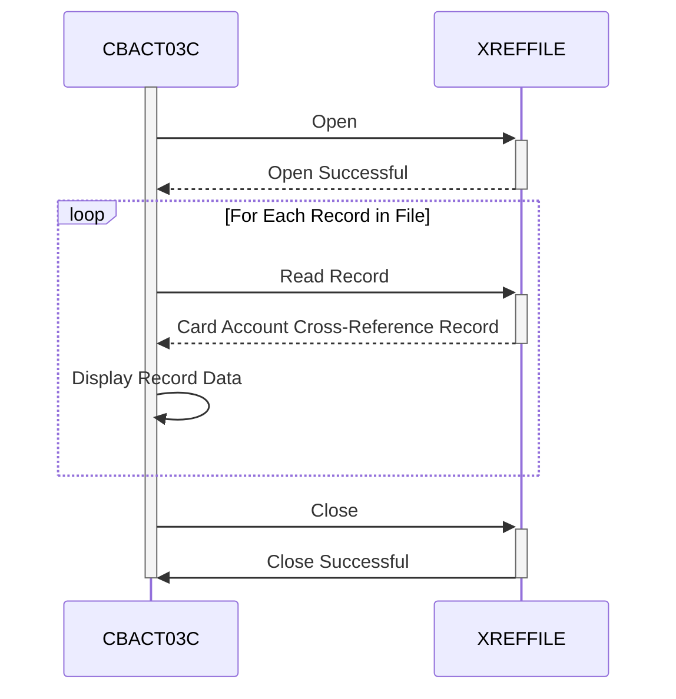

Gerado em: 2 de outubro de 2024

**Título do Documento:** Processador de Arquivo de Dados de Referência Cruzada de Conta de Cartão - CBACT03C

**Descrição Resumida:**
Este programa lê e exibe registros de um arquivo indexado contendo dados de referência cruzada de contas de cartão de crédito. Ele lida com status de arquivo e inclui tratamento de erros.

**Histórias do Usuário:**
Como analista de dados, preciso visualizar o conteúdo do arquivo de dados de referência cruzada da conta do cartão para garantir a integridade e a precisão dos dados.

**Épico Relacionado:**
3 - Gestão de Cartão de Crédito

**Requisitos Técnicos:**

- **Abrir Arquivo de Referência Cruzada:** Este método abre o arquivo de dados de referência cruzada para leitura.
  - Entrada: Nenhuma
  - Validação: Verifique se o arquivo existe e pode ser aberto para entrada usando códigos de status de arquivo.
  - Saída: Nenhuma

- **Ler Registro de Referência Cruzada:** Este método lê um registro por vez do arquivo de dados de referência cruzada aberto.
  - Entrada: Nenhuma
  - Validação: Verifique a condição de fim de arquivo (EOF) usando códigos de status de arquivo. Se EOF for atingido, defina o sinalizador `END-OF-FILE` como `'Y'`.
  - Saída: `CARD-XREF-RECORD`: Contém os dados do registro lido.

- **Exibir Dados do Registro:** Este método exibe o conteúdo de um único registro lido do arquivo de dados de referência cruzada.
  - Entrada: `CARD-XREF-RECORD`: O registro lido do arquivo.
  - Validação: Nenhuma
  - Saída: Exibe o conteúdo de `CARD-XREF-RECORD` (provavelmente no console ou em um log).

- **Fechar Arquivo de Referência Cruzada:** Este método fecha o arquivo de dados de referência cruzada.
  - Entrada: Nenhuma
  - Validação: Verifique se o arquivo foi fechado com sucesso usando códigos de status de arquivo.
  - Saída: Nenhuma

- **Exibir Status do Arquivo:** Este método interpreta e exibe os códigos de status do arquivo em um formato amigável.
  - Entrada: `IO-STATUS`: Contém o código de status do arquivo.
  - Validação: Nenhuma
  - Saída: Exibe uma mensagem de erro formatada com base no código de status do arquivo.

- **Lidar com Erro Fatal:** Este método lida com erros graves exibindo uma mensagem e encerrando o programa de forma anormal.
  - Entrada: Nenhuma
  - Validação: Nenhuma
  - Saída: Exibe uma mensagem de erro e aciona um abend com um código específico.

**Modelos Relacionados**

- **`CARD-XREF-RECORD`**
  - `FD-XREF-CARD-NUM` `PIC X(16)`: Número do cartão de crédito.
  - `FD-XREF-DATA` `PIC X(34)`: Informações adicionais de referência cruzada.

**Configurações:**

- `CBACT03C.cbl`
  - `XREFFILE-FNAME`: `"CXREF"`
	- Descrição: Nome do arquivo para o arquivo de referência cruzada.

**Melhorias de Código:**
- **Tratamento de Erros:** Implemente uma rotina de tratamento de erros mais centralizada para reduzir a duplicação de código e melhorar a manutenção.
- **Log:** Em vez de apenas exibir mensagens de erro, grave-as em um arquivo de log para melhor rastreamento e depuração.
- **Modularidade:** Divida o programa em parágrafos menores e mais gerenciáveis ​​para melhor organização do código.
- **Comentários:** Adicione mais comentários em linha para explicar a lógica e o propósito das diferentes seções de código.

**Melhorias de Segurança:**
- **Controle de Acesso a Arquivos:** Implemente restrições de acesso a arquivos apropriadas para evitar acesso não autorizado ao arquivo de dados de referência cruzada.
- **Criptografia de Dados:** Considere criptografar os dados confidenciais no arquivo de referência cruzada para protegê-los contra divulgação não autorizada.
- **Trilha de Auditoria:** Registre todas as tentativas de acesso ao arquivo, incluindo as bem-sucedidas e as malsucedidas, para fins de auditoria de segurança.

**Diagrama Conceitual:**

--Made by "Smart Engineering" (by Compass.UOL)--