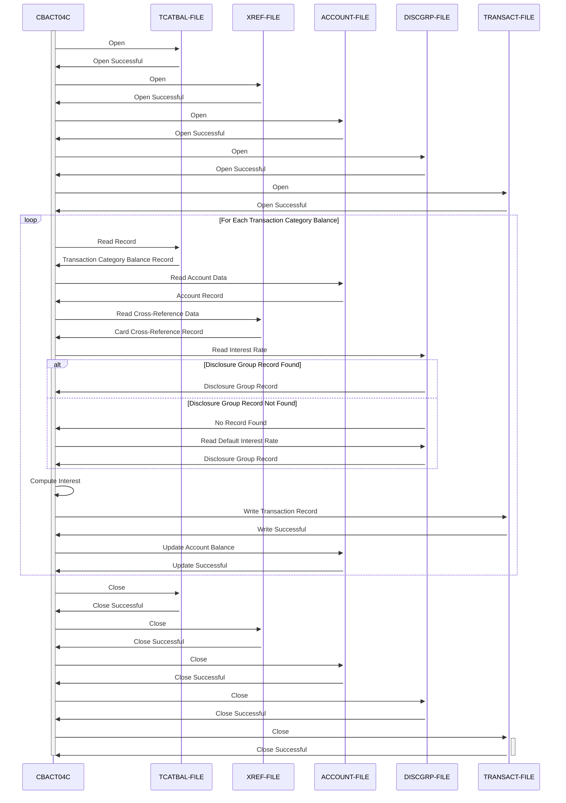

Gerado em: 2 de outubro de 2024

**Título do Documento:** Módulo de Cálculo de Juros CardDemo - Especificação de Processamento em Lote

**Descrição Resumida:**
O Módulo de Cálculo de Juros CardDemo é um programa em lote que calcula e aplica juros mensais às contas de clientes com base em seus saldos de categoria de transação e taxas de juros predefinidas. Ele lê dados de vários arquivos de entrada, realiza cálculos, atualiza o arquivo mestre da conta e gera registros de transação para juros aplicados.

**Histórias do Usuário:**
Como analista de dados, preciso garantir que os juros sejam calculados e aplicados com precisão às contas dos clientes para que os relatórios financeiros estejam corretos e os extratos dos clientes reflitam os encargos de juros corretos.

**Épico Relacionado:** 
4 - Processamento de Transações

**Requisitos Técnicos:**

- Abrir Arquivos: Abre os arquivos necessários para processamento: `TCATBAL-FILE` (Arquivo de Saldo de Categoria de Transação), `XREF-FILE` (Arquivo de Referência Cruzada), `DISCGRP-FILE` (Arquivo de Grupo de Divulgação), `ACCOUNT-FILE` (Arquivo Mestre da Conta) e `TRANSACT-FILE` (Arquivo de Transação).
  - Entrada: Nenhuma.
  - Saída: Nenhuma.
- Ler Saldo da Categoria de Transação: Lê registros do `TCATBAL-FILE`, que contém o saldo para cada categoria de transação para cada conta.
  - Entrada: Nenhuma.
  - Saída: `TRAN-CAT-BAL-RECORD` (Registro de Saldo da Categoria de Transação) - Contém ID da conta, código do tipo de transação, código da categoria de transação e saldo.
- Atualizar Conta: Atualiza o saldo da conta no `ACCOUNT-FILE` adicionando o total de juros calculados e redefine os valores de crédito e débito do ciclo para zero.
  - Entrada: `WS-TOTAL-INT` (Juros Totais) - O total de juros calculados para a conta.
  - Saída: Nenhuma.
- Obter Dados da Conta: Recupera dados da conta do `ACCOUNT-FILE` com base no ID da conta.
  - Entrada: `FD-ACCT-ID` (ID da Conta) - O ID da conta a ser recuperada.
  - Saída: `ACCOUNT-RECORD` (Registro da Conta) - Contém todos os detalhes da conta, incluindo o ID do grupo da conta.
- Obter Dados de Referência Cruzada: Recupera dados do `XREF-FILE` usando o ID da conta como chave.
  - Entrada: `FD-XREF-ACCT-ID` (ID da Conta) - O ID da conta a ser recuperada.
  - Saída: `CARD-XREF-RECORD` (Registro de Referência Cruzada do Cartão) - Contém o número do cartão de crédito associado à conta.
- Obter Taxa de Juros: Recupera a taxa de juros do `DISCGRP-FILE` com base no ID do grupo da conta, código do tipo de transação e código da categoria de transação. Se nenhum registro correspondente for encontrado, ele tenta recuperar a taxa de juros padrão usando o código de grupo `'DEFAULT'`.
  - Entrada: `FD-DIS-ACCT-GROUP-ID` (ID do Grupo da Conta) - O ID do grupo da conta.
  - Entrada: `FD-DIS-TRAN-TYPE-CD` (Código do Tipo de Transação) - O código para o tipo de transação.
  - Entrada: `FD-DIS-TRAN-CAT-CD` (Código da Categoria de Transação) - O código para a categoria de transação.
  - Saída: `DIS-GROUP-RECORD` (Registro do Grupo de Divulgação) - Contém a taxa de juros para o grupo de contas e categoria de transação especificados.
- Calcular Juros: Calcula os juros mensais com base no saldo da categoria de transação e na taxa de juros recuperada. A fórmula usada é `(TRAN-CAT-BAL * DIS-INT-RATE) / 1200`.
  - Entrada: `TRAN-CAT-BAL` (Saldo da Categoria de Transação) - O saldo para a categoria de transação.
  - Entrada: `DIS-INT-RATE` (Taxa de Juros) - A taxa de juros recuperada do `DISCGRP-FILE`.
  - Saída: `WS-MONTHLY-INT` (Juros Mensais) - Os juros mensais calculados.
- Gravar Transação: Constrói e grava registros de transação no `TRANSACT-FILE` com detalhes dos juros calculados.
  - Entrada: `WS-MONTHLY-INT` (Juros Mensais) - Os juros mensais calculados.
  - Entrada: `ACCT-ID` (ID da Conta) - O ID da conta.
  - Entrada: `XREF-CARD-NUM` (Número do Cartão de Crédito) - O número do cartão de crédito associado à conta.
  - Entrada: `PARM-DATE` (Data de Execução) - A data em que o programa foi executado.
  - Saída: Nenhuma.
- Fechar Arquivos: Fecha todos os arquivos que foram abertos durante o processamento.
  - Entrada: Nenhuma.
  - Saída: Nenhuma.
- Obter Timestamp de Formato DB2: Recupera o timestamp atual e o formata no formato de timestamp DB2.
  - Entrada: Nenhuma.
  - Saída: `DB2-FORMAT-TS` (Timestamp de Formato DB2) - O timestamp atual no formato DB2.
- Exibir Status de E/S: Exibe informações formatadas de status do arquivo em caso de erros de arquivo.
  - Entrada: `IO-STATUS` (Status de E/S) - O código de status do arquivo.
  - Saída: Nenhuma.
- Programa Abend: Encerra o programa anormalmente em caso de erros fatais.
  - Entrada: Nenhuma.
  - Saída: Nenhuma.

**Modelos Relacionados**

- `TRAN-CAT-BAL-RECORD` (Registro de Saldo da Categoria de Transação)
  - `FD-TRANCAT-ACCT-ID` `Numeric(11)`: Identificador da Conta
  - `FD-TRANCAT-TYPE-CD` `Alphanumeric(2)`: Código do Tipo de Transação
  - `FD-TRANCAT-CD` `Numeric(4)`: Código da Transação
  - `FD-FD-TRAN-CAT-DATA` `Alphanumeric(33)`: Dados da Categoria de Transação
- `CARD-XREF-RECORD` (Registro de Referência Cruzada do Cartão)
  - `FD-XREF-CARD-NUM` `Alphanumeric(16)`: Número do Cartão de Crédito
  - `FD-XREF-CUST-NUM` `Numeric(9)`: Número do Cliente
  - `FD-XREF-ACCT-ID` `Numeric(11)`: Identificador da Conta
  - `FD-XREF-FILLER` `Alphanumeric(14)`: Preenchimento
- `DIS-GROUP-RECORD` (Registro do Grupo de Divulgação)
  - `FD-DIS-ACCT-GROUP-ID` `Alphanumeric(10)`: Identificador do Grupo da Conta
  - `FD-DIS-TRAN-TYPE-CD` `Alphanumeric(2)`: Código do Tipo de Transação
  - `FD-DIS-TRAN-CAT-CD` `Numeric(4)`: Código da Transação
  - `FD-DISCGRP-DATA` `Alphanumeric(34)`: Dados do Grupo de Divulgação
- `ACCOUNT-RECORD` (Registro da Conta)
  - `FD-ACCT-ID` `Numeric(11)`: Identificador da Conta
  - `FD-ACCT-DATA` `Alphanumeric(289)`: Dados da Conta
- `TRAN-RECORD` (Registro de Transação)
  - `FD-TRANS-ID` `Alphanumeric(16)`: Identificador da Transação
  - `FD-ACCT-DATA` `Alphanumeric(334)`: Dados da Conta

**Configurações:**

- Nomes de Arquivo
  - `TCATBALF`: `"TCATBAL"`
	- Descrição: Nome do arquivo para o arquivo de saldo da categoria de transação.
  - `XREFFILE`: `"CXREF"`
	- Descrição: Nome do arquivo para o arquivo de referência cruzada.
  - `DISCGRP`: `"DISCGRP"`
	- Descrição: Nome do arquivo para o arquivo de grupo de divulgação.
  - `ACCTFILE`: `"ACCTDAT"`
	- Descrição: Nome do arquivo para o arquivo da conta.
  - `TRANSACT`: `"TRANSACT"`
	- Descrição: Nome do arquivo para o arquivo de transação.
- Valores Constantes
  - `'DEFAULT'`: `"DEFAULT"`
	- Descrição: ID do grupo de contas padrão usado quando um registro de grupo de divulgação específico não é encontrado.
  - `'01'`: `"01"`
	- Descrição: Código do tipo de transação para juros.
  - `'05'`: `"05"`
	- Descrição: Código da categoria de transação para juros.
  - `'System'`: `"Sistema"`
	- Descrição: Origem da transação de juros.
  - `'Int. for a/c '`: `"Juros para a/c "`
	- Descrição: Prefixo de descrição para a transação de juros.

**Melhorias de Código:**

- Melhorar o tratamento de erros, fornecendo mensagens de erro mais específicas e lidando com diferentes cenários de erro normalmente.
- Adicionar comentários mais detalhados para explicar a lógica e o propósito das diferentes seções de código.
- Implementar um mecanismo de registro para registrar o fluxo de execução do programa, erros e eventos importantes.
- Considere usar uma abordagem mais estruturada para organizar o código, como o uso de subprogramas ou módulos para diferentes funcionalidades.
- Explorar técnicas de otimização de desempenho, como o uso de métodos de acesso a arquivos ou estruturas de dados mais eficientes.

**Melhorias de Segurança:**

- Implementar mecanismos de controle de acesso para restringir o acesso não autorizado ao programa e seus arquivos de entrada/saída.
- Considere criptografar dados confidenciais, como números de contas e taxas de juros, tanto no armazenamento quanto durante a transmissão.
- Implementar mecanismos de auditoria para rastrear todo o acesso a dados e modificações para fins de segurança e conformidade.
- Rever e atualizar regularmente as medidas de segurança para lidar com possíveis vulnerabilidades.

**Diagrama Conceitual:**

--Made by "Smart Engineering" (by Compass.UOL)--