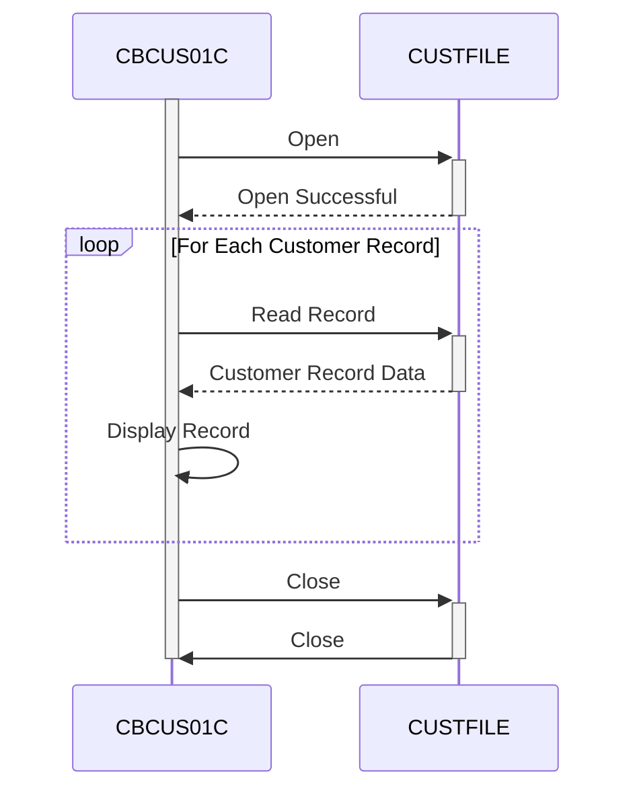

Gerado em: 2 de outubro de 2024

**Título do Documento: Especificação do Processo em Lote - Extração de Dados do Cliente CardDemo**

**Descrição Resumida:**
A Extração de Dados do Cliente CardDemo é um processo em lote que lê sequencialmente os registros do cliente no arquivo `CUSTFILE`, exibe o conteúdo de cada registro e manipula os status das operações do arquivo. Este processo é essencial para que os analistas de dados acessem e visualizem as informações do cliente diretamente do arquivo de origem.

**Histórias do Usuário:**
Como analista de dados, preciso ser capaz de extrair e visualizar os dados do cliente do sistema mainframe para realizar análises e gerar relatórios.

**Épico Relacionado:** 8 - Gestão de Dados do Cliente

**Requisitos Técnicos:**
- **Rotina de Abertura de Arquivo:** Abre o arquivo do cliente (`CUSTFILE`) para leitura sequencial.
  - Entrada: Nenhuma
  - Resultado: Abre o arquivo do cliente ou aborta o programa se ocorrer um erro.
- **Rotina de Recuperação de Registro:** Lê cada registro do cliente no `CUSTFILE`.
  - Entrada: Nenhuma
  - Resultado: Recupera o próximo registro do cliente do arquivo e o armazena na estrutura de dados `CUSTOMER-RECORD`. Se nenhum outro registro for encontrado, define o sinalizador `END-OF-FILE`.
- **Rotina de Exibição de Dados:** Exibe o conteúdo do registro do cliente atual no console do sistema.
  - Entrada: `CUSTOMER-RECORD`
  - Resultado: O conteúdo do `CUSTOMER-RECORD` é exibido.
- **Rotina de Fechamento de Arquivo:** Fecha o `CUSTFILE`.
  - Entrada: Nenhuma
  - Resultado: Fecha o arquivo do cliente ou exibe uma mensagem de erro e aborta o programa se ocorrer um problema durante o fechamento.
- **Tratamento de Erros:** Implementa verificações de erro para todas as operações de arquivo e exibe mensagens de erro específicas. Se ocorrer um erro durante a abertura ou fechamento do arquivo, o programa será encerrado.
  - Entrada: Código de status do arquivo
  - Resultado: Exibe uma mensagem de erro amigável com base no código de status do arquivo.

**Modelos Relacionados**
- **`CUSTOMER-RECORD`:** Representa um registro de cliente.
  - `FD-CUST-ID` `9(09)`: Identificador único para cada cliente.                 
  - `FD-CUST-DATA` `X(491)`: Contém todas as outras informações relacionadas ao cliente.

**Configurações:**
- **`CBCUS01C.cbl`**
  - `CUSTFILE-FNAME`: `"CUSTDAT"`
	- Descrição: Nome do arquivo para o arquivo de dados do cliente.

**Melhorias de Código:**
- **Log:** Implementar um mecanismo de log para registrar operações de arquivo bem-sucedidas, erros e potencialmente o número de registros processados. Isso fornecerá um rastro de auditoria e ajudará na depuração.
- **Parametrização:** Considere parametrizar o programa para aceitar o nome do arquivo de entrada como um argumento em vez de codificá-lo permanentemente. Isso aumenta a flexibilidade.
- **Validação de Dados:** Dependendo da natureza dos dados no `CUSTFILE`, incorpore verificações de validação de dados nos dados do cliente extraídos para garantir a qualidade dos dados e identificar potenciais inconsistências.
- **Opções de Saída:** Fornecer opções para gerar os dados extraídos para diferentes destinos, como um arquivo diferente, um banco de dados ou uma impressora, em vez de apenas exibi-los no console.

**Melhorias de Segurança:**
- **Controle de Acesso:** Implementar mecanismos de controle de acesso para restringir a execução deste programa e o acesso ao `CUSTFILE` apenas ao pessoal autorizado.
- **Mascaramento/Redação de Dados:** Se o `CUSTFILE` contiver informações confidenciais do cliente, considere mascarar ou redigir determinados campos durante a exibição ou saída para proteger a privacidade do cliente.
- **Log Seguro:** Garanta que os logs gerados pelo programa sejam armazenados com segurança e sejam à prova de adulteração, especialmente se contiverem informações confidenciais.

**Diagrama Conceitual:**

--Made by "Smart Engineering" (by Compass.UOL)--