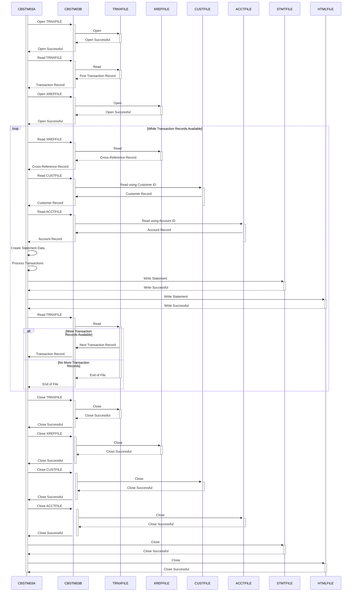

--CONTENT TO TRANSLATE--
Gerado em: 2 de outubro de 2024

**Título do Documento:** Geração de Extrato de Conta CardDemo - Especificação do Programa

**Descrição Resumida:**
O programa de Geração de Extrato de Conta CardDemo é um processo em lote que gera extratos de conta para portadores de cartão de crédito. Ele lê detalhes de transações, informações do cliente e dados da conta de vários arquivos de entrada e produz extratos em formato de texto simples e HTML.

**Histórias do Usuário:**
Como analista de dados, preciso garantir que todos os registros de clientes sejam validados e processados ​​corretamente para gerar extratos de conta precisos que podem ser usados ​​para fins de análise e relatórios. Isso me permitirá rastrear a atividade do cliente, identificar tendências e tomar decisões informadas com base em dados confiáveis.

**Épico Relacionado:**
5 - Relatórios e Análises

**Requisitos Técnicos:**
- **Recuperar Registro de Referência Cruzada:** Recupera o próximo registro do arquivo de referência cruzada (`XREFFILE`) para obter a ID do cliente, ID da conta e número do cartão de crédito.
  - Entrada: Nenhuma.
  - Saída: `CARD-XREF-RECORD` contendo a ID do cliente (`XREF-CUST-ID`), ID da conta (`XREF-ACCT-ID`) e número do cartão de crédito (`XREF-CARD-NUM`).
- **Recuperar Registro do Cliente:** Recupera o registro do cliente do arquivo do cliente (`CUSTFILE`) com base na ID do cliente obtida do registro de referência cruzada.
  - Entrada: `XREF-CUST-ID` do `CARD-XREF-RECORD`.
  - Saída: `CUSTOMER-RECORD` contendo detalhes do cliente, como nome, endereço e pontuação de crédito.
- **Recuperar Registro da Conta:** Recupera o registro da conta do arquivo da conta (`ACCTFILE`) usando a ID da conta obtida do registro de referência cruzada.
  - Entrada: `XREF-ACCT-ID` do `CARD-XREF-RECORD`.
  - Saída: `ACCOUNT-RECORD` contendo detalhes da conta, como ID da conta e saldo atual.
- **Criar e Preencher Dados do Extrato:** Inicializa e preenche as estruturas de dados do extrato (`STATEMENT-LINES` e `HTML-LINES`) com informações do cliente, da conta e da transação.
  - Entrada: `CUSTOMER-RECORD`, `ACCOUNT-RECORD`.
  - Saída: Estruturas de dados `STATEMENT-LINES` e `HTML-LINES` preenchidas contendo informações do cliente, detalhes da conta e cabeçalhos de resumo da transação.
- **Recuperar e Processar Transações:** Recupera e processa transações do arquivo de transações (`TRNXFILE`) para um número de cartão de crédito específico.
  - Entrada: `XREF-CARD-NUM` do `CARD-XREF-RECORD`.
  - Saída: Uma lista de objetos `TRNX-RECORD`, cada um contendo detalhes da transação, como ID da transação, descrição e valor.
- **Gravar Detalhes da Transação:** Grava os detalhes de cada transação nas estruturas de dados do extrato (`STATEMENT-LINES` e `HTML-LINES`).
  - Entrada: `TRNX-RECORD` contendo detalhes da transação.
  - Saída: Estruturas de dados `STATEMENT-LINES` e `HTML-LINES` atualizadas com os detalhes da transação anexados à seção de resumo da transação.

**Modelos Relacionados**
- `CARD-XREF-RECORD`
  - `XREF-CUST-ID` `String`: ID do Cliente.
  - `XREF-ACCT-ID` `String`: ID da Conta.
  - `XREF-CARD-NUM` `String`: Número do Cartão de Crédito.
- `CUSTOMER-RECORD`
  - `CUST-FIRST-NAME` `String`: Primeiro nome do cliente.
  - `CUST-MIDDLE-NAME` `String`: Nome do meio do cliente.
  - `CUST-LAST-NAME` `String`: Sobrenome do cliente.
  - `CUST-ADDR-LINE-1` `String`: Linha de endereço 1 do cliente.
  - `CUST-ADDR-LINE-2` `String`: Linha de endereço 2 do cliente.
  - `CUST-ADDR-LINE-3` `String`: Linha de endereço 3 do cliente.
  - `CUST-ADDR-STATE-CD` `String`: Código do estado do cliente.
  - `CUST-ADDR-COUNTRY-CD` `String`: Código do país do cliente.
  - `CUST-ADDR-ZIP` `String`: CEP do cliente.
  - `CUST-FICO-CREDIT-SCORE` `String`: Pontuação de crédito FICO do cliente.
- `ACCOUNT-RECORD`
  - `ACCT-ID` `String`: ID da Conta.
  - `ACCT-CURR-BAL` `Decimal`: Saldo atual da conta.
- `TRNX-RECORD`
  - `TRNX-CARD-NUM` `String`: Número do cartão associado à transação.
  - `TRNX-ID` `String`: ID da transação.
  - `TRNX-REST` `String`: Detalhes da transação.
  - `TRNX-AMT` `Decimal`: Valor da transação.

**Configurações:**
- Valores Constantes
  - `WS-REPORT-LINES-PER-PAGE`: `55`
	- Descrição: Número de linhas por página no relatório, definido em `CBSTM03A.CBL`.

**Melhorias de Código:**
- **Tratamento de Erros:** Implemente um mecanismo de tratamento de erros mais robusto para capturar e registrar erros durante o processamento de arquivos, recuperação de dados e geração de extratos. Isso melhorará a confiabilidade do programa e tornará mais fácil solucionar problemas.
- **Modularidade:** Divida o programa em módulos ou sub-rotinas menores e mais gerenciáveis ​​para melhorar a legibilidade e a manutenção do código. Por exemplo, separe a lógica de geração de extratos HTML e de texto simples em módulos diferentes.
- **Validação de Dados:** Adicione verificações de validação de dados para garantir a integridade e consistência dos dados recuperados dos arquivos de entrada. Por exemplo, valide números de cartão de crédito, IDs de cliente e valores de transação.
- **Documentação:** Melhore a documentação do código adicionando comentários para explicar o propósito e a funcionalidade das diferentes seções do código. Isso tornará mais fácil para outros desenvolvedores entender e manter o código.

**Melhorias de Segurança:**
- **Criptografia de Dados:** Implemente a criptografia de dados para informações confidenciais, como números de cartão de crédito e dados do cliente, tanto em trânsito quanto em repouso. Isso protegerá os dados contra acesso não autorizado e garantirá a conformidade com os regulamentos de privacidade de dados.
- **Manipulação Segura de Arquivos:** Garanta práticas seguras de manipulação de arquivos, incluindo permissões de arquivo apropriadas e controles de acesso, para evitar acesso não autorizado a arquivos de entrada e saída.
- **Auditoria:** Implemente um mecanismo de auditoria para rastrear todo acesso a dados e modificações, fornecendo um registro de todas as atividades realizadas pelo programa. Isso ajudará na identificação e investigação de quaisquer violações de segurança ou tentativas de manipulação de dados. 

**Diagrama Conceitual:**

--Made by "Smart Engineering" (by Compass.UOL)--