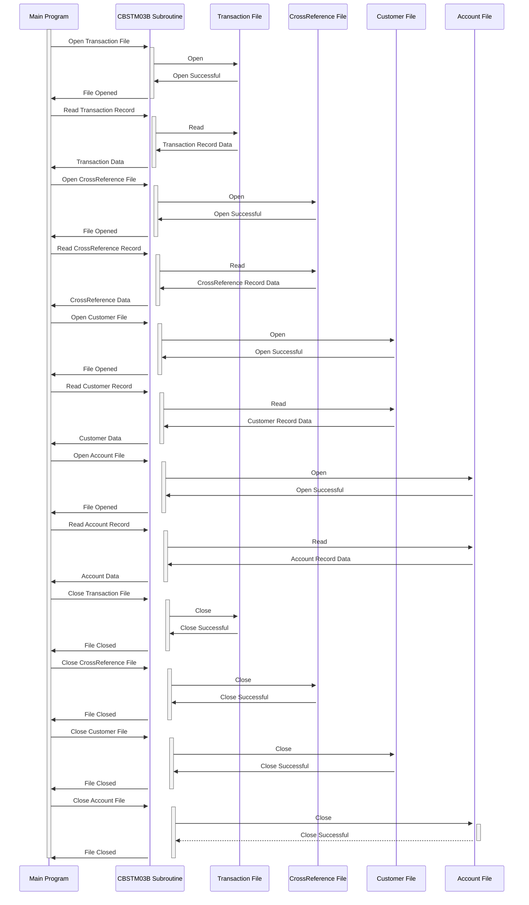

Gerado em: 2 de outubro de 2024

**Título do Documento: Sub-rotina de Processamento de Arquivo de Transação de Cartão - Especificação Técnica**

**Descrição Resumida:**
Esta sub-rotina gerencia operações de arquivo para quatro arquivos indexados relacionados a transações de cartão, atuando como um componente reutilizável dentro de um sistema de processamento em lote maior. Ele lida com a leitura de registros de transações, informações de referência cruzada de cartão e acesso a detalhes de clientes e contas.

**Histórias do Usuário:**
Como um sistema de processamento em lote, preciso ser capaz de acessar e processar dados de transações, referência cruzada, clientes e contas para atualizar com precisão as informações da conta com base nos detalhes da transação.

**Épico Relacionado:**
4 - Processamento de Transações

**Requisitos Técnicos:**
- **Processamento de Arquivo de Transação:** Este método lida com as operações de abertura, leitura e fechamento do arquivo de transação (`TRNX-FILE`). 
  - Entrada: Solicitação do programa principal (`LK-M03B-DD` = `'TRNXFILE'`, `LK-M03B-OPER` = `'O'` para abrir, `'R'` para ler, `'C'` para fechar).
  - Saída:  `LK-M03B-RC` conterá o status do arquivo (`TRNXFILE-STATUS`) após a operação.
- **Processamento de Arquivo de Referência Cruzada:** Este método é responsável por abrir, ler e fechar o arquivo de referência cruzada (`XREF-FILE`).
  - Entrada: Solicitação do programa principal (`LK-M03B-DD` = `'XREFFILE'`, `LK-M03B-OPER` = `'O'` para abrir, `'R'` para ler, `'C'` para fechar).
  - Saída: `LK-M03B-RC` conterá o status do arquivo (`XREFFILE-STATUS`) após a operação.
- **Processamento de Arquivo do Cliente:**  Este método lida com as operações de abertura, leitura e fechamento do arquivo do cliente (`CUST-FILE`).
  - Entrada: Solicitação do programa principal (`LK-M03B-DD` = `'CUSTFILE'`, `LK-M03B-OPER` = `'O'` para abrir, `'R'` para ler, `'C'` para fechar, `'K'` para ler com chave). Se `LK-M03B-OPER` for `'K'`, então `LK-M03B-KEY` conterá o ID do cliente (`FD-CUST-ID`).
  - Saída: `LK-M03B-RC` conterá o status do arquivo (`CUSTFILE-STATUS`) após a operação. Se `LK-M03B-OPER` for `'K'`, então `LK-M03B-FLDT` conterá os dados do cliente (`FD-CUST-DATA`).
- **Processamento de Arquivo de Conta:** Este método é responsável por abrir, ler e fechar o arquivo de conta (`ACCT-FILE`).
  - Entrada: Solicitação do programa principal (`LK-M03B-DD` = `'ACCTFILE'`, `LK-M03B-OPER` = `'O'` para abrir, `'R'` para ler, `'C'` para fechar, `'K'` para ler com chave). Se `LK-M03B-OPER` for `'K'`, então `LK-M03B-KEY` conterá o ID da conta (`FD-ACCT-ID`).
  - Saída: `LK-M03B-RC` conterá o status do arquivo (`ACCTFILE-STATUS`) após a operação. Se `LK-M03B-OPER` for `'K'`, então `LK-M03B-FLDT` conterá os dados da conta (`FD-ACCT-DATA`).

**Modelos Relacionados**
- **Transaction:** Representa uma única transação de cartão de crédito.
  - `FD-TRNXS-ID` `Alfanumérico`: ID da transação exclusivo, combinação de `FD-TRNX-CARD` e `FD-TRNX-ID`.
  - `FD-TRNX-CARD` `Alfanumérico`: Número do cartão de crédito associado à transação.
  - `FD-TRNX-ID` `Alfanumérico`: Identificador exclusivo para a transação.
  - `FD-ACCT-DATA` `Alfanumérico`: Dados da conta relacionados à transação.
- **CrossReference:** Vincula um número de cartão de crédito a uma conta.
  - `FD-XREF-CARD-NUM` `Alfanumérico`: Número do cartão de crédito sendo referenciado.
  - `FD-XREF-DATA` `Alfanumérico`: Dados associados à referência cruzada, potencialmente incluindo o ID da conta.
- **Customer:** Contém informações sobre um cliente.
  - `FD-CUST-ID` `Alfanumérico`: Identificador exclusivo para o cliente.
  - `FD-CUST-DATA` `Alfanumérico`: Dados associados ao cliente.
- **Account:** Contém informações sobre uma conta de cartão de crédito.
  - `FD-ACCT-ID` `Numérico`: Identificador exclusivo para a conta.
  - `FD-ACCT-DATA` `Alfanumérico`: Dados associados à conta.

**Configurações:**
- **Nomes de Arquivo:**
  - `TRNXFILE`:  Nome do arquivo de transação, definido externamente.
  - `XREFFILE`: Nome do arquivo de referência cruzada, definido externamente.
  - `CUSTFILE`: Nome do arquivo do cliente, definido externamente.
  - `ACCTFILE`: Nome do arquivo da conta, definido externamente.

**Melhorias de Código:**
- **Tratamento de Erros Centralizado:** Implemente uma rotina de tratamento de erros centralizada para fornecer uma abordagem consistente para registro e recuperação de erros.
- **Documentação Aprimorada:** Melhore os comentários do código para explicar claramente o propósito e a funcionalidade das diferentes seções do código.
- **Validação de Parâmetros:** Adicione validação para parâmetros de entrada (`LK-M03B-DD`, `LK-M03B-OPER`, `LK-M03B-KEY`) para evitar comportamento inesperado.

**Melhorias de Segurança:**
- **Controle de Acesso a Arquivos:** Implemente restrições de acesso a arquivos apropriadas para evitar acesso não autorizado a dados confidenciais.
- **Registro e Auditoria:** Registre todas as operações de arquivo, incluindo ID do usuário e carimbos de data/hora, para habilitar a auditoria e o rastreamento do acesso a dados.

**Diagrama Conceitual:**

--Made by "Smart Engineering" (by Compass.UOL)--