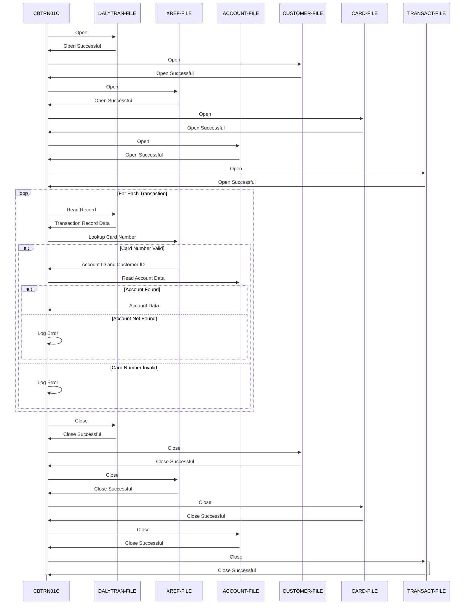

Gerado em: 2 de outubro de 2024

**Título do Documento:** CardDemo - Processamento Diário de Transações - Especificação do Programa

**Descrição Resumida:**
O programa CardDemo Daily Transaction Processing é um processo em lote projetado para lidar com o fluxo diário de transações de cartão de crédito. Sua principal função é garantir que cada transação seja validada e refletida com precisão nas contas de clientes correspondentes. Isso envolve verificar a validade do cartão utilizado, recuperar as informações da conta associada e preparar os dados para atualizar os registros de transações.

**Histórias de Usuário:**
Como analista de dados, preciso ter certeza de que todas as transações diárias com cartão de crédito sejam validadas e processadas com precisão para que eu possa realizar análises financeiras e relatórios confiáveis.

**Épico Relacionado:**
4 - Processamento de Transações

**Requisitos Técnicos:**

- Abrir Arquivos: Este método abre todos os arquivos necessários para processamento.
  - Entrada: Nenhuma.
  - Saída: Arquivos abertos `DALYTRAN-FILE`, `CUSTOMER-FILE`, `XREF-FILE`, `CARD-FILE`, `ACCOUNT-FILE`, `TRANSACT-FILE`.
  - Resultado: `{Boolean}`: Retorna `TRUE` se todos os arquivos forem abertos com sucesso, `FALSE` caso contrário.
- Ler Registro de Transação Diária: Este método lê um único registro de transação do arquivo de transações diárias (`DALYTRAN-FILE`).
  - Entrada: Nenhuma.
  - Saída: `DALYTRAN-RECORD` `{Record}`: Um único registro de transação.
  - Resultado: `{Boolean}`: Retorna `TRUE` se um registro for lido com sucesso, `FALSE` se o final do arquivo for atingido ou se ocorrer um erro.
- Consultar Número do Cartão: Este método procura o número do cartão no arquivo de referência cruzada (`XREF-FILE`) para recuperar a ID da conta e a ID do cliente correspondentes.
  - Entrada: `DALYTRAN-CARD-NUM` `{String}`: O número do cartão a ser pesquisado.
  - Saída: `XREF-ACCT-ID` `{String}`: A ID da conta associada ao número do cartão. `XREF-CUST-ID` `{String}`: A ID do cliente associada ao número do cartão.
  - Resultado: `{Boolean}`: Retorna `TRUE` se o número do cartão for encontrado no arquivo de referência cruzada, `FALSE` caso contrário.
- Ler Dados da Conta: Este método lê as informações da conta do arquivo de contas (`ACCOUNT-FILE`) usando a ID da conta fornecida.
  - Entrada: `XREF-ACCT-ID` `{String}`: A ID da conta a ser lida.
  - Saída: `ACCOUNT-RECORD` `{Record}`: As informações da conta para a ID da conta fornecida.
  - Resultado: `{Boolean}`: Retorna `TRUE` se as informações da conta forem lidas com sucesso, `FALSE` caso contrário.
- Fechar Arquivos: Este método fecha todos os arquivos abertos.
  - Entrada: Nenhuma.
  - Saída: Nenhuma.
  - Resultado: `{Boolean}`: Retorna `TRUE` se todos os arquivos forem fechados com sucesso, `FALSE` caso contrário.
- Abend Program: Este método termina abruptamente o programa e registra um erro.
  - Entrada: Nenhuma.
  - Saída: Nenhuma.
  - Resultado: `{None}`: Este método não retorna.
- Exibir Status de E/S: Este método exibe as informações de status do arquivo para fins de depuração.
  - Entrada: `IO-STATUS` `{String}`: O status do arquivo a ser exibido.
  - Saída: Nenhuma.
  - Resultado: `{None}`: Este método não retorna um valor.

**Modelos Relacionados**

- `Daily Transaction`
  - `FD-TRAN-ID` `{String}`: Identificador único para cada transação.
  - `FD-CUST-DATA` `{String}`: Dados do cliente associados à transação.
- `Customer`
  - `FD-CUST-ID` `{String}`: Identificador único para cada cliente.
  - `FD-CUST-DATA` `{String}`: Dados do cliente.
- `Card Cross Reference`
  - `FD-XREF-CARD-NUM` `{String}`: Número do cartão de crédito, usado como chave no arquivo de referência cruzada.
  - `FD-XREF-DATA` `{String}`: Dados adicionais relacionados à referência cruzada do cartão.
- `Card`
  - `FD-CARD-NUM` `{String}`: Número do cartão de crédito, usado como chave no arquivo de informações do cartão.
  - `FD-CARD-DATA` `{String}`: Dados adicionais relacionados ao cartão.
- `Account`
  - `FD-ACCT-ID` `{String}`: Identificador único para cada conta.
  - `FD-ACCT-DATA` `{String}`: Dados adicionais relacionados à conta.
- `Transaction`
  - `FD-TRANS-ID` `{String}`: Identificador único para cada transação.
  - `FD-ACCT-DATA` `{String}`: Dados da conta associados à transação.

**Configurações:**

- Valores Constantes
  - `APPL-EOF`: `16`
	- Descrição:  Código de status de fim de arquivo.
  - `ABCODE`: `999`
	- Descrição: Código Abend para término anormal do programa.

**Melhorias de Código:**

- **Tratamento de Erros Aprimorado:** Implemente uma estratégia de tratamento de erros mais abrangente, capturando e registrando códigos de erro específicos e mensagens para facilitar a solução de problemas. Inclua verificações de status do arquivo após cada operação de leitura e gravação.
- **Log Aprimorado:** Em vez de apenas exibir mensagens de erro, implemente um mecanismo de log que registre informações detalhadas sobre cada erro, incluindo carimbos de data/hora, códigos de erro e dados relevantes. Isso ajudará na depuração e monitoramento do sistema.
- **Modularidade:** Divida o programa em parágrafos ou seções menores e mais gerenciáveis para melhor organização e legibilidade do código. Por exemplo, separe a lógica de manipulação de arquivos (abertura, leitura, fechamento) da lógica principal de processamento de transações.
- **Validação de Dados:** Adicione verificações de validação para dados lidos de arquivos de entrada. Por exemplo, valide o formato e o tamanho dos números de cartão, IDs de conta e outros campos críticos.
- **Documentação:** Adicione comentários explicando a finalidade e a funcionalidade de cada seção do código.  Documente os formatos de dados de entrada e saída esperados para cada arquivo.
- **Otimização de Desempenho:** Explore maneiras de otimizar o desempenho, especialmente se o volume diário de transações for grande. Isso pode envolver o uso de métodos de acesso a arquivos ou estruturas de dados mais eficientes, se possível.

**Melhorias de Segurança:**

- **Autenticação e Autorização:** Implemente medidas de segurança para garantir que apenas usuários autorizados possam executar o programa e acessar os dados confidenciais nos arquivos. Isso pode envolver o uso de recursos de segurança no nível do sistema ou a incorporação da autenticação do usuário no programa.
- **Criptografia de Dados:** Criptografe dados confidenciais como números de cartão, detalhes da conta e informações do cliente nos arquivos e durante o processamento para protegê-los de acesso não autorizado.
- **Trilha de Auditoria:** Implemente uma trilha de auditoria para rastrear todas as ações executadas pelo programa, incluindo quem o executou, quando foi executado e quaisquer erros encontrados. Isso ajudará a identificar qualquer acesso não autorizado ou violação de dados.
- **Manipulação Segura de Arquivos:** Certifique-se de que os arquivos que contêm dados confidenciais sejam armazenados com segurança com permissões de acesso adequadas.

**Diagrama Conceitual:**

--Made by "Smart Engineering" (by Compass.UOL)--