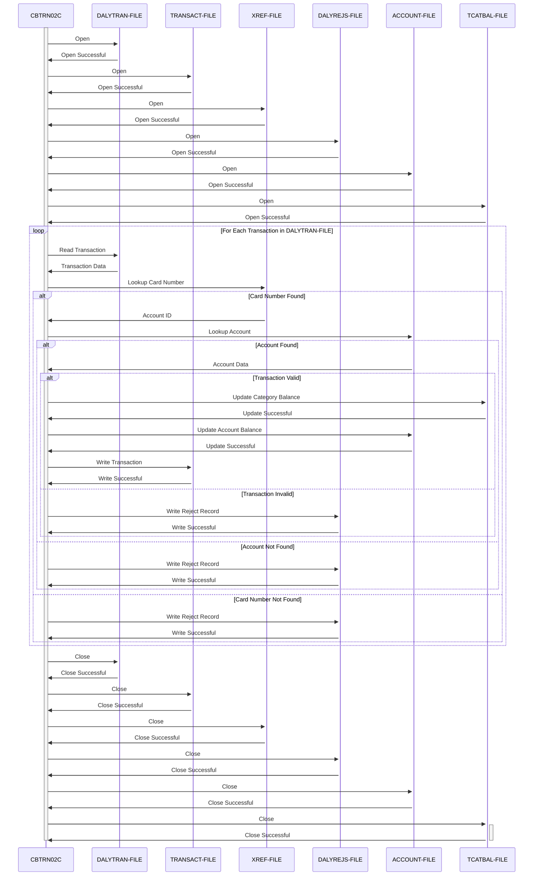

Gerado em: 2 de outubro de 2024

**Título do Documento: CardDemo - Especificação do Processador de Transações Diárias**

**Descrição Resumida:**
O CardDemo Daily Transaction Processor é um programa batch COBOL projetado para processar transações diárias de cartão de crédito, validá-las em relação às regras de negócios predefinidas, atualizar saldos de contas e registrar detalhes de transações. Ele garante que as transações sejam aplicadas corretamente às contas dos clientes, mantendo a integridade dos dados e aderindo à lógica de negócios.

**Histórias do Usuário:**
Como analista de dados, preciso ter certeza de que apenas transações válidas de cartão de crédito são processadas e refletidas nas contas dos clientes para que minha análise seja precisa e confiável.

**Épico Relacionado:**
4 - Processamento de Transações

**Requisitos Técnicos:**
Este programa processa transações diárias de um arquivo sequencial (`DALYTRAN-FILE`), realizando validações em relação a dados de referência cruzada e de contas antes de atualizar saldos de transações e contas em arquivos indexados. As transações rejeitadas são gravadas em um arquivo separado (`DALYREJS-FILE`) com códigos de razão.

- **Abrir Arquivo de Transação Diária**: Abre o arquivo de entrada contendo as transações diárias.
  - Entrada: Nenhuma.
  - Resultado `Boolean`: Indica sucesso ou falha da operação de abertura do arquivo. 
- **Abrir Arquivo de Transação**: Abre o arquivo de saída para armazenar as transações processadas.
  - Entrada: Nenhuma.
  - Resultado `Boolean`: Indica sucesso ou falha da operação de abertura do arquivo. 
- **Abrir Arquivo de Referência Cruzada**: Abre o arquivo que mapeia os números dos cartões de crédito para os IDs das contas.
  - Entrada: Nenhuma.
  - Resultado `Boolean`: Indica sucesso ou falha da operação de abertura do arquivo. 
- **Abrir Arquivo de Rejeições Diárias**: Abre o arquivo para armazenar as transações rejeitadas.
  - Entrada: Nenhuma.
  - Resultado `Boolean`: Indica sucesso ou falha da operação de abertura do arquivo. 
- **Abrir Arquivo de Conta**: Abre o arquivo contendo informações da conta do cliente.
  - Entrada: Nenhuma.
  - Resultado `Boolean`: Indica sucesso ou falha da operação de abertura do arquivo. 
- **Abrir Arquivo de Saldo de Categoria de Transação**: Abre o arquivo para rastrear saldos por categoria de transação.
  - Entrada: Nenhuma.
  - Resultado `Boolean`: Indica sucesso ou falha da operação de abertura do arquivo. 
- **Ler Transação Diária**: Lê o próximo registro de transação do arquivo de entrada.
  - Entrada: Nenhuma.
  - Resultado `{FD-TRAN-RECORD}`: Contém os detalhes da próxima transação ou um indicador de fim de arquivo. 
- **Validar Transação**: Executa uma série de verificações para garantir a validade da transação.
  - Entrada: `DALYTRAN-RECORD`.
  - Nome da Etapa: Pesquisar Número do Cartão no Arquivo de Referência Cruzada
    - Entrada: `DALYTRAN-CARD-NUM` de `DALYTRAN-RECORD`.
    - Saída: `CARD-XREF-RECORD` se uma correspondência for encontrada.
    - Resultado `Integer`: Define `WS-VALIDATION-FAIL-REASON` como `100` se nenhuma correspondência for encontrada, indicando um número de cartão inválido.
  - Nome da Etapa: Pesquisar ID da Conta no Arquivo de Conta
    - Entrada: `XREF-ACCT-ID` de `CARD-XREF-RECORD`.
    - Saída: `ACCOUNT-RECORD` se uma correspondência for encontrada.
    - Resultado `Integer`: Define `WS-VALIDATION-FAIL-REASON` como `101` se nenhuma correspondência for encontrada, indicando uma conta inválida.
    - Regra de Negócios: Verificação de Limite de Crédito
      - Cálculo: Verifica se `ACCT-CREDIT-LIMIT` é maior ou igual à soma de `ACCT-CURR-CYC-CREDIT`, menos `ACCT-CURR-CYC-DEBIT`, mais `DALYTRAN-AMT`.
      - Resultado `Integer`: Define `WS-VALIDATION-FAIL-REASON` como `102` se o limite de crédito for excedido.
    - Regra de Negócios: Verificação de Expiração da Conta
      - Cálculo: Compara `ACCT-EXPIRATION-DATE` com `DALYTRAN-ORIG-TS` (timestamp de origem da transação).
      - Resultado `Integer`: Define `WS-VALIDATION-FAIL-REASON` como `103` se a conta estiver expirada.
  - Resultado `Integer`: Retorna `WS-VALIDATION-FAIL-REASON`, que é `0` se a transação for válida ou um código de erro específico se uma regra de validação for violada. 
- **Lançar Transação**: Processa uma transação válida atualizando os saldos da conta e da categoria e registrando os detalhes da transação.
  - Entrada: `DALYTRAN-RECORD`, `CARD-XREF-RECORD`, `ACCOUNT-RECORD`.
  - Nome da Etapa: Atualizar Saldo da Categoria de Transação
    - Entrada: `XREF-ACCT-ID`, `DALYTRAN-TYPE-CD`, `DALYTRAN-CAT-CD`, `DALYTRAN-AMT`.
    - Saída: Atualiza `TRAN-CAT-BAL-RECORD`.
    - Nome da Etapa: Criar Registro de Saldo da Categoria de Transação
      - Cálculo: Se um registro para a conta e categoria de transação não existir, crie um novo `TRAN-CAT-BAL-RECORD` e inicialize-o.
      - Resultado `TRAN-CAT-BAL-RECORD`: Um novo registro é criado com o ID da conta, código do tipo de transação, código da categoria de transação e o valor da transação adicionado ao saldo.
    - Nome da Etapa: Atualizar Registro de Saldo da Categoria de Transação
      - Cálculo: Se um registro existir, adicione `DALYTRAN-AMT` ao `TRAN-CAT-BAL` existente.
      - Resultado `TRAN-CAT-BAL-RECORD`: O registro existente é atualizado com o novo saldo.
  - Nome da Etapa: Atualizar Registro de Conta
    - Entrada: `DALYTRAN-AMT`, `ACCOUNT-RECORD`.
    - Cálculo: Adicione `DALYTRAN-AMT` a `ACCT-CURR-BAL`. Se `DALYTRAN-AMT` for positivo, adicione-o a `ACCT-CURR-CYC-CREDIT`, caso contrário, adicione-o a `ACCT-CURR-CYC-DEBIT`.
    - Resultado `ACCOUNT-RECORD`: O registro da conta é atualizado com o novo saldo e totais do ciclo.
  - Nome da Etapa: Gravar Registro de Transação
    - Entrada: `TRAN-RECORD`.
    - Cálculo: Crie `TRAN-RECORD` a partir de `DALYTRAN-RECORD`, `XREF-ACCT-ID` e o timestamp atual.
    - Resultado `TRAN-RECORD`: O registro de transação é gravado no arquivo de saída.
- **Gravar Registro de Rejeição**: Grava um registro de transação rejeitada no arquivo de saída.
  - Entrada: `DALYTRAN-RECORD`, `WS-VALIDATION-FAIL-REASON`, `WS-VALIDATION-FAIL-REASON-DESC`.
  - Cálculo: Combina `DALYTRAN-RECORD`, o código de razão de rejeição e a descrição da razão de rejeição em `REJECT-RECORD`.
  - Resultado `REJECT-RECORD`: O registro de transação rejeitada é gravado no arquivo de saída. 
- **Fechar Arquivo de Transação Diária**: Fecha o arquivo de entrada.
  - Entrada: Nenhuma.
  - Resultado `Boolean`: Indica sucesso ou falha da operação de fechamento do arquivo. 
- **Fechar Arquivo de Transação**: Fecha o arquivo de saída para transações processadas.
  - Entrada: Nenhuma.
  - Resultado `Boolean`: Indica sucesso ou falha da operação de fechamento do arquivo. 
- **Fechar Arquivo de Referência Cruzada**: Fecha o arquivo de referência cruzada.
  - Entrada: Nenhuma.
  - Resultado `Boolean`: Indica sucesso ou falha da operação de fechamento do arquivo. 
- **Fechar Arquivo de Rejeições Diárias**: Fecha o arquivo para transações rejeitadas.
  - Entrada: Nenhuma.
  - Resultado `Boolean`: Indica sucesso ou falha da operação de fechamento do arquivo. 
- **Fechar Arquivo de Conta**: Fecha o arquivo da conta do cliente.
  - Entrada: Nenhuma.
  - Resultado `Boolean`: Indica sucesso ou falha da operação de fechamento do arquivo. 
- **Fechar Arquivo de Saldo de Categoria de Transação**: Fecha o arquivo para saldos de categoria de transação.
  - Entrada: Nenhuma.
  - Resultado `Boolean`: Indica sucesso ou falha da operação de fechamento do arquivo. 

**Modelos Relacionados**
- `DALYTRAN-RECORD`
  - `DALYTRAN-ID` `String`: Identificador exclusivo para cada transação diária.
  - `DALYTRAN-TYPE-CD` `String`: Código indicando o tipo de transação (por exemplo, compra, pagamento).
  - `DALYTRAN-CAT-CD` `String`: Código que categoriza a transação (por exemplo, mantimentos, combustível, entretenimento).
  - `DALYTRAN-SOURCE` `String`: Origem da transação (por exemplo, online, terminal POS).
  - `DALYTRAN-DESC` `String`: Descrição da transação.
  - `DALYTRAN-AMT` `Decimal`: Valor da transação.
  - `DALYTRAN-MERCHANT-ID` `String`: Identificador exclusivo para o comerciante envolvido na transação.
  - `DALYTRAN-MERCHANT-NAME` `String`: Nome do comerciante.
  - `DALYTRAN-MERCHANT-CITY` `String`: Cidade do comerciante.
  - `DALYTRAN-MERCHANT-ZIP` `String`: CEP do comerciante.
  - `DALYTRAN-CARD-NUM` `String`: Número do cartão de crédito usado para a transação.
  - `DALYTRAN-ORIG-TS` `String`: Timestamp indicando quando a transação foi iniciada.
- `TRAN-RECORD`
  - `TRAN-ID` `String`: Identificador exclusivo para a transação.
  - `TRAN-TYPE-CD` `String`: Código indicando o tipo de transação (por exemplo, compra, pagamento).
  - `TRAN-CAT-CD` `String`: Código que categoriza a transação (por exemplo, mantimentos, combustível, entretenimento).
  - `TRAN-SOURCE` `String`: Origem da transação (por exemplo, online, terminal POS).
  - `TRAN-DESC` `String`: Descrição da transação.
  - `TRAN-AMT` `Decimal`: Valor da transação.
  - `TRAN-MERCHANT-ID` `String`: Identificador exclusivo para o comerciante envolvido na transação.
  - `TRAN-MERCHANT-NAME` `String`: Nome do comerciante.
  - `TRAN-MERCHANT-CITY` `String`: Cidade do comerciante.
  - `TRAN-MERCHANT-ZIP` `String`: CEP do comerciante.
  - `TRAN-CARD-NUM` `String`: Número do cartão de crédito usado para a transação.
  - `TRAN-ORIG-TS` `String`: Timestamp indicando quando a transação foi iniciada.
  - `TRAN-PROC-TS` `String`: Timestamp indicando quando a transação foi processada.
- `CARD-XREF-RECORD`
  - `FD-XREF-CARD-NUM` `String`: Número do cartão de crédito.
  - `FD-XREF-DATA` `String`: Dados adicionais associados ao cartão de crédito, incluindo `XREF-ACCT-ID`.
- `ACCOUNT-RECORD`
  - `FD-ACCT-ID` `String`: Identificador exclusivo para a conta.
  - `FD-ACCT-DATA` `String`: Dados adicionais associados à conta, incluindo:
    - `ACCT-CURR-BAL` `Decimal`: Saldo atual da conta.
    - `ACCT-CURR-CYC-CREDIT` `Decimal`: Total de créditos no ciclo atual.
    - `ACCT-CURR-CYC-DEBIT` `Decimal`: Total de débitos no ciclo atual.
    - `ACCT-CREDIT-LIMIT` `Decimal`: Limite de crédito da conta.
    - `ACCT-EXPIRATION-DATE` `String`: Data de expiração do cartão de crédito.
- `TRAN-CAT-BAL-RECORD`
  - `FD-TRAN-CAT-KEY` `String`: Chave composta para o registro de saldo da categoria de transação, incluindo:
    - `FD-TRANCAT-ACCT-ID` `String`: ID da conta.
    - `FD-TRANCAT-TYPE-CD` `String`: Código do tipo de transação.
    - `FD-TRANCAT-CD` `String`: Código da categoria.
  - `FD-FD-TRAN-CAT-DATA` `String`: Dados adicionais associados ao saldo da categoria de transação, incluindo `TRAN-CAT-BAL`.
- `REJECT-RECORD`
  - `REJECT-TRAN-DATA` `String`: Os dados originais do registro de transação.
  - `VALIDATION-TRAILER` `String`: Contém `WS-VALIDATION-FAIL-REASON` e `WS-VALIDATION-FAIL-REASON-DESC`.

**Configurações:**
- `CBTRN02C.cbl`
  - `REJECT-REASON-XREF-NOT-FOUND`: `01`
	- Descrição: Código de razão de rejeição para referência cruzada não encontrada.
  - `REJECT-REASON-ACCT-NOT-FOUND`: `02`
	- Descrição: Código de razão de rejeição para conta não encontrada.
  - `REJECT-REASON-ACCT-EXPIRED`: `03`
	- Descrição: Código de razão de rejeição para conta expirada.
  - `REJECT-REASON-ACCT-OVERLIMIT`: `04`
	- Descrição: Código de razão de rejeição para conta acima do limite.

**Melhorias de Código:**
- **Tratamento de Erros:** Implemente um mecanismo de tratamento de erros centralizado e consistente. Em vez de usar várias instruções `IF` para verificações de status de arquivo, considere usar um parágrafo dedicado ao tratamento de erros.
- **Log:** Aprimore o log para incluir timestamps, mensagens de erro específicas e dados relevantes para facilitar a solução de problemas.
- **Validação de Dados:** Implemente uma validação de dados mais robusta para campos de entrada, como verificação de intervalos numéricos, formatos de data válidos e consistência do tipo de dados.
- **Estrutura do Código:** Refatore o código para melhorar a legibilidade e a manutenção. Considere dividir parágrafos grandes em seções menores e mais focadas.
- **Comentários:** Adicione comentários mais detalhados para explicar o propósito e a lógica de cada seção do código.

**Melhorias de Segurança:**
- **Permissões de Arquivo:** Certifique-se de que os arquivos acessados pelo programa tenham permissões adequadas para evitar acesso não autorizado ou modificação.
- **Criptografia de Dados:** Considere criptografar dados confidenciais, como números de cartão de crédito e saldos de contas, tanto no armazenamento quanto durante a transmissão.
- **Auditoria:** Implemente uma trilha de auditoria para rastrear todas as atividades de processamento de transações, incluindo IDs de usuário, timestamps e alterações feitas nos dados.
- **Sanitização de Entrada:** Sanitize todos os dados de entrada para evitar ataques de injeção, como injeção de SQL ou cross-site scripting.

**Diagrama Conceitual:**

--Made by "Smart Engineering" (by Compass.UOL)--