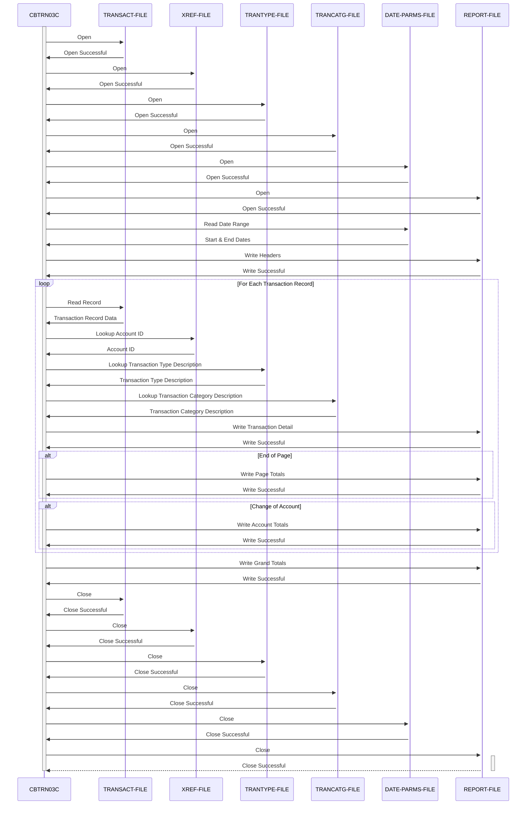

Gerado em: 2 de outubro de 2024

**Título do Documento:** CBTRN03C Relatório Detalhado de Transações de Cartão de Crédito - Especificação do Programa

**Descrição Resumida:**
O programa `CBTRN03C` é um programa COBOL em lote que gera um relatório detalhado de transações de cartão de crédito para um intervalo de datas especificado. Ele lê dados de transações de um arquivo sequencial, recupera informações relacionadas de arquivos indexados (referência cruzada, tipo de transação, categoria de transação) e formata as informações em um relatório. O relatório inclui totais de página, totais de conta e um total geral.

**Histórias do Usuário:**
Como analista de dados, preciso de um relatório detalhado das transações de cartão de crédito para analisar padrões de gastos, identificar tendências e reconciliar dados financeiros.

**Épico Relacionado:**
5 - Relatórios e Análise

**Requisitos Técnicos:**
- **Abrir Arquivos:** Este método abre todos os arquivos necessários para o processo de geração do relatório.
  - Entrada: Nenhuma.
  - Saída:  Abre os arquivos `TRANSACT-FILE`, `XREF-FILE`, `TRANTYPE-FILE`, `TRANCATG-FILE`, `REPORT-FILE` e `DATE-PARMS-FILE`. 
- **Ler Parâmetros de Data:** Este método lê as datas de início e término do relatório do arquivo `DATE-PARMS-FILE`.
  - Entrada: Nenhuma.
  - Saída: `WS-START-DATE` e `WS-END-DATE` com o intervalo de datas.
- **Ler Registros de Transações:** Este método lê os registros de transações do arquivo `TRANSACT-FILE` sequencialmente.
  - Entrada: Nenhuma.
  - Saída: `TRAN-RECORD` com os dados da transação.
- **Pesquisar ID da Conta:** Este método recupera o ID da conta associado a um número de cartão de crédito usando o arquivo `XREF-FILE`.
  - Entrada: `TRAN-CARD-NUM`.
  - Saída: `XREF-ACCT-ID`.
- **Pesquisar Descrição do Tipo de Transação:** Este método recupera a descrição de um determinado código de tipo de transação usando o arquivo `TRANTYPE-FILE`.
  - Entrada: `TRAN-TYPE-CD`.
  - Saída: `TRAN-TYPE-DESC`.
- **Pesquisar Descrição da Categoria de Transação:** Este método recupera a descrição de uma determinada combinação de código de tipo de transação e categoria usando o arquivo `TRANCATG-FILE`.
  - Entrada: `TRAN-TYPE-CD` e `TRAN-CAT-CD`.
  - Saída: `TRAN-CAT-TYPE-DESC`.
- **Gravar Relatório de Transação:** Este método formata e grava os detalhes da transação no arquivo de relatório. Ele também lida com quebras de página e calcula os totais da página.
  - Entrada: `TRAN-RECORD`, `XREF-ACCT-ID`, `TRAN-TYPE-DESC`, `TRAN-CAT-TYPE-DESC`.
  - Saída: Grava os detalhes da transação no arquivo `REPORT-FILE`.
- **Gravar Totais da Página:** Este método grava os totais da página no arquivo `REPORT-FILE` e redefine o acumulador de totais da página.
  - Entrada: `WS-PAGE-TOTAL`.
  - Saída: Grava os totais da página no arquivo `REPORT-FILE` e redefine `WS-PAGE-TOTAL` para zero.
- **Gravar Totais da Conta:** Este método grava os totais da conta no arquivo `REPORT-FILE` e redefine o acumulador de totais da conta.
  - Entrada: `WS-ACCOUNT-TOTAL`.
  - Saída: Grava os totais da conta no arquivo `REPORT-FILE` e redefine `WS-ACCOUNT-TOTAL` para zero.
- **Gravar Totais Gerais:** Este método grava o total geral de todas as transações no arquivo `REPORT-FILE`.
  - Entrada: `WS-GRAND-TOTAL`.
  - Saída: Grava os totais gerais no arquivo `REPORT-FILE`.
- **Gravar Cabeçalhos:** Este método grava os cabeçalhos do relatório no arquivo `REPORT-FILE`.
  - Entrada: `WS-START-DATE` e `WS-END-DATE`.
  - Saída: Grava os cabeçalhos no arquivo `REPORT-FILE`.
- **Gravar Registro do Relatório:** Este método grava um registro formatado no arquivo `REPORT-FILE`.
  - Entrada: `FD-REPTFILE-REC`.
  - Saída: Grava um registro formatado no arquivo `REPORT-FILE`.
- **Gravar Detalhe:** Este método formata e grava uma única linha de detalhe de transação no relatório.
  - Entrada: `TRAN-RECORD`, `XREF-ACCT-ID`, `TRAN-TYPE-DESC`, `TRAN-CAT-TYPE-DESC`.
  - Saída: Grava uma linha de detalhe de transação formatada no arquivo `REPORT-FILE`.
- **Fechar Arquivos:** Este método fecha todos os arquivos abertos usados no processo de geração do relatório.
  - Entrada: Nenhuma.
  - Saída: Fecha os arquivos `TRANSACT-FILE`, `XREF-FILE`, `TRANTYPE-FILE`, `TRANCATG-FILE`, `REPORT-FILE` e `DATE-PARMS-FILE`. 
- **Exibir Status de E/S:** Este método exibe o status do arquivo em caso de erro de E/S.
  - Entrada: `IO-STATUS`.
  - Saída: Exibe o status do arquivo.
- **Finalizar Programa Anormalmente:** Este método finaliza o programa anormalmente em caso de erro fatal.
  - Entrada: Nenhuma.
  - Saída: Finaliza o programa anormalmente.

**Modelos Relacionados**
- `TRAN-RECORD`
  - `TRAN-CARD-NUM` `String`: O número do cartão de crédito associado à transação.
  - `TRAN-AMT` `Decimal`: O valor da transação.
  - `TRAN-TYPE-CD` `String`: O código do tipo de transação (por exemplo, '01' para compra, '02' para devolução).
  - `TRAN-CAT-CD` `String`: O código da categoria da transação (por exemplo, '1001' para varejo).
  - `TRAN-PROC-TS` `String`: A data e hora em que a transação foi processada.
- `CARD-XREF-RECORD`
  - `XREF-CARD-NUM` `String`: O número do cartão de crédito.
  - `XREF-ACCT-ID` `String`: O ID da conta associado ao cartão de crédito.
- `TRAN-TYPE-RECORD`
  - `TRAN-TYPE` `String`: O código do tipo de transação.
  - `TRAN-TYPE-DESC` `String`: A descrição do tipo de transação.
- `TRAN-CAT-RECORD`
  - `TRAN-TYPE-CD` `String`: O código do tipo de transação.
  - `TRAN-CAT-CD` `String`: O código da categoria da transação.
  - `TRAN-CAT-TYPE-DESC` `String`: A descrição da categoria da transação.

**Configurações:**
- Valores Constantes
  - `WS-PAGE-SIZE`: `20`
	- Descrição: Número de linhas de detalhes de transação por página no relatório.
- `CBTRN03C.cbl`
  - `TRANFILE-STATUS`: `"00"`
	- Descrição: Status de arquivo bem-sucedido para `TRANSACT-FILE`.
  - `CARDXREF-STATUS`: `"00"`
	- Descrição: Status de arquivo bem-sucedido para `XREF-FILE`.
  - `TRANTYPE-STATUS`: `"00"`
	- Descrição: Status de arquivo bem-sucedido para `TRANTYPE-FILE`.
  - `TRANCATG-STATUS`: `"00"`
	- Descrição: Status de arquivo bem-sucedido para `TRANCATG-FILE`.
  - `TRANREPT-STATUS`: `"00"`
	- Descrição: Status de arquivo bem-sucedido para `REPORT-FILE`.
  - `DATEPARM-STATUS`: `"00"`
	- Descrição: Status de arquivo bem-sucedido para `DATE-PARMS-FILE`.

**Melhorias de Código:**
- **Tratamento de Erros:** Implementar um tratamento de erros mais robusto, incluindo mensagens de erro específicas e registro para melhor depuração e solução de problemas.
- **Validação de Dados:** Adicionar verificações de validação de dados para dados de transações, como garantir valores numéricos, tipos e categorias de transações válidos e lidar com elementos de dados ausentes.
- **Modularidade:** Dividir o programa em módulos ou sub-rotinas menores e mais gerenciáveis para melhor organização e manutenção.
- **Documentação:** Adicionar comentários mais detalhados para explicar a lógica do programa, estruturas de dados e variáveis.
- **Otimização de Desempenho:** Considerar a otimização das operações de E/S de arquivo, como usar leituras e gravações em bloco para arquivos sequenciais e usar estratégias de indexação apropriadas para arquivos indexados.

**Melhorias de Segurança:**
- **Controle de Acesso:** Implementar mecanismos de controle de acesso para restringir o acesso não autorizado ao programa, arquivos de entrada e relatórios de saída.
- **Criptografia de Dados:** Criptografar dados confidenciais nos arquivos de transações para proteger contra acesso não autorizado, especialmente se eles contiverem informações pessoais ou detalhes financeiros.
- **Registro de Auditoria:** Implementar o registro de auditoria para rastrear a execução do programa, acesso do usuário e modificações de dados para fins de segurança e conformidade.

**Diagrama Conceitual:**

--Made by "Smart Engineering" (by Compass.UOL)--