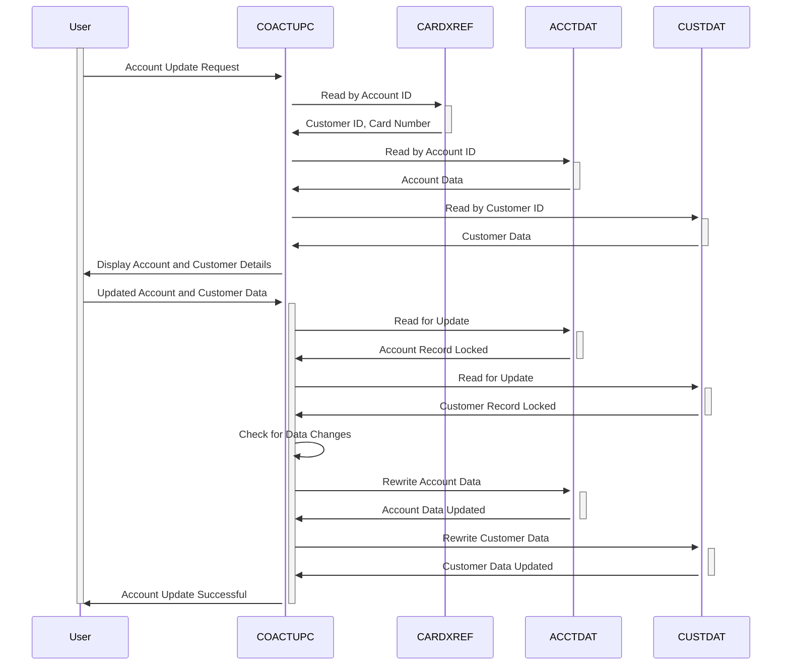

Gerado em: 2 de outubro de 2024

**Título do Documento: Especificação do Programa de Atualização de Conta CardDemo**

**Descrição Resumida:**
O Programa de Atualização de Conta CardDemo é um programa COBOL que fornece uma interface CICS para atualizar informações de contas de clientes. Ele interage com os arquivos Account Master, Customer Master e Card Data. O programa permite que os usuários pesquisem por uma conta, visualizem seus detalhes, façam alterações e confirmem essas alterações no banco de dados. O programa executa várias validações de dados para garantir a integridade dos dados.

**Histórias do Usuário:**
Como representante de atendimento ao cliente, preciso visualizar e atualizar as informações da conta do cliente para auxiliá-lo em suas dúvidas e solicitações.

**Épico Relacionado:** 2 - Gestão de Contas

**Requisitos Técnicos:**
Este programa fornece funcionalidades para recuperar, exibir e atualizar a conta do cliente e os dados do cliente associados. Ele interage com três arquivos VSAM - `ACCTDAT` (Account Master), `CUSTDAT` (Customer Master) e `CARDXREF` (Card Cross Reference).

- **Ler Dados da Conta:** Este método recupera os dados da conta e do cliente com base no número da conta fornecido.
  - Entrada: `CC-ACCT-ID` `{Numeric (9,0)}`: ID da conta.
  - Etapa 1: Chame `Read Card Cross Reference by Account` para obter `CDEMO-CUST-ID` e `CDEMO-CARD-NUM`.
  - Etapa 2: Chame `Read Account Data by Account` para obter os dados da conta.
  - Etapa 3: Chame `Read Customer Data by Customer` para obter os dados do cliente.
  - Etapa 4: Chame `Store Fetched Data` para armazenar os dados recuperados na área de comunicação.
  - Resultado: Dados da conta e do cliente.

- **Read Card Cross Reference by Account:** Este método lê o arquivo Card Cross Reference pelo número da conta.
  - Entrada: `WS-CARD-RID-ACCT-ID` `{Numeric (9,0)}`: ID da conta.
  - Processo: Lê o arquivo `CARDXREF` usando `WS-CARD-RID-ACCT-ID-X` como chave.
  - Saída: `CDEMO-CUST-ID` `{Numeric (9,0)}`: ID do cliente.
  - Saída: `CDEMO-CARD-NUM` `{Alphanumeric (19)}`: Número do cartão.

- **Read Account Data by Account:** Este método lê os dados da conta do arquivo Account Master pelo número da conta.
  - Entrada: `WS-CARD-RID-ACCT-ID` `{Numeric (9,0)}`: ID da conta.
  - Processo: Lê o arquivo `ACCTDAT` usando `WS-CARD-RID-ACCT-ID-X` como chave.
  - Saída: Dados da conta.

- **Read Customer Data by Customer:** Este método lê os dados do cliente do arquivo Customer Master pelo ID do cliente.
  - Entrada: `WS-CARD-RID-CUST-ID` `{Numeric (9,0)}`: ID do cliente.
  - Processo: Lê o arquivo `CUSTDAT` usando `WS-CARD-RID-CUST-ID-X` como chave.
  - Saída: Dados do cliente.

- **Store Fetched Data:** Este método armazena os dados da conta e do cliente buscados na área de comunicação.
  - Entrada: Dados da conta.
  - Entrada: Dados do cliente.
  - Processo: Armazena os dados na estrutura `ACUP-OLD-DETAILS`.
  - Saída: Área de comunicação atualizada.

- **Write Processing:** Este método lida com o processo de atualização dos dados da conta e do cliente.
  - Entrada: Dados atualizados da conta e do cliente.
  - Etapa 1: Lê o arquivo `ACCTDAT` para atualização usando `WS-CARD-RID-ACCT-ID-X` como chave.
  - Etapa 2: Lê o arquivo `CUSTDAT` para atualização usando `WS-CARD-RID-CUST-ID-X` como chave.
  - Etapa 3: Chama `Check Change in Record` para verificar se os dados foram alterados por outro usuário.
  - Etapa 4: Reescreve o arquivo `ACCTDAT` com os dados atualizados da conta.
  - Etapa 5: Reescreve o arquivo `CUSTDAT` com os dados atualizados do cliente.
  - Resultado: Dados da conta e do cliente atualizados nos respectivos arquivos VSAM.

- **Check Change in Record:** Este método verifica se o registro da conta ou do cliente foi alterado por outro usuário desde a última leitura.
  - Entrada: Dados da conta e do cliente dos arquivos.
  - Entrada: Dados originais da conta e do cliente da área de comunicação.
  - Processo: Compara os dados dos arquivos com os dados da área de comunicação.
  - Resultado: Se houver uma diferença, significa que os dados foram alterados por outro usuário.

**Modelos Relacionados**

- `ACCOUNT-RECORD`
  - `ACCT-ID` `{Numeric (9,0)}`: ID da conta
  - `ACCT-ACTIVE-STATUS` `{Alphanumeric (1)}`: Status da conta (Ativo/Inativo)
  - `ACCT-CURR-BAL` `{Numeric (10,2)}`: Saldo atual da conta
  - `ACCT-CREDIT-LIMIT` `{Numeric (10,2)}`: Limite de crédito
  - `ACCT-CASH-CREDIT-LIMIT` `{Numeric (10,2)}`: Limite de crédito em dinheiro
  - `ACCT-OPEN-DATE` `{Alphanumeric (10)}`: Data de abertura da conta (AAAA-MM-DD)
  - `ACCT-EXPIRAION-DATE` `{Alphanumeric (10)}`: Data de expiração da conta (AAAA-MM-DD)
  - `ACCT-REISSUE-DATE` `{Alphanumeric (10)}`: Data de reemissão da conta (AAAA-MM-DD)
  - `ACCT-CURR-CYC-CREDIT` `{Numeric (10,2)}`: Crédito do ciclo atual
  - `ACCT-CURR-CYC-DEBIT` `{Numeric (10,2)}`: Débito do ciclo atual
  - `ACCT-GROUP-ID` `{Alphanumeric (10)}`: ID do grupo da conta

- `CUSTOMER-RECORD`
  - `CUST-ID` `{Numeric (9,0)}`: ID do cliente
  - `CUST-FIRST-NAME` `{Alphanumeric (25)}`: Primeiro nome do cliente
  - `CUST-MIDDLE-NAME` `{Alphanumeric (25)}`: Nome do meio do cliente
  - `CUST-LAST-NAME` `{Alphanumeric (25)}`: Sobrenome do cliente
  - `CUST-ADDR-LINE-1` `{Alphanumeric (50)}`: Linha de endereço 1 do cliente
  - `CUST-ADDR-LINE-2` `{Alphanumeric (50)}`: Linha de endereço 2 do cliente
  - `CUST-ADDR-LINE-3` `{Alphanumeric (50)}`: Linha de endereço 3 do cliente
  - `CUST-ADDR-STATE-CD` `{Alphanumeric (2)}`: Código do estado do cliente
  - `CUST-ADDR-COUNTRY-CD` `{Alphanumeric (3)}`: Código do país do cliente
  - `CUST-ADDR-ZIP` `{Alphanumeric (10)}`: CEP do cliente
  - `CUST-PHONE-NUM-1` `{Alphanumeric (15)}`: Número de telefone 1 do cliente
  - `CUST-PHONE-NUM-2` `{Alphanumeric (15)}`: Número de telefone 2 do cliente
  - `CUST-SSN` `{Numeric (9,0)}`: Número do Seguro Social do cliente
  - `CUST-GOVT-ISSUED-ID` `{Alphanumeric (20)}`: ID emitido pelo governo do cliente
  - `CUST-DOB-YYYY-MM-DD` `{Alphanumeric (10)}`: Data de nascimento do cliente (AAAA-MM-DD)
  - `CUST-EFT-ACCOUNT-ID` `{Alphanumeric (10)}`: ID da conta EFT do cliente
  - `CUST-PRI-CARD-HOLDER-IND` `{Alphanumeric (1)}`: Indicador do titular do cartão principal
  - `CUST-FICO-CREDIT-SCORE` `{Numeric (3,0)}`: Pontuação de crédito FICO do cliente

- `CARD-XREF-RECORD`
  - `XREF-CARD-NUM` `{Alphanumeric (19)}`: Número do cartão
  - `XREF-CUST-ID` `{Numeric (9,0)}`: ID do cliente
  - `XREF-ACCT-ID` `{Numeric (9,0)}`: ID da conta

**Configurações:**

- `COACTUPC.cbl`
  - `MAX-ACCTS`: `99999`
	- Descrição: Número máximo de contas permitido.
  - `FICO-SCORE-LOW`: `300`
	- Descrição: Pontuação FICO mínima aceitável.
  - `FICO-SCORE-HIGH`: `850`
	- Descrição: Pontuação FICO máxima aceitável.
- Valores Constantes
  - `LIT-ACCTFILENAME`: `"ACCTDAT "`
	- Descrição: Nome do arquivo mestre da conta.
  - `LIT-CUSTFILENAME`: `"CUSTDAT "`
	- Descrição: Nome do arquivo mestre do cliente.
  - `LIT-CARDFILENAME`: `"CARDDAT "`
	- Descrição: Nome do arquivo de dados do cartão.
  - `LIT-CARDFILENAME-ACCT-PATH`: `"CARDAIX "`
	- Descrição: Índice alternativo para `CARDDAT` com base no ID da conta.
  - `LIT-CARDXREFNAME-ACCT-PATH`: `"CXACAIX "`
	- Descrição: Índice alternativo para um arquivo de referência cruzada de cartão com base no ID da conta.

**Melhorias de Código:**

- **Tratamento de Erros:** Implemente uma abordagem mais estruturada para tratamento de erros, como o uso de uma rotina centralizada de tratamento de erros.
- **Log:** Adicione um log abrangente para todas as operações de acesso e atualização de dados, incluindo carimbos de data/hora, IDs de usuário e ações específicas executadas.
- **Validação de Dados:** Considere adicionar verificações de validação de dados mais robustas, como o uso de expressões regulares para validação de número de telefone e email.
- **Modularidade:** Divida o programa em módulos ou sub-rotinas menores e mais gerenciáveis para melhorar a legibilidade e a manutenção do código.
- **Comentários:** Adicione comentários mais detalhados para explicar a lógica e o propósito de diferentes seções do código.

**Melhorias de Segurança:**

- **Autorização:** Implemente um mecanismo de autorização mais seguro, como o controle de acesso baseado em função, para restringir o acesso a informações confidenciais da conta.
- **Criptografia de Dados:** Criptografe dados confidenciais, como SSN do cliente e informações financeiras, em trânsito e em repouso.
- **Trilha de Auditoria:** Aprimore a trilha de auditoria para incluir detalhes de todas as tentativas de acesso e modificação de dados, incluindo tentativas bem-sucedidas e malsucedidas.

**Diagrama Conceitual:**

--Made by "Smart Engineering" (by Compass.UOL)--