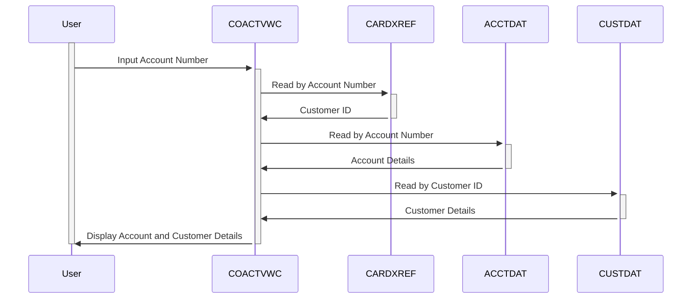

Gerado em: 2 de Outubro de 2024

**Título do Documento:** Sistema de Gerenciamento de Cartão de Crédito - Especificação da Funcionalidade de Visualização de Conta

**Descrição Resumida:**
Este documento descreve a funcionalidade "Visualização de Conta" dentro de um sistema de gerenciamento de cartão de crédito. Esta funcionalidade permite que usuários autorizados, como representantes de atendimento ao cliente, visualizem informações detalhadas sobre uma conta de cartão de crédito específica usando o número da conta.

**Histórias do Usuário:**
Como representante de atendimento ao cliente, preciso visualizar informações detalhadas sobre a conta do cartão de crédito de um cliente para que eu possa responder às suas perguntas e fornecer suporte.

**Épico Relacionado:**
2 - Gerenciamento de Conta

**Requisitos Técnicos:**

- **Processo de Visualização de Conta:** Esta funcionalidade recupera e exibe detalhes de uma conta de cartão de crédito com base no número da conta inserido.
  - Entrada do Usuário: O usuário insere o número da conta.
  - `Read Card Cross-Reference File (CARDXREF)`: Lê o arquivo `CARDXREF` usando o número da conta como chave para obter o ID do cliente.
  - `Read Account Data File (ACCTDAT)`: Lê o arquivo `ACCTDAT` usando o número da conta como chave para obter os detalhes da conta.
  - `Read Customer Data File (CUSTDAT)`: Lê o arquivo `CUSTDAT` usando o ID do cliente recuperado de `CARDXREF` para obter os detalhes do cliente.
  - Exibir Detalhes da Conta: Exibe os detalhes da conta e do cliente recuperados na tela.
  - Saída: Os detalhes da conta e do cliente são exibidos na tela.

**Modelos Relacionados**

- `Account`
  - `AccountNumber` `String`: Identificador único para uma conta de cartão de crédito.
  - `AccountStatus` `String`: Status da conta (por exemplo, Ativo, Fechado).
  - `CurrentBalance` `Decimal`: Saldo atual da conta.
  - `CreditLimit` `Decimal`: Limite máximo de crédito permitido na conta.
  - `AvailableCredit` `Decimal`: Valor do crédito atualmente disponível para uso.
  - `OpenDate` `Date`: Data em que a conta foi aberta.
  - `ExpirationDate` `Date`: Data de expiração do cartão de crédito.
- `Customer`
  - `CustomerID` `Integer`: Identificador exclusivo para um cliente.
  - `CustomerName` `String`: Nome completo do cliente.
  - `CustomerAddress` `String`: Endereço de cobrança do cliente.
  - `SSN` `String`: Número do Seguro Social do cliente.
  - `DOB` `Date`: Data de nascimento do cliente.
  - `FICOScore` `Integer`: Pontuação de crédito FICO do cliente.

**Configurações:**

- `COACTVWC.cbl`
  - `LIT-ACCTFILENAME`: `"ACCTDAT "`
	- Descrição: Nome do arquivo para o arquivo de dados da conta.
  - `LIT-CARDXREFNAME-ACCT-PATH`: `"CXACAIX "`
	- Descrição: Nome do arquivo para o arquivo de referência cruzada da conta.
  - `LIT-CUSTFILENAME`: `"CUSTDAT "`
	- Descrição: Nome do arquivo para o arquivo de dados do cliente.

**Melhorias de Código:**

- Implementar um mecanismo de tratamento de erros mais robusto. O tratamento de erros atual é básico e depende muito de mensagens codificadas. Uma abordagem mais estruturada, como o uso de um módulo centralizado de tratamento de erros, melhoraria a manutenção e a legibilidade do código.
- Introduzir uma estrutura de logging para capturar eventos e erros importantes. Isso ajudaria na solução de problemas e no monitoramento do sistema.
- Considere refatorar o código para extrair funcionalidades comuns em módulos reutilizáveis. Isso reduziria a duplicação de código e melhoraria a manutenção.
- Adicione comentários inline mais abrangentes para explicar a lógica e o propósito de diferentes seções de código.

**Melhorias de Segurança:**

- O programa acessa dados financeiros confidenciais, por isso é crucial implementar medidas de segurança robustas.
- **Autenticação e Autorização:** Garanta que apenas usuários autorizados possam acessar o programa e suas funcionalidades. Implemente um mecanismo de autenticação seguro e controle de acesso baseado em função (RBAC) para restringir o acesso com base em funções e privilégios do usuário.
- **Criptografia de Dados:** Criptografe dados confidenciais em trânsito e em repouso para protegê-los de acesso não autorizado. Use algoritmos de criptografia fortes e práticas seguras de gerenciamento de chaves.
- **Log de Auditoria:** Registre todas as ações do usuário e tentativas de acesso a dados para rastrear a atividade do sistema e detectar possíveis violações de segurança.

**Diagrama Conceitual:**

--Made by "Smart Engineering" (by Compass.UOL)--