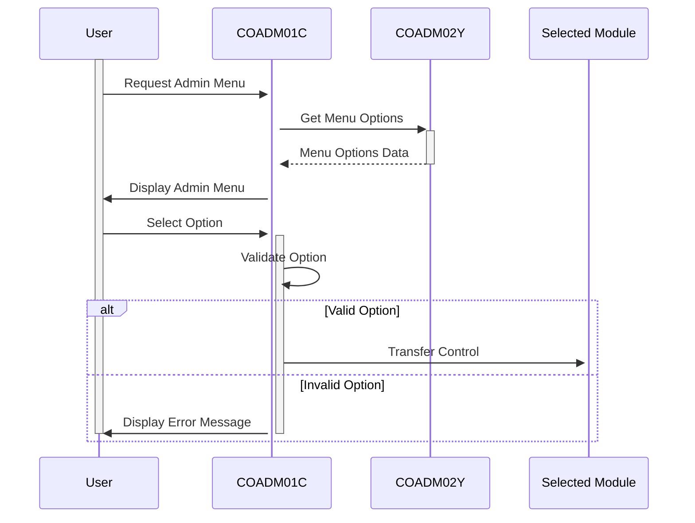

Gerado em: 2 de outubro de 2024

**Título do Documento:** Aplicativo CardDemo - Especificação do Menu Administrativo

**Descrição Resumida:** 
O Menu Administrativo do aplicativo CardDemo é um hub central projetado para pessoal autorizado, concedendo acesso a várias funções administrativas. Este menu simplifica as tarefas administrativas, fornecendo uma interface amigável para gerenciar usuários, gerar relatórios e lidar com outras operações confidenciais.

**Histórias do Usuário:**
Como administrador do sistema, preciso de um local centralizado para acessar e gerenciar funções administrativas, como gerenciamento de usuários e geração de relatórios, para manter o aplicativo CardDemo com eficiência.

**Épico Relacionado:** 6 - Gerenciamento de Usuários e Segurança

**Requisitos Técnicos:**
- **Exibir Opções do Menu Admin:** Exibe um menu gerado dinamicamente de opções administrativas, numeradas para facilitar a seleção.
  - Entrada: `CDEMO-ADMIN-OPT-COUNT` (de `COADM02Y.cbl`) determina o número de opções de menu a serem exibidas.
  - Processamento: Itera pelo array `CDEMO-ADMIN-OPT-NAME` (de `COADM02Y.cbl`) para recuperar o nome de exibição de cada opção.
  - Saída: O menu é exibido na tela com cada opção numerada e rotulada de acordo com o array `CDEMO-ADMIN-OPT-NAME`.
- **Processar Entrada do Usuário:** Recebe e processa a opção selecionada do menu pelo usuário.
  - Entrada: O usuário insere o número da opção escolhida.
  - Validação: Verifica se a entrada é numérica e está dentro do intervalo válido de opções (1 a `CDEMO-ADMIN-OPT-COUNT`).
  - Resultado: 
      - Se válido, o nome do programa correspondente de `CDEMO-ADMIN-OPT-PGMNAME` (de `COADM02Y.cbl`) é recuperado.
      - Se inválido, uma mensagem de erro é exibida, solicitando ao usuário que insira sua escolha novamente.
- **Transferir Controle para o Módulo Selecionado:** Transfere o controle para o módulo administrativo selecionado pelo usuário.
  - Entrada: O nome do programa do módulo selecionado de `CDEMO-ADMIN-OPT-PGMNAME` (de `COADM02Y.cbl`).
  - Processamento: O programa usa o comando CICS `XCTL` para transferir o controle para o programa especificado.
  - Saída: O módulo administrativo selecionado é carregado e exibido ao usuário.

**Modelos Relacionados**

- AdminMenuOptions: Representa uma opção do menu administrativo.
  - OptionNumber `Integer`: O número sequencial da opção exibida no menu.
  - OptionName `String`: O nome descritivo da função administrativa.
  - ProgramName `String`: O nome do programa COBOL responsável pela funcionalidade da opção.

**Configurações:**

- `COADM02Y.cbl`
  - `CDEMO-ADMIN-OPT-COUNT`: Representa o número total de opções do menu administrativo.
  - `CDEMO-ADMIN-OPT-PGMNAME`: Um array que armazena os nomes dos programas associados a cada opção do menu.
  - `CDEMO-ADMIN-OPT-NAME`: Um array que armazena os nomes de exibição de cada opção do menu.

**Melhorias de Código:**
- **Registro de Erros:** Implementar um mecanismo centralizado de registro de erros para registrar detalhes de quaisquer erros encontrados, incluindo o registro de data e hora, código de erro e informações de contexto relevantes. Isso ajudaria na depuração e monitoramento do sistema.
- **Limpeza de Entrada:** Embora o código verifique a entrada numérica, considere adicionar técnicas mais robustas de validação e limpeza de entrada para evitar possíveis vulnerabilidades de segurança, como injeção de SQL ou cross-site scripting, especialmente se o aplicativo evoluir para lidar com dados externos.
- **Modularidade do Código:** Explorar a refatoração do código extraindo tarefas específicas (como exibição de menu, validação de entrada, execução do programa) em sub-rotinas separadas. Isso aumentaria a legibilidade e a manutenção do código.
- **Documentação:** Incorpore comentários detalhados no código para explicar o propósito e a funcionalidade de diferentes seções, variáveis e lógica. Isso beneficiaria muito os futuros desenvolvedores encarregados de entender ou modificar o código.

**Melhorias de Segurança:**
- **Autenticação e Autorização:** Implementar um mecanismo robusto de autenticação e autorização para garantir que apenas pessoal autorizado possa acessar o Menu Administrativo. Isso pode envolver autenticação multifator, controle de acesso baseado em função (RBAC) e armazenamento seguro de senha.
- **Comunicação Segura:** Se o aplicativo se comunica com outros sistemas ou bancos de dados, certifique-se de que todos os canais de comunicação sejam protegidos usando protocolos como TLS/SSL para proteger dados confidenciais durante a transmissão.

**Diagrama Conceitual:**

--Made by "Smart Engineering" (by Compass.UOL)--