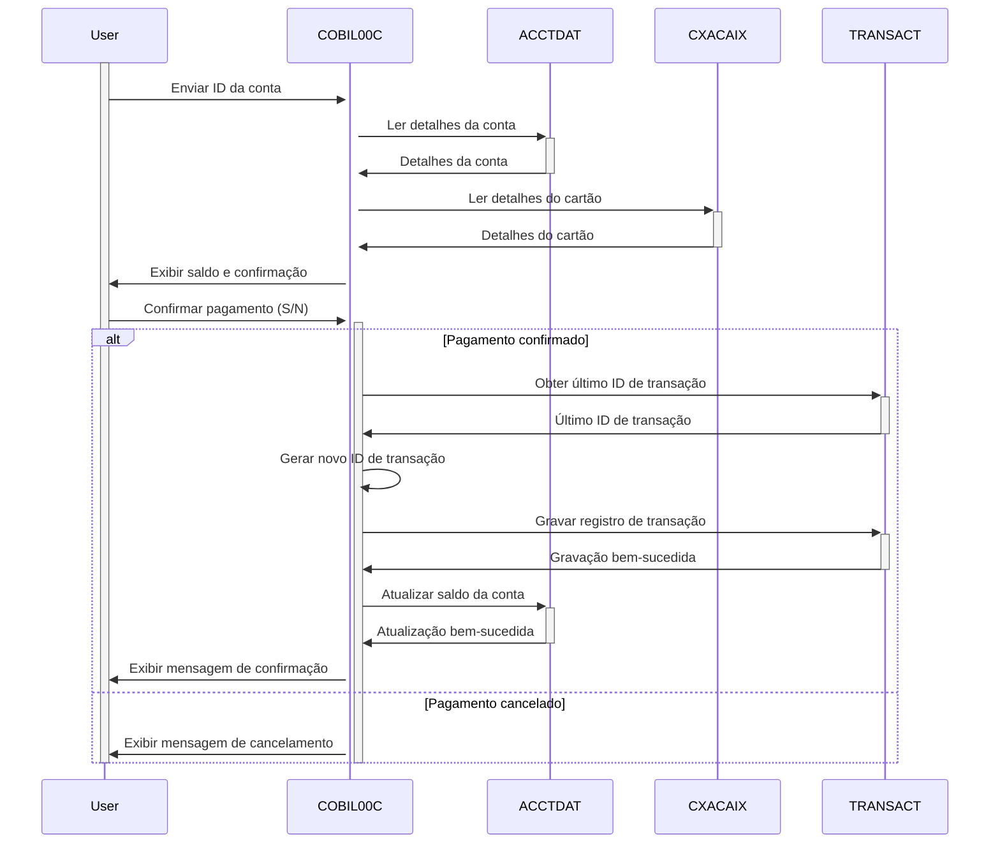

Gerado em: 2 de outubro de 2024

**Título do Documento:** CardDemo - Especificação de Pagamento de Fatura Online

**Descrição Resumida:**
Este documento descreve as especificações para a funcionalidade "Pagamento de Fatura Online" dentro do aplicativo CardDemo. Essa funcionalidade permite que os titulares de cartão de crédito paguem convenientemente o saldo devedor integralmente por meio de uma interface online. Este processo é perfeitamente integrado ao sistema central de gerenciamento de cartão de crédito, garantindo atualizações precisas de saldo e registro de transações.

**Histórias do Usuário:**
Como titular de um cartão de crédito, desejo poder pagar minha fatura online para que eu possa gerenciar minha conta com conveniência.

**Épico Relacionado:**
4 - Processamento de Transações

**Requisitos Técnicos:**
Este programa lida com pagamentos de faturas online para contas de cartão de crédito. Quando um cliente opta por pagar sua fatura online, esta parte do sistema entra em ação. Isso envolve validar a entrada do usuário, recuperar informações da conta, confirmar o pagamento, processar a transação, atualizar saldos de contas e gerar um ID de transação exclusivo para fins de auditoria.

- **Leitura de Dados da Conta**: Recupera os detalhes da conta, incluindo o saldo atual, do arquivo `ACCTDAT` com base no ID da conta fornecido pelo usuário.
  - Entrada: `ACTIDINI` da entrada do usuário.
  - Validação: O ID da conta é validado em relação ao arquivo `ACCTDAT`. Se o ID da conta não for encontrado, uma mensagem de erro será exibida ao usuário.
  - Resultado `ACCOUNT-RECORD`: Contém os detalhes da conta, como saldo e outras informações relevantes.
- **Leitura de Dados de Referência Cruzada**: Acessa o arquivo `CXACAIX` para recuperar o número do cartão associado ao ID da conta fornecido.
  - Entrada: `ACCT-ID` do `ACCOUNT-RECORD`.
  - Validação: Se a conta não for encontrada no arquivo `CXACAIX`, uma mensagem de erro será exibida.
  - Resultado `CARD-XREF-RECORD`: Contém o número do cartão vinculado à conta.
- **Geração de ID de Transação**: Gera um ID de transação exclusivo recuperando o último ID usado do arquivo `TRANSACT` e incrementando-o.
  - Entrada: `TRAN-ID` do último registro no arquivo `TRANSACT`.
  - Cálculo: Incrementa o `TRAN-ID` recuperado em 1 para criar um novo ID exclusivo.
  - Resultado `WS-TRAN-ID-NUM`: Um novo ID de transação exclusivo.
- **Registro de Transação**: Grava os detalhes da transação de pagamento da fatura no arquivo `TRANSACT`.
  - Entrada: `TRAN-RECORD` contendo detalhes da transação como `TRAN-ID`, `TRAN-TYPE-CD`, `TRAN-AMT`, `TRAN-CARD-NUM`, carimbo de data / hora e outras informações relevantes.
  - Validação: Verifica se há `TRAN-ID` duplicado para evitar erros. Se uma duplicata for encontrada, uma mensagem de erro será exibida.
  - Saída: Um novo registro é gravado no arquivo `TRANSACT` com os detalhes do pagamento da fatura.
- **Atualização do Saldo da Conta**: Atualiza o saldo da conta no arquivo `ACCTDAT` para refletir o pagamento da fatura.
  - Entrada: `ACCOUNT-RECORD` com o `ACCT-CURR-BAL` atualizado após a subtração do valor do pagamento.
  - Validação: Se a conta não for encontrada, uma mensagem de erro será exibida.
  - Saída: O arquivo `ACCTDAT` é atualizado com o novo saldo da conta.
- **Recuperação de Carimbo de Data / Hora**: Recupera o carimbo de data / hora atual do sistema para registrar a hora da transação.
  - Entrada: Nenhuma
  - Cálculo: Usa os comandos CICS `ASKTIME` e `FORMATTIME` para obter o carimbo de data / hora atual.
  - Resultado `WS-TIMESTAMP`: A data e hora atuais no formato especificado.
- **Inicialização de Dados de Tela**: Limpa os campos de entrada e redefine a mensagem de erro na tela.
  - Entrada: Nenhuma
  - Cálculo: Define os campos de entrada `ACTIDINI`, `CURBALI` e `CONFIRMI` para seus valores padrão e limpa o `WS-MESSAGE`.
  - Saída: Tela atualizada com campos de entrada limpos e mensagem de erro.

**Modelos Relacionados**
- `ACCOUNT-RECORD`
  - `ACCT-ID` `String`: Identificador exclusivo para a conta de um cliente.
  - `ACCT-CURR-BAL` `Decimal`: Saldo devedor atual na conta.
- `CARD-XREF-RECORD`
  - `XREF-ACCT-ID` `String`: ID da conta usado para referência cruzada com os detalhes do cartão.
  - `XREF-CARD-NUM` `String`: Número do cartão de crédito vinculado ao ID da conta.
- `TRAN-RECORD`
  - `TRAN-ID` `String`: Identificador exclusivo para cada transação.
  - `TRAN-TYPE-CD` `String`: Código especificando o tipo de transação (por exemplo, '02' para Pagamento de Fatura).
  - `TRAN-CAT-CD` `Integer`: Código que representa a categoria da transação.
  - `TRAN-SOURCE` `String`: Origem da transação (por exemplo, 'POS TERM', 'ONLINE').
  - `TRAN-DESC` `String`: Descrição da transação.
  - `TRAN-AMT` `Decimal`: Valor da transação.
  - `TRAN-CARD-NUM` `String`: Número do cartão de crédito associado à transação.
  - `TRAN-MERCHANT-ID` `Integer`: Identificador exclusivo para o comerciante envolvido na transação.
  - `TRAN-MERCHANT-NAME` `String`: Nome do comerciante associado à transação.
  - `TRAN-MERCHANT-CITY` `String`: Cidade do comerciante associado à transação.
  - `TRAN-MERCHANT-ZIP` `String`: CEP do comerciante associado à transação.
  - `TRAN-ORIG-TS` `Timestamp`: Timestamp indicando quando a transação foi iniciada.
  - `TRAN-PROC-TS` `Timestamp`: Timestamp indicando quando a transação foi processada.

**Configurações:**
- Valores Constantes
  - `WS-TRANSACT-FILE`: `"TRANSACT"`
	- Descrição: Nome do arquivo para o arquivo de dados de transação.
  - `WS-ACCTDAT-FILE`: `"ACCTDAT"`
	- Descrição: Nome do arquivo para o arquivo de dados da conta.
  - `WS-CXACAIX-FILE`: `"CXACAIX"`
	- Descrição: Nome do arquivo para o arquivo de dados de referência cruzada.
  - `BILLPAY-CONF-MSG`: `"PAGAMENTO DA FATURA PROCESSADO COM SUCESSO"`
	- Descrição: Mensagem exibida quando o pagamento da fatura é processado com sucesso.
  - `BILLPAY-ERRMSG-ZERO`: `"SALDO ZERO - NENHUM PAGAMENTO PROCESSADO"`
	- Descrição: Mensagem de erro para uma conta com saldo zero durante o pagamento da fatura.
  - `BILLPAY-ERRMSG-ACCT`: `"CONTA INVÁLIDA - NENHUM PAGAMENTO PROCESSADO"`
	- Descrição: Mensagem de erro exibida quando a conta é inválida e nenhum pagamento é processado.
- `COBIL00.CPY`
  - `CB0-ACCT-ID-C`: `4`
	- Descrição: Atributo de cor para o campo de ID da conta.
  - `CB0-ACCT-ID-P`: `0`
	- Descrição: Atributo de proteção para o campo de ID da conta.
  - `CB0-ACCT-ID-H`: `0`
	- Descrição: Atributo oculto para o campo de ID da conta.
  - `CB0-ACCT-ID-V`: `0`
	- Descrição: Atributo de validação para o campo de ID da conta.
  - `CB0-ACCT-ID-O`: `10`
	- Descrição: Posição de saída para o campo de ID da conta.
  - `CB0-ACCT-BAL-C`: `4`
	- Descrição: Atributo de cor para o campo de saldo da conta.
  - `CB0-ACCT-BAL-P`: `1`
	- Descrição: Atributo de proteção para o campo de saldo da conta.
  - `CB0-ACCT-BAL-H`: `0`
	- Descrição: Atributo oculto para o campo de saldo da conta.
  - `CB0-ACCT-BAL-V`: `0`
	- Descrição: Atributo de validação para o campo de saldo da conta.
  - `CB0-ACCT-BAL-O`: `10`
	- Descrição: Posição de saída para o campo de saldo da conta.
  - `CB0-CONFIRM-C`: `4`
	- Descrição: Atributo de cor para o campo de sinalizador de confirmação.
  - `CB0-CONFIRM-P`: `0`
	- Descrição: Atributo de proteção para o campo de sinalizador de confirmação.
  - `CB0-CONFIRM-H`: `0`
	- Descrição: Atributo oculto para o campo de sinalizador de confirmação.
  - `CB0-CONFIRM-V`: `0`
	- Descrição: Atributo de validação para o campo de sinalizador de confirmação.
  - `CB0-CONFIRM-O`: `1`
	- Descrição: Posição de saída para o campo de sinalizador de confirmação.
  - `CB0-ERRMSG-C`: `2`
	- Descrição: Atributo de cor para o campo de mensagem de erro.
  - `CB0-ERRMSG-P`: `1`
	- Descrição: Atributo de proteção para o campo de mensagem de erro.
  - `CB0-ERRMSG-H`: `0`
	- Descrição: Atributo oculto para o campo de mensagem de erro.
  - `CB0-ERRMSG-V`: `0`
	- Descrição: Atributo de validação para o campo de mensagem de erro.
  - `CB0-ERRMSG-O`: `60`
	- Descrição: Posição de saída para o campo de mensagem de erro.
  - `CB0-FKEYS-C`: `7`
	- Descrição: Atributo de cor para o campo de teclas de função.
  - `CB0-FKEYS-P`: `1`
	- Descrição: Atributo de proteção para o campo de teclas de função.
  - `CB0-FKEYS-H`: `0`
	- Descrição: Atributo oculto para o campo de teclas de função.
  - `CB0-FKEYS-V`: `0`
	- Descrição: Atributo de validação para o campo de teclas de função.
  - `CB0-FKEYS-O`: `80`
	- Descrição: Posição de saída para o campo de teclas de função.
- `COCOM01Y.cpy`
  - `CDEMO-CB00-TRNID-FIRST`: `""`
	- Descrição: Primeiro ID de Transação na lista.
  - `CDEMO-CB00-TRNID-LAST`: `""`
	- Descrição: Último ID de Transação na lista.
  - `CDEMO-CB00-PAGE-NUM`: `0`
	- Descrição: Número da página atual.
  - `CDEMO-CB00-NEXT-PAGE-FLG`: `"N"`
	- Descrição: Sinalizador indicando se há uma próxima página.
  - `CDEMO-CB00-TRN-SEL-FLG`: `""`
	- Descrição: Sinalizador indicando se uma transação está selecionada.
  - `CDEMO-CB00-TRN-SELECTED`: `""`
	- Descrição: ID da Transação selecionada.

**Melhorias de Código:**
- Implementar um mecanismo de tratamento de erros mais robusto que inclua o registro de erros em um arquivo ou banco de dados para fins de depuração.
- Usar uma biblioteca ou estrutura de validação de dados para simplificar e padronizar a validação das entradas do usuário, como IDs de conta e sinalizadores de confirmação.
- Considere o uso de um formatador de código para melhorar a legibilidade e a consistência do código.
- Adicionar comentários mais detalhados para explicar a lógica e o propósito de diferentes seções do código.
- Implementar uma interface mais amigável para exibir mensagens de erro e mensagens de confirmação, potencialmente usando caixas de diálogo modal ou dicas visuais.

**Melhorias de Segurança:**
- Criptografar dados confidenciais, como números de contas e detalhes de transações, tanto em trânsito quanto em repouso.
- Implementar mecanismos de controle de acesso para restringir o acesso não autorizado à funcionalidade de pagamento de faturas e dados confidenciais.
- Auditar regularmente o sistema em busca de vulnerabilidades de segurança e implementar patches ou atualizações necessárias.
- Considere o uso de uma ferramenta de teste de segurança para identificar e mitigar possíveis riscos à segurança.
- Implementar uma política de senha forte para contas de usuário e impor alterações regulares de senha.

**Diagrama Conceitual:**

--Made by "Smart Engineering" (by Compass.UOL)--