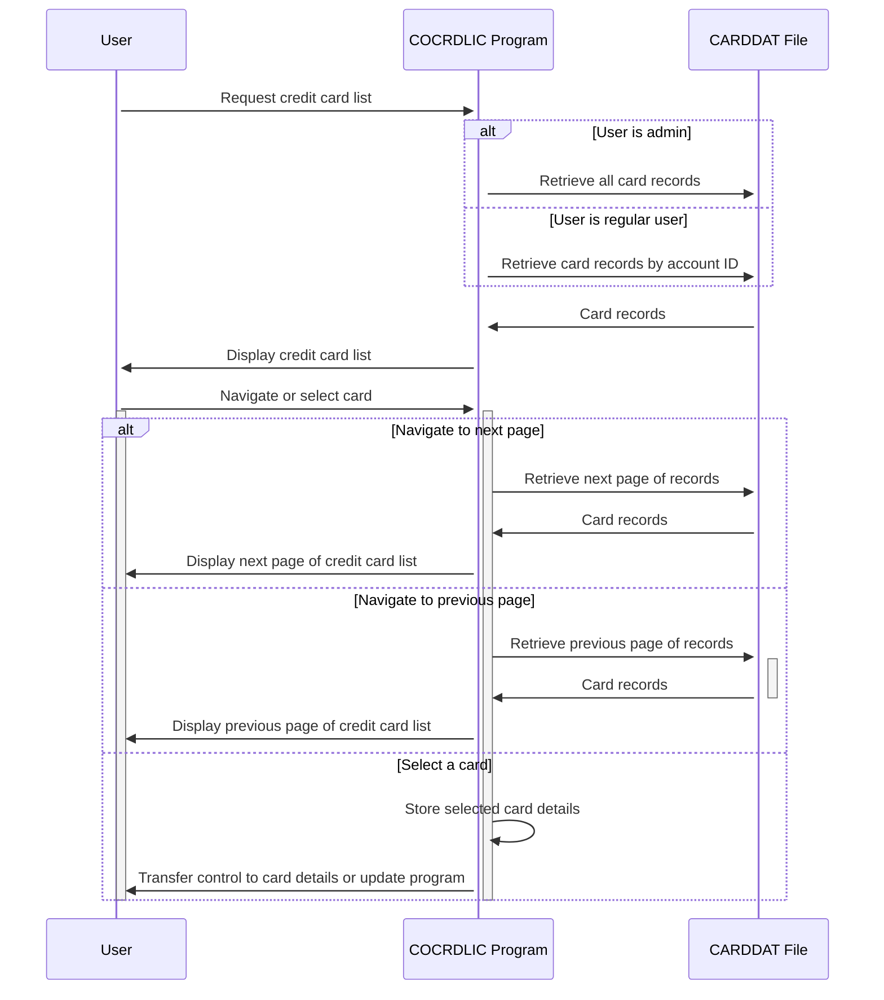

Gerado em: 2 de outubro de 2024

**Título do Documento:** Especificação de Exibição e Navegação da Lista de Cartões de Crédito

**Descrição Resumida:**
O programa `COCRDLIC.cbl` exibe uma lista de cartões de crédito para o usuário, permitindo a navegação e seleção de cartões individuais. O programa recupera dados de um arquivo VSAM chamado `CARDDAT` e os apresenta em um formato paginado. Os usuários podem filtrar a lista por ID de conta e número do cartão e podem navegar pelas páginas usando teclas de função.

**Histórias do Usuário:**
Como administrador de cartão de crédito, desejo visualizar uma lista de todos os cartões de crédito no sistema para que eu possa gerenciá-los de forma eficaz.
Como um usuário comum, desejo visualizar uma lista de cartões de crédito associados à minha conta para que eu possa revisar os detalhes do meu cartão.

**Épico Relacionado:** 3 - Gerenciamento de Cartão de Crédito

**Requisitos Técnicos:**

- **Exibir Lista de Cartões de Crédito:** Este método exibe uma lista de cartões de crédito com base na função do usuário e em quaisquer filtros aplicados.
  - Entrada: Função do usuário (administrador ou usuário comum), ID da conta (opcional), número do cartão (opcional)
  - Regra de Negócio: Se o usuário for um administrador, exiba todos os cartões. Se o usuário for um usuário comum, exiba apenas os cartões associados ao ID da conta fornecido.
  - Processamento: Recupere dados do arquivo `CARDDAT`, filtrando por ID da conta e número do cartão, se fornecidos.
  - Resultado `{Array de Registros de Cartão}`: Retorna um array de registros de cartão de crédito a serem exibidos na tela.
  - Saída: Exibe os cartões de crédito em um formato paginado, permitindo que o usuário navegue pelas páginas usando as teclas de função `F7` (Página Anterior) e `F8` (Próxima Página).

- **Filtrar Registros de Cartão de Crédito:** Este método filtra os registros de cartão de crédito com base no ID da conta e/ou número do cartão fornecidos.
  - Entrada: Estrutura `CARD-RECORD`, `CC-ACCT-ID`, `CC-CARD-NUM-N`
  - Regra de Negócio: Se o ID da conta for fornecido, exclua os registros que não corresponderem ao ID da conta. Se o número do cartão for fornecido, exclua os registros que não corresponderem ao número do cartão.
  - Processamento: Compare o ID da conta e o número do cartão do `CARD-RECORD` com os valores de filtro fornecidos.
  - Resultado `WS-DONOT-EXCLUDE-THIS-RECORD` `{Boolean}`: Defina como `TRUE` se o registro deve ser incluído, `FALSE` caso contrário.

- **Ler Registros de Cartão de Crédito para Frente:** Este método lê os registros de cartão de crédito do arquivo `CARDDAT` em uma direção para frente, começando da chave fornecida.
  - Entrada: `WS-CARD-RID-CARDNUM`
  - Processamento: Inicie uma operação de navegação no arquivo `CARDDAT` usando o número do cartão fornecido como chave. Leia os registros sequencialmente até que o tamanho máximo da tela seja atingido ou o final do arquivo seja encontrado.
  - Saída: Preenche o array `WS-SCREEN-DATA` com os registros de cartão de crédito recuperados. Atualiza as variáveis `WS-CA-FIRST-CARD-NUM`, `WS-CA-LAST-CARD-NUM`, `WS-CA-FIRST-CARD-ACCT-ID` e `WS-CA-LAST-CARD-ACCT-ID` para rastrear os registros exibidos para fins de navegação.

- **Ler Registros de Cartão de Crédito para Trás:** Este método lê os registros de cartão de crédito do arquivo `CARDDAT` em uma direção para trás, começando da chave fornecida.
  - Entrada: `WS-CARD-RID-CARDNUM`
  - Processamento: Inicie uma operação de navegação no arquivo `CARDDAT` usando o número do cartão fornecido como chave. Leia os registros em ordem inversa até que o tamanho máximo da tela seja atingido ou o início do arquivo seja encontrado.
  - Saída: Preenche o array `WS-SCREEN-DATA` com os registros de cartão de crédito recuperados. Atualiza as variáveis `WS-CA-FIRST-CARD-NUM`, `WS-CA-LAST-CARD-NUM`, `WS-CA-FIRST-CARD-ACCT-ID` e `WS-CA-LAST-CARD-ACCT-ID` para rastrear os registros exibidos para fins de navegação.

**Modelos Relacionados**

- `CARD-RECORD`
  - `CARD-NUM` `{String}`: Número do cartão de crédito.
  - `CARD-ACCT-ID` `{String}`: ID da conta associada ao cartão de crédito.
  - `CARD-ACTIVE-STATUS` `{String}`: Status do cartão de crédito (Ativo ou Inativo).

**Configurações:**

- `COCRDLIC.cbl`
  - `CARDS-PER-PAGE`: `10`
	- Descrição: Número de cartões exibidos por página.
  - `MAX-CARDS`: `9999`
	- Descrição: Número máximo de cartões de crédito.
- Valores Constantes
  - `LIT-CARD-FILE`: `"CARDDAT "`
	- Descrição: Nome do arquivo VSAM que contém os dados do cartão de crédito.
  - `LIT-CARD-FILE-ACCT-PATH`: `"CARDAIX "`
	- Descrição: Caminho para o índice alternativo para o arquivo `CARDDAT`, provavelmente usado para recuperação eficiente por ID de conta.
  - `WS-MAX-SCREEN-LINES`: `7`
	- Descrição: Número máximo de registros de cartão de crédito exibidos em uma única página.

**Melhorias de Código:**

- Implementar uma abordagem mais estruturada para o tratamento de erros, usando uma rotina centralizada de tratamento de erros para gerenciar diferentes condições de erro.
- Melhorar a legibilidade do código usando nomes de variáveis significativos e comentários para explicar a lógica complexa.
- Considere o uso de uma camada de acesso a dados para abstrair a interação com o arquivo VSAM, melhorando a manutenção e capacidade de teste do código.
- Explore técnicas de otimização de desempenho, como o uso de um algoritmo de classificação mais eficiente ou armazenamento em cache de dados acessados com frequência.

**Melhorias de Segurança:**

- Implementar validação de entrada para evitar ataques de injeção e garantir a integridade dos dados.
- Criptografar dados confidenciais, como números de cartão de crédito, tanto no armazenamento quanto durante a transmissão.
- Implementar o registro de auditoria para rastrear ações do usuário e eventos do sistema para fins de segurança e conformidade.
- Revisar e fortalecer os mecanismos de controle de acesso para garantir que apenas pessoal autorizado possa acessar dados confidenciais.

**Diagrama Conceitual:**

--Made by "Smart Engineering" (by Compass.UOL)--