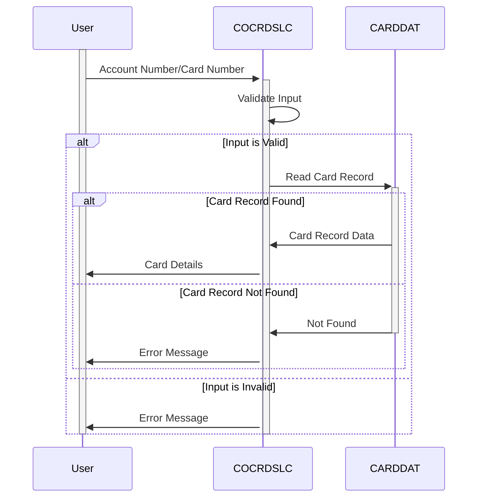

Gerado em: 2 de outubro de 2024

**Título do Documento:** Programa de Recuperação de Detalhes de Cartão de Crédito

**Descrição Resumida:**
O programa de Recuperação de Detalhes de Cartão de Crédito permite que representantes de atendimento ao cliente acessem informações detalhadas do cartão de crédito usando o número da conta ou o número do cartão. Ele garante a segurança dos dados validando as entradas do usuário antes de acessar informações confidenciais.

**Histórias do Usuário:**
Como um representante de atendimento ao cliente, preciso ser capaz de acessar de forma rápida e fácil as informações detalhadas do cartão de crédito de nossos clientes, para que eu possa auxiliá-los em suas consultas.

**Épico Relacionado:** 3 - Gestão de Cartão de Crédito

**Requerimentos Técnicos:**
- **Inicialização da Tela**:
  - Nome da Etapa: Inicializar campos da tela.
  - Resultado: O programa inicializa os campos da tela com valores padrão, como título, nome do programa, data e hora.
  - Resultado `CCRDSLAO`: Estrutura de dados da tela com valores inicializados.
- **Configuração de Variáveis de Tela**:
  - Nome da Etapa: Configurar variáveis de tela com base no contexto do programa e dados de entrada.
  - Resultado `CCRDSLAO`: Estrutura de dados da tela com valores apropriados para número da conta, número do cartão e outros detalhes.
- **Configuração de Atributos de Tela**:
  - Nome da Etapa: Configurar atributos de tela com base nos resultados da validação.
  - Resultado `CCRDSLAI`: Estrutura de dados de entrada da tela com os atributos apropriados definidos (por exemplo, proteção, cor, posição do cursor).
- **Enviar Tela**:
  - Nome da Etapa: Exibir a tela para o usuário.
  - Resultado: O programa envia o mapa de tela `CCRDSLAO` para o terminal do usuário.
- **Receber Entrada**:
  - Nome da Etapa: Recuperar a entrada do usuário na tela.
  - Resultado: O programa recebe a entrada do usuário do mapa de tela `CCRDSLAI`.
- **Editar Entrada**:
  - Nome da Etapa: Validar a entrada do usuário para números de conta e cartão.
  - Resultado `WS-RETURN-MSG`: Mensagem de erro se a validação falhar.
- **Editar Número da Conta**:
  - Nome da Etapa: Verificar se o número da conta é válido (numérico e 11 dígitos).
  - Resultado `WS-RETURN-MSG`: Mensagem de erro se a validação falhar, por exemplo, `O número da conta deve ser um número de 11 dígitos diferente de zero`.
- **Editar Número do Cartão**:
  - Nome da Etapa: Verificar se o número do cartão é válido (numérico e 16 dígitos).
  - Resultado `WS-RETURN-MSG`: Mensagem de erro se a validação falhar, por exemplo, `O número do cartão, se fornecido, deve ter 16 dígitos`.
- **Ler Dados do Cartão**:
  - Nome da Etapa: Recuperar dados do cartão com base no número da conta ou número do cartão.
  - Resultado `CARD-RECORD`: O programa lê o arquivo `CARDDAT` usando o número do cartão como chave e recupera o registro do cartão correspondente.
- **Obter Cartão por Conta e Número do Cartão**:
  - Nome da Etapa: Pesquisar no banco de dados `CARDDAT` usando o número do cartão fornecido.
  - Resultado `CARD-RECORD`: Se um registro correspondente for encontrado, os detalhes do cartão serão armazenados em `CARD-RECORD`. Caso contrário, defina `DID-NOT-FIND-ACCTCARD-COMBO` como `TRUE`.
- **Obter Cartão por Conta**:
  - Nome da Etapa: Este método não é usado na versão atual. Ele sugere funcionalidade futura para pesquisar por número de conta.
  - Resultado: Não aplicável na versão atual.
- **Enviar Texto Longo**:
  - Nome da Etapa: Enviar uma mensagem de texto longa ao usuário (provavelmente para depuração).
  - Resultado: O programa envia o conteúdo de `WS-LONG-MSG` para o terminal do usuário.
- **Enviar Texto Simples**:
  - Nome da Etapa: Enviar uma mensagem de texto simples ao usuário (provavelmente para depuração).
  - Resultado: O programa envia o conteúdo de `WS-RETURN-MSG` para o terminal do usuário.
- **Manipulador de Término Anormal**:
  - Nome da Etapa: Lidar com términos anormais do programa.
  - Resultado: O programa envia uma mensagem de erro ao usuário, registra as informações de erro e encerra o programa.

**Modelos Relacionados**
- `WS-CARD-RID`
  - `WS-CARD-RID-CARDNUM` `X(16)`: Número do Cartão de Crédito (16 caracteres)
  - `WS-CARD-RID-ACCT-ID` `9(11)`: Número da Conta (11 dígitos)
- `CARD-RECORD`
  - `CARD-ACCT-ID-N` `9(11)`: Número da Conta (11 dígitos)
  - `CARD-CVV-CD-N` `9(03)`: Valor de Verificação do Cartão (3 dígitos)
  - `CARD-CARD-NUM-N` `9(16)`: Número do Cartão de Crédito (16 dígitos)
  - `CARD-NAME-EMBOSSED-X` `X(50)`: Nome do Titular do Cartão (50 caracteres)
  - `CARD-STATUS-X` `X`: Status do Cartão (1 caractere)
  - `CARD-EXPIRAION-DATE-N` `9(10)`: Data de Validade do Cartão (10 dígitos)

**Configurações:**
- Valores Constantes
  - `LIT-CARDFILENAME`: `"CARDDAT "`
	- Descrição: Nome do arquivo do banco de dados do cartão de crédito.
  - `LIT-CARDFILENAME-ACCT-PATH`: `"CARDAIX "`
	- Descrição: Nome do caminho do índice alternativo para pesquisa por número de conta.
  - `WS-PROMPT-FOR-ACCT`: `"Número da conta não fornecido"`
	- Descrição: Mensagem exibida quando o número da conta não é fornecido.
  - `WS-PROMPT-FOR-CARD`: `"Número do cartão não fornecido"`
	- Descrição: Mensagem exibida quando o número do cartão não é fornecido.
  - `DID-NOT-FIND-ACCTCARD-COMBO`: `"Cartões não encontrados para esta condição de pesquisa"`
	- Descrição: Mensagem exibida quando nenhum cartão correspondente é encontrado para a combinação de número de conta e número do cartão fornecida.
  - `DID-NOT-FIND-ACCT-IN-CARDXREF`: `"Esta conta não foi encontrada no banco de dados de cartões"`
	- Descrição: Mensagem exibida quando a conta não é encontrada no banco de dados de cartão.
- COCRDSLC.cbl
  - `CARDS-PER-PAGE`: `10`
	- Descrição: Número de cartões a serem exibidos por página.

**Melhorias de Código:**
- Melhorar o Tratamento de Erros: O programa usa mensagens de erro genéricas em alguns casos. Implemente mensagens de erro mais específicas com base no tipo de erro encontrado.
- Modularidade do Código: Divida o programa em módulos menores e mais gerenciáveis para melhor legibilidade e manutenção.
- Usar Estruturas de Dados: Defina estruturas de dados para representar os dados de entrada e saída para melhor organização e clareza.
- Parametrizar Nomes de Arquivo: Em vez de codificar nomes de arquivo, use parâmetros de configuração para melhor flexibilidade.
- Registro em Log: Implemente um mecanismo de registro em log para capturar eventos importantes e erros para fins de depuração e auditoria.
- Otimização de Desempenho: Analise o desempenho do programa e identifique áreas para otimização, como reduzir as operações de E/S ou melhorar o acesso ao banco de dados.

**Melhorias de Segurança:**
- Limpeza de Entrada: Implemente a limpeza de entrada para evitar injeção de SQL e outras vulnerabilidades de segurança.
- Autenticação e Autorização: Integre com um sistema de segurança para autenticar usuários e autorizar o acesso a dados confidenciais.
- Criptografia: Criptografe dados confidenciais, como números de cartão e códigos CVV, tanto no armazenamento quanto durante a transmissão.
- Registro em Log Seguro: Garanta que os logs sejam armazenados com segurança e contenham apenas as informações necessárias para evitar o vazamento de dados confidenciais.
- Avaliações Regulares de Segurança: Conduza avaliações regulares de segurança para identificar e resolver potenciais vulnerabilidades.

**Diagrama Conceitual:**

--Made by "Smart Engineering" (by Compass.UOL)--