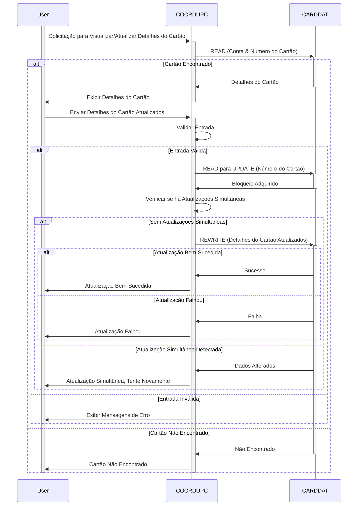

Gerado em: 2 de outubro de 2024

**Título do Documento:** Especificação do Programa de Atualização de Detalhes do Cartão de Crédito

**Descrição Resumida:**
Este programa fornece uma interface online CICS para atualização de detalhes do cartão de crédito. Ele permite que pessoal autorizado visualize e modifique informações do cartão de crédito com segurança. Ele interage com um Arquivo de Dados do Cartão, permitindo que os usuários recuperem, modifiquem e salvem informações do cartão, enfatizando a validação de dados e o tratamento de erros.

**Histórias do Usuário:**
Como um usuário autorizado, preciso ser capaz de visualizar e atualizar os detalhes do cartão de crédito para que eu possa manter as informações do cliente precisas.

**Épico Relacionado:**
3 - Gerenciamento de Cartão de Crédito

**Requisitos Técnicos:**
Este programa lida com solicitações do usuário, valida dados, interage com o banco de dados, garante que as alterações sejam aplicadas com segurança e fornece feedback ao usuário.

- **Recuperar Detalhes do Cartão**: Recupera informações do cartão de crédito do banco de dados com base nos números de conta e cartão fornecidos.
  - Entrada: `CC-ACCT-ID-N` `{Numeric(11)}` e `CC-CARD-NUM-N` `{Numeric(16)}` do arquivo `CARDDAT`.
  - Processamento: Lê o arquivo `CARDDAT` usando o comando `READ` com `RIDFLD` definido como `WS-CARD-RID-CARDNUM`, que contém o número do cartão de entrada.
  - Saída: Preenche a estrutura `CARD-RECORD` com os detalhes do cartão recuperados, se encontrados.
- **Validação de Entrada**: Valida a entrada do usuário para erros e inconsistências.
  - Entrada: Dados dos campos do mapa `CCRDUPAI` (`ACCTSIDI`, `CARDSIDI`, `CRDNAMEI`, `CRDSTCDI`, `EXPDAYI`, `EXPMONI`, `EXPYEARI`).
  - Regras de Validação: 
    - Número da Conta: Deve ser numérico e ter 11 dígitos.
    - Número do Cartão: Deve ser numérico e ter 16 dígitos.
    - Nome do Titular do Cartão: Pode conter apenas letras e espaços.
    - Data de Validade: Deve ser uma data válida no futuro (validada pelas condições `VALID-MONTH` e `VALID-YEAR`).
    - Status do Cartão: Deve ser 'Y' ou 'N' (validado pela condição `FLG-YES-NO-VALID`).
  - Saída: Define sinalizadores apropriados (`WS-EDIT-ACCT-FLAG`, `WS-EDIT-CARD-FLAG`, `WS-EDIT-CARDNAME-FLAG`, `WS-EDIT-CARDSTATUS-FLAG`, `WS-EDIT-CARDEXPMON-FLAG`, `WS-EDIT-CARDEXPYEAR-FLAG`, `WS-RETURN-FLAG`) e mensagens de erro (`WS-RETURN-MSG`) com base nos resultados da validação.
- **Atualizar Detalhes do Cartão**: Atualiza o registro correspondente no banco de dados se a entrada for válida.
  - Entrada: Detalhes validados do cartão da estrutura `CCUP-NEW-DETAILS`.
  - Processamento: Lê o arquivo `CARDDAT` para atualização usando o comando `READ` com a opção `UPDATE`.
  - Mecanismo de Bloqueio: Usa bloqueio implícito CICS durante a `READ` com `UPDATE` para evitar atualizações simultâneas.
  - Saída: Reescreve o `CARD-RECORD` atualizado no arquivo `CARDDAT` usando o comando `REWRITE`.
- **Confirmação e Feedback**: Fornece feedback ao usuário, confirmando se a atualização foi bem-sucedida ou se ocorreu algum erro.
  - Entrada: Códigos de resposta (`WS-RESP-CD`, `WS-REAS-CD`) dos comandos de E/S de arquivo CICS.
  - Processamento: Verifica os códigos de resposta para sucesso (`DFHRESP(NORMAL)`) ou condições de erro específicas (`DFHRESP(NOTFND)`, etc.).
  - Saída: Define mensagens apropriadas (`WS-INFO-MSG`, `WS-RETURN-MSG`) com base no resultado da operação de atualização. Essas mensagens são exibidas no mapa `CCRDUPAO`.

**Modelos Relacionados**
- `CARD-RECORD`
  - `CARD-ACCT-ID` `{Numeric(11)}`: Número da conta associado ao cartão de crédito.
  - `CARD-CARD-NUM` `{Numeric(16)}`: Número do cartão de crédito.
  - `CARD-CVV-CD` `{Numeric(3)}`: Código de Verificação do Cartão (CVV).
  - `CARD-EMBOSSED-NAME` `{Alphanumeric(50)}`: Nome do titular do cartão como está gravado no cartão.
  - `CARD-EXPIRAION-DATE` `{Alphanumeric(10)}`: Data de validade do cartão de crédito (MM/AA).
  - `CARD-ACTIVE-STATUS` `{Alphanumeric(1)}`: Status do cartão (por exemplo, 'Y' para ativo, 'N' para inativo).

**Configurações:**
- Valores constantes
  - `LIT-CARDFILENAME`: `"CARDDAT "`
	- Descrição: Nome do arquivo para o arquivo de dados do cartão de crédito.
- `COCRDUP.CPY`
  - `TRNNAMEA`: `"Atualização de Conta   "`
	- Descrição: Título da tela para a função de Atualização de Conta.
  - `TITLE01A`: `"Atualização de Detalhes do Cartão de Crédito"`
	- Descrição: Título da tela de Atualização de Detalhes do Cartão de Crédito.
  - `PGMNAMEA`: `"COCRDUPC"`
	- Descrição: Nome do programa para Atualização de Detalhes do Cartão de Crédito.
  - `TITLE02A`: `"Digite Todos os Campos"`
	- Descrição: Instrução para o usuário inserir todos os campos.
  - `INFOMSGA`: `"Digite todos os dados e pressione ENTER"`
	- Descrição: Mensagem exibida ao usuário, solicitando que ele insira os dados e pressione Enter.
  - `ERRMSGA`: `"Entrada Inválida, digite novamente"`
	- Descrição: Mensagem de erro exibida ao usuário em caso de entrada inválida.

**Melhorias de Código:**
- **Tratamento de Erros**: O tratamento de erros do programa pode ser mais abrangente. Ele depende da configuração de sinalizadores e mensagens, o que pode não ser suficiente para todas as condições de erro. Implemente um mecanismo de tratamento de erros mais robusto que inclua o registro de erros em um arquivo ou banco de dados para análise posterior.
- **Documentação**: O código não possui comentários suficientes para explicar a lógica e o propósito de várias seções. Adicione comentários mais detalhados para melhorar a legibilidade e a manutenção do código.
- **Modularidade**: Algumas seções do código podem ser divididas em módulos menores e mais reutilizáveis. Por exemplo, a lógica de validação de entrada pode ser separada em sub-rotinas individuais para cada campo, tornando o código mais organizado e fácil de modificar.

**Melhorias de Segurança:**
- **Autenticação e Autorização**: O programa não inclui explicitamente verificações de autenticação ou autorização. É crucial integrar medidas de segurança para verificar a identidade do usuário e garantir que apenas pessoal autorizado possa acessar e modificar informações confidenciais do cartão de crédito.
- **Criptografia de Dados**: Dados confidenciais, como números de cartão de crédito e códigos CVV, devem ser criptografados tanto no armazenamento quanto durante a transmissão para evitar acesso não autorizado.

**Diagrama Conceitual:**

--Made by "Smart Engineering" (by Compass.UOL)--