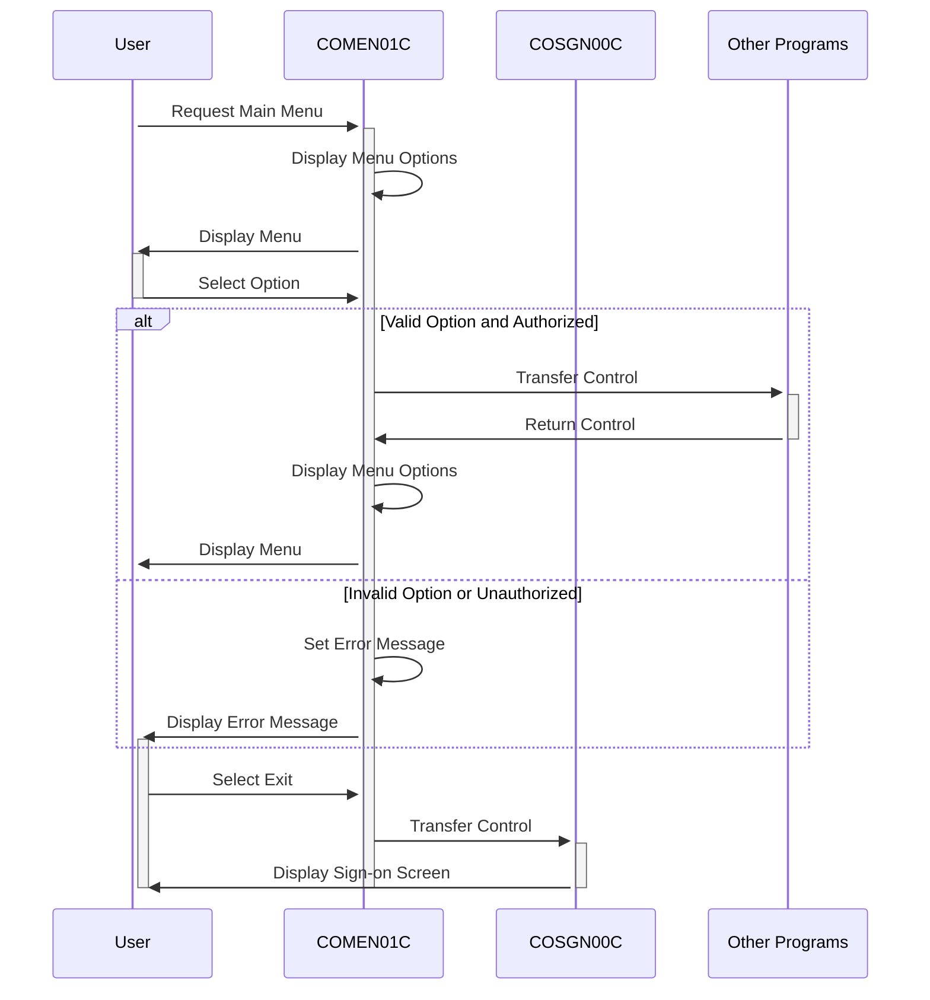

Gerado em: 2 de outubro de 2024

**Título do Documento:** Especificação do Programa de Menu Principal do Aplicativo CardDemo

**Descrição Resumida:**
O programa `COMEN01C` é o menu principal para usuários regulares do aplicativo CardDemo. Ele apresenta um menu de opções, captura a entrada do usuário, valida a entrada e, em seguida, transfere o controle para o programa apropriado com base na opção selecionada.

**Histórias do Usuário:**
Como um usuário regular, quero que seja apresentado um menu de opções para que eu possa navegar facilmente pelo aplicativo CardDemo e executar ações relacionadas à minha conta.

**Épico Relacionado:**
6 - Gerenciamento de Usuários e Segurança

**Requisitos Técnicos:**

- Exibir Opções do Menu: Este método cria e exibe dinamicamente as opções do menu com base no tipo de usuário.
  - Entrada: Tipo de usuário de `CDEMO-USRTYP-USER`.
  - Processo: Itera pelas opções `CDEMO-MENU-OPT-COUNT`. Cria uma string de menu com o número da opção e o nome de `CDEMO-MENU-OPT-NUM` e `CDEMO-MENU-OPT-NAME`. A string do menu é exibida na tela com base no índice da opção.
  - Saída: Exibição das opções do menu na tela.
- Processar Entrada do Usuário: Este método processa a seleção do menu do usuário, validando a entrada e transferindo o controle para o programa selecionado.
  - Entrada: Entrada do usuário de `OPTIONI` de `COMEN1AI`.
  - Validações:
    - Verifica se a entrada é numérica.
    - Verifica se a entrada está dentro do intervalo de opções disponíveis.
    - Verifica se o usuário está autorizado a acessar a opção selecionada com base no tipo de usuário de `CDEMO-USRTYP-USER` e `CDEMO-MENU-OPT-USRTYPE`.
  - Processo: Se válido, transfere o controle para o programa correspondente especificado em `CDEMO-MENU-OPT-PGMNAME`.
  - Saída: Transferência do controle para o programa selecionado ou exibição de uma mensagem de erro.
- Retornar à Tela de Login: Este método retorna o usuário à tela de login.
  - Entrada: Nenhuma.
  - Processo: Transfere o controle para o programa `COSGN00C`.
  - Saída: Transferência do controle para a tela de login.
- Enviar Tela do Menu: Este método exibe a tela do menu principal para o usuário.
  - Entrada: Dados para informações do cabeçalho de `COTTL01Y` e `CSDAT01Y`. Mensagem de erro de `WS-MESSAGE`.
  - Processo: Preenche o cabeçalho da tela com título, nome do programa, data e hora. Exibe as opções do menu criadas. Exibe quaisquer mensagens de erro.
  - Saída: Exibição da tela do menu principal.
- Receber Tela do Menu: Este método recebe a entrada do usuário na tela do menu.
  - Entrada: Entrada do usuário na tela.
  - Processo: Captura a opção selecionada pelo usuário e quaisquer códigos de resposta da tela.
  - Saída: Entrada do usuário armazenada em `COMEN1AI`.
- Preencher Informações do Cabeçalho: Este método preenche as informações do cabeçalho da tela do menu.
  - Entrada: Data e hora de `CSDAT01Y`.
  - Processo: Recupera a data e hora atuais. Formata a data e hora para exibição.
  - Saída: Informações do cabeçalho preenchidas na tela.

**Modelos Relacionados**

- `CDEMO-MENU-OPT`: Descreve as propriedades de uma opção de menu.
  - `CDEMO-MENU-OPT-NUM` `String`: O número exibido para a opção do menu.
  - `CDEMO-MENU-OPT-NAME` `String`: O nome descritivo da opção do menu.
  - `CDEMO-MENU-OPT-PGMNAME` `String`: O nome do programa associado à opção do menu.
  - `CDEMO-MENU-OPT-USRTYPE` `String`: O tipo de usuário com permissão para acessar a opção do menu.

**Configurações:**

- `COMEN01C.cbl`
  - `WS-USRSEC-FILE`: `"USRSEC  "`
	- Descrição: Nome do arquivo para o arquivo de segurança do usuário.
- `COMEN02Y.cpy`
  - `CDEMO-MENU-OPT`: `6`
	- Descrição: Número de opções do menu.
- `COTTL01Y.cpy`
  - `CCDA-TITLE01`: `"CREDIT CARD DEMO APPLICATION"`
	- Descrição: Título principal do aplicativo.
  - `CCDA-TITLE02`: `"MAIN MENU"`
	- Descrição: Título para a tela do menu principal.
- `CSMSG01Y.cpy`
  - `CCDA-MSG-INVALID-KEY`: `"Invalid Key Pressed"`
	- Descrição: Mensagem exibida quando uma tecla inválida é pressionada.

**Melhorias de Código:**
- Tratamento de Erros: Implementar um mecanismo de tratamento de erros mais robusto, incluindo o registro de erros em um arquivo e a exibição de mensagens de erro mais amigáveis ao usuário.
- Documentação: Adicionar mais comentários ao código para explicar a lógica e o propósito de cada seção.
- Desempenho: Considerar a otimização do loop que constrói as opções do menu para melhorar o desempenho, especialmente se houver um grande número de opções.
- Experiência do Usuário: Aprimorar a interface do usuário fornecendo opções de menu mais descritivas e usando uma linguagem mais clara nas mensagens de erro.

**Melhorias de Segurança:**
- Autenticação do Usuário: Garantir que a autenticação do usuário seja realizada antes de acessar o menu principal.
- Autorização: Implementar controle de acesso baseado em função para restringir o acesso às opções do menu com base nas funções do usuário.
- Validação de Entrada: Limpar a entrada do usuário para evitar ataques de injeção.
- Registro: Registrar todas as ações do usuário e eventos do sistema para fins de auditoria.

**Diagrama Conceitual:**

--Made by "Smart Engineering" (by Compass.UOL)--