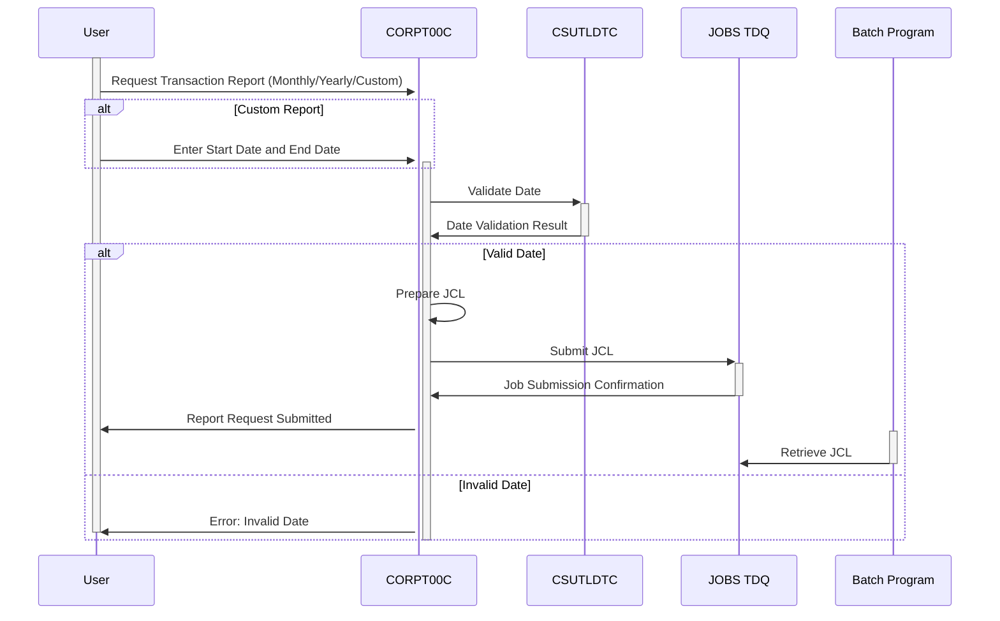

Gerado em: 2 de outubro de 2024

**Título do Documento: CardDemo Envio de Relatório de Transação - Especificação do Programa**

**Descrição Resumida:**
Esta especificação detalha o programa `CORPT00C` dentro do aplicativo CardDemo, projetado para facilitar o envio de trabalhos em lote para gerar relatórios de transações. Os usuários podem escolher entre três tipos de relatório: Mensal, Anual ou Personalizado, especificando um intervalo de datas para o último. O programa valida as entradas do usuário, prepara instruções de trabalho (JCL) e envia o trabalho para uma fila para processamento assíncrono por um programa em lote. Após o envio bem-sucedido, o usuário recebe uma mensagem de confirmação.

**Histórias do Usuário:**
Como analista de negócios, preciso gerar relatórios abrangentes de transações de cartão de crédito para períodos específicos (mensal, anual ou intervalos de datas personalizados) para analisar tendências e padrões no comportamento do cliente.

**Épico Relacionado:**
5 - Relatórios e Análise

**Requisitos Técnicos:**

- **Tratamento da Interface do Usuário:** Este método interage com o CICS para exibir telas, receber entrada do usuário e enviar respostas.
  - Entrada: Entrada do usuário a partir da tela (`CORPT0A`)
  - Saída: Atualizações de tela com dados, mensagens e prompts (`CORPT0AO`)
- **Processar Entrada do Usuário:** Este método processa a entrada do usuário, valida dados e prepara para o envio do trabalho.
  - Entrada: Seleções do usuário para o tipo de relatório, data de início e data de término.
  - Validação:
    - Verifica se um tipo de relatório (Mensal, Anual ou Personalizado) está selecionado.
    - Valida o formato e a ordem lógica das datas de início e término se um relatório personalizado for escolhido.
    - Usa `CSUTLDTC` para verificar se as datas inseridas são datas válidas do calendário.
  - Resultado: Define sinalizadores de erro e mensagens se a validação falhar.
- **Preparação para Envio de Trabalho:** Este método constrói o JCL para o trabalho em lote com base nas seleções do usuário.
  - Entrada: Tipo de relatório, data de início e data de término.
  - Processamento:
    - Preenche a estrutura `JOB-DATA` com instruções JCL.
    - Insere os parâmetros do relatório (datas de início e término) no JCL.
  - Resultado: Uma string JCL completa pronta para envio para a fila de lote.
- **Envio de Trabalho para a Fila:** Este método envia o JCL preparado para o TDQ `JOBS` para processamento em lote.
  - Entrada: `JCL-RECORD` contendo o JCL construído.
  - Processamento:
    - Usa o comando `CICS WRITEQ TD` para gravar o JCL na fila `JOBS`.
    - Verifica se o envio foi bem-sucedido usando códigos de resposta (`WS-RESP-CD` e `WS-REAS-CD`).
  - Resultado: Mensagem de sucesso ou falha com base na operação de gravação TDQ.
- **Navegação e Confirmação:** Este método lida com a navegação para telas anteriores e exibe mensagens de confirmação.
  - Entrada: Ação do usuário (tecla Enter ou tecla PF3).
  - Processamento:
    - Determina o programa de destino com base na entrada do usuário.
    - Define os dados necessários na área de comunicação (`CARDDEMO-COMMAREA`) para transferência do programa.
    - Emite o comando `CICS XCTL` para transferir o controle para o programa de destino.
  - Resultado: Transfere o controle para o programa especificado.
- **Preenchimento de Dados da Tela:** Este método preenche as informações do cabeçalho na tela.
  - Entrada: Nenhuma
  - Processamento:
    - Recupera a data e hora atuais usando `FUNCTION CURRENT-DATE`.
    - Formata a data e hora para exibição.
    - Move os dados formatados para a estrutura de dados da tela de saída (`CORPT0AO`).
  - Resultado: Atualiza o cabeçalho da tela com a data e hora atuais.
- **Inicialização de Campo:** Este método inicializa e limpa os campos de dados.
  - Entrada: Nenhuma
  - Processamento:
    - Define valores iniciais para vários campos, incluindo indicadores de tipo de relatório, campos de data e sinalizadores de erro.
  - Resultado: Redefine os campos de entrada e as variáveis do programa para seus estados padrão.

**Modelos Relacionados**

- **`CORPT0AI`**
  - `MONTHLYI` `{String}`: Indicador para seleção de relatório mensal.
  - `YEARLYI` `{String}`: Indicador para seleção de relatório anual.
  - `CUSTOMI` `{String}`: Indicador para seleção de relatório personalizado.
  - `SDTMMI` `{String}`: Mês da data de início para relatório personalizado.
  - `SDTDDI` `{String}`: Dia da data de início para relatório personalizado.
  - `SDTYYYYI` `{String}`: Ano da data de início para relatório personalizado.
  - `EDTMMI` `{String}`: Mês da data de término para relatório personalizado.
  - `EDTDDI` `{String}`: Dia da data de término para relatório personalizado.
  - `EDTYYYYI` `{String}`: Ano da data de término para relatório personalizado.
  - `CONFIRMI` `{String}`: Entrada de confirmação do usuário (S/N).
- **`CORPT0AO`**
  - `TITLE01O` `{String}`: Título da tela 1.
  - `TITLE02O` `{String}`: Título da tela 2.
  - `TRNNAMEO` `{String}`: Nome da transação.
  - `PGMNAMEO` `{String}`: Nome do programa.
  - `CURDATEO` `{String}`: Data atual no formato MM/DD/YY.
  - `CURTIMEO` `{String}`: Hora atual no formato HH:MM:SS.
  - `ERRMSGO` `{String}`: Mensagem de erro.
- **`JOB-DATA`**
  - `JOB-LINES` `{String[1000]}`: Array contendo linhas de JCL.
- **`CSUTLDTC-PARM`**
  - `CSUTLDTC-DATE` `{String}`: Data a ser validada.
  - `CSUTLDTC-DATE-FORMAT` `{String}`: Formato da data de entrada.
  - `CSUTLDTC-RESULT` `{String}`: Resultado da validação da data.

**Configurações:**

- Valores Constantes
  - `WS-TRANSACT-FILE`: `"TRANSACT"`
	- Descrição: Nome do arquivo para o arquivo de transação.
  - `WS-DATE-FORMAT`: `"YYYY-MM-DD"`
	- Descrição: Formato para entrada de data.
- `COTTL01Y.cpy`
  - `CCDA-TITLE01`: `"CREDIT CARD DEMO APPLICATION"`
	- Descrição: Título principal do aplicativo.
  - `CCDA-TITLE17`: `"TRANSACTION REPORT"`
	- Descrição: Título para a tela de relatório de transação.
  - `CCDA-PGMNAME09`: `"CORPT00C"`
	- Descrição: Nome do programa para envio de relatório de transação.
  - `CCDA-MSG-INVALID-KEY`: `"Invalid Key Pressed"`
	- Descrição: Mensagem exibida para teclas inválidas pressionadas.
- `CORPT00.cpy`
  - `TRNNAMEA`: `"Transaction Report"`
	- Descrição: Nome da transação para envio de relatório.
  - `TITLE01A`: `"Card Demo - Submit Transaction Report"`
	- Descrição: Título da tela para envio de relatório.
  - `TITLE02A`: `"Choose Report Criteria"`
	- Descrição: Instrução para seleção de critérios de relatório.
  - `INFOMSGA`: `"Confirm Job Submission (Y/N)?"`
	- Descrição: Mensagem de confirmação para envio de trabalho.

**Melhorias no Código:**

- **Tratamento de Erros:** Melhore o tratamento de erros fornecendo mensagens de erro mais específicas para o usuário. Por exemplo, ao validar datas, indique o motivo exato da invalidade (por exemplo, formato inválido, data de início posterior à data de término).
- **Modularização:** Divida o parágrafo `PROCESS-ENTER-KEY` em módulos menores e mais focados para cada tipo de relatório. Isso melhora a legibilidade e a manutenção do código.
- **Biblioteca de Validação de Data:** Considere usar uma biblioteca ou utilitário de validação de data dedicado em vez de depender apenas de `CSUTLDTC`. Isso pode oferecer recursos de validação mais robustos.
- **Comentários:** Adicione mais comentários em linha para explicar a lógica e o propósito das diferentes seções do código, especialmente em rotinas de validação complexas.

**Melhorias de Segurança:**

- **Limpeza de Entrada:** Limpe as entradas do usuário para evitar ataques de injeção. Por exemplo, use técnicas adequadas de validação de dados para garantir que as datas inseridas estejam no formato esperado e não contenham caracteres maliciosos.
- **Autorização:** Implemente o controle de acesso baseado em função para restringir o acesso à funcionalidade de geração de relatório de transação apenas a usuários autorizados.
- **Log:** Registre todas as solicitações de relatório, incluindo ID do usuário, carimbo de data/hora, parâmetros do relatório e detalhes de envio do trabalho. Isso ajuda na auditoria e no rastreamento das atividades de geração de relatórios.

**Diagrama Conceitual:**

--Made by "Smart Engineering" (by Compass.UOL)--