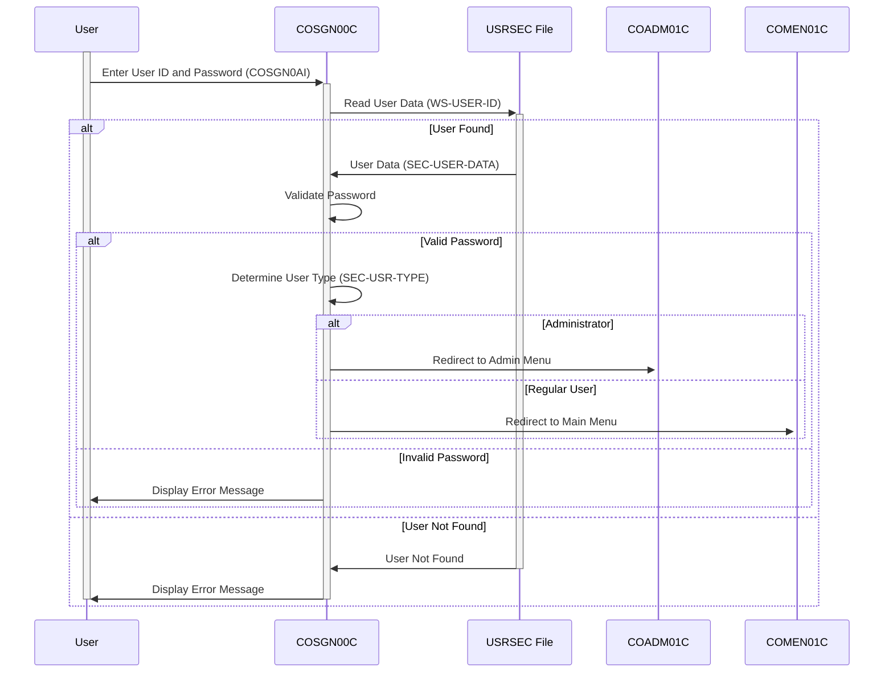

Gerado em: 2 de outubro de 2024

**Título do Documento: Aplicativo CardDemo - Especificação do Módulo de Iniciação de Sessão**

**Descrição Resumida:**
Este documento descreve as especificações para o módulo de Iniciação de Sessão (`COSGN00C`) dentro do aplicativo CardDemo, um sistema baseado em COBOL projetado para gerenciamento de cartões de crédito. O módulo garante autenticação segura do usuário, validando as credenciais do usuário em relação aos dados armazenados. Após a verificação bem-sucedida, ele concede aos usuários acesso ao aplicativo com base em suas funções definidas, direcionando-os para as funcionalidades apropriadas.

**Histórias do Usuário:**
Como administrador do sistema CardDemo, preciso garantir que apenas usuários autorizados com credenciais válidas possam acessar o sistema para proteger dados confidenciais do cliente e financeiros.

**Épico Relacionado:** 6 - Gerenciamento de Usuários e Segurança

**Requisitos Técnicos:**
- **Exibir Tela de Iniciação de Sessão:** Esta função exibe a tela inicial de iniciação de sessão para o usuário.
  - Entrada: Nenhuma
  - Saída: Exibe a tela de iniciação de sessão (`COSGN0A`) com campos para `ID do Usuário` e `Senha`.
- **Capturar Entrada do Usuário:** Esta função captura o `ID do Usuário` e a `Senha` inseridos pelo usuário.
  - Entrada: Entrada do usuário da tela de iniciação de sessão (`COSGN0AI`).
  - Validações:
    - Verifique se `ID do Usuário` não contém espaços ou valores baixos.
    - Verifique se `Senha` não contém espaços ou valores baixos.
  - Saída: `WS-USER-ID` - ID do Usuário capturado, `WS-USER-PWD` - Senha capturada.
- **Ler Dados do Usuário:** Esta função lê os dados do usuário do arquivo `USRSEC` com base no ID do Usuário fornecido.
  - Entrada: `WS-USER-ID` - O ID do Usuário inserido pelo usuário.
  - Saída: `SEC-USER-DATA` - Registro do usuário do arquivo `USRSEC` (se encontrado) ou códigos de resposta apropriados.
  - Resultado `WS-RESP-CD`:
    - `0` - Registro encontrado.
    - `13` - Registro não encontrado.
    - Outro - Erro de E/S VSAM.
- **Autenticar Usuário:** Esta função verifica se a `Senha` inserida corresponde à `Senha` armazenada para o usuário.
  - Entrada: `WS-USER-PWD` - Senha inserida, `SEC-USR-PWD` - Senha armazenada de `SEC-USER-DATA`.
  - Validação:
    - Compare `WS-USER-PWD` com `SEC-USR-PWD`.
  - Saída: Indicação de sucesso ou falha com base na correspondência de senha.
- **Determinar Tipo de Usuário:** Esta função recupera o tipo de usuário do registro do usuário.
  - Entrada: `SEC-USER-DATA` - Registro do usuário lido do arquivo `USRSEC`.
  - Saída: `CDEMO-USER-TYPE` - Tipo de usuário (por exemplo, 'ADMIN' ou 'USER').
- **Redirecionar Usuário:** Esta função redireciona o usuário para o menu apropriado com base em seu tipo de usuário.
  - Entrada: `CDEMO-USER-TYPE` - Tipo de usuário determinado.
  - Saída: Transfere o controle para `COADM01C` (Menu do Administrador) ou `COMEN01C` (Menu Principal).

**Modelos Relacionados**
- `SEC-USER-DATA`: Representa o registro do usuário.
  - `SEC-USR-PWD` `Alfanumérico (PIC X(08))`: Senha criptografada para o usuário.
  - `SEC-USR-TYPE` `Alfanumérico (PIC X(01))`: Tipo de usuário ('A' para Administrador, 'U' para Usuário Regular).

**Configurações:**
- **Valores Constantes**
  - `WS-USRSEC-FILE`: `USRSEC`
	- Descrição:  Nome do arquivo para o arquivo de segurança do usuário.
- **COSGN00.cpy**
  - `COSGN0A`: Definição de tela para a tela de iniciação de sessão.
  - `COSGN0AI`: Estrutura de dados de entrada para a tela de iniciação de sessão.
  - `COSGN0AO`: Estrutura de dados de saída para a tela de iniciação de sessão.
- **CSUSR01Y.cpy**
  - `SEC-USER-DATA`: Estrutura de dados para informações do usuário.
- **COCOM01Y.cpy**
  - `CARDDEMO-COMMAREA`: Estrutura de dados da área de comunicação.

**Melhorias de Código:**
- **Criptografia de Senha:** Implemente um algoritmo de hash de senha mais robusto em vez de armazenamento de texto simples.
- **Tratamento de Erros:** Forneça mensagens de erro mais específicas para o usuário para facilitar a solução de problemas.
- **Configuração:** Externalize parâmetros configuráveis, como o número máximo de tentativas de iniciação de sessão.
- **Log:** Implemente o log de auditoria para todas as tentativas de iniciação de sessão, incluindo timestamps e status de sucesso/falha.

**Melhorias de Segurança:**
- **Complexidade da Senha:** Imponha políticas de senha forte, exigindo que os usuários definam senhas complexas.
- **Gerenciamento de Sessão:** Implemente técnicas seguras de gerenciamento de sessão para proteger as sessões do usuário.
- **Autenticação Multifator (MFA):** Considere implementar MFA para uma camada adicional de segurança.

**Diagrama Conceitual:**

--Made by "Smart Engineering" (by Compass.UOL)--