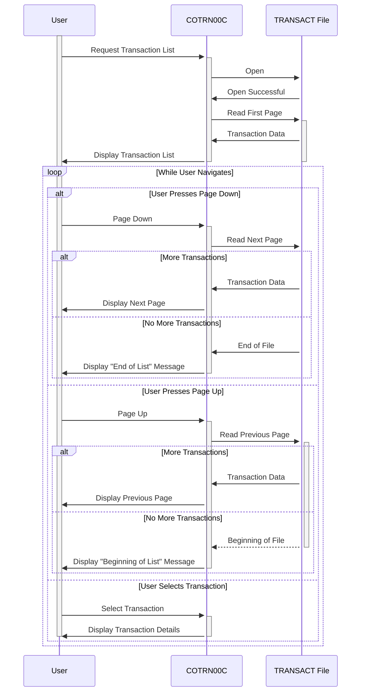

Gerado em: 2 de outubro de 2024

**Título do Documento:** Módulo de Listagem de Transações CardDemo - Especificação Técnica

**Descrição Resumida:**
Este documento fornece uma visão geral técnica abrangente do módulo de Listagem de Transações CardDemo, que permite aos usuários visualizar o histórico de transações do cartão de crédito em formato paginado. Ele detalha a funcionalidade do programa, interações do usuário, tratamento de dados e dependências do sistema.

**Histórias do Usuário:**
Como usuário do CardDemo, quero visualizar uma lista de minhas transações recentes com cartão de crédito para poder controlar meus gastos e identificar possíveis erros ou atividades fraudulentas.

**Épico Relacionado:**
4 - Processamento de Transações

**Requisitos Técnicos:**

- **Inicialização da Lista de Transações:** Este procedimento inicializa o processo de listagem de transações configurando as variáveis e sinalizadores necessários. Ele também lida com a exibição inicial da tela da lista de transações.
  - Inicializar Variáveis: Define valores iniciais para variáveis do programa como `WS-PGMNAME`, `WS-TRANID`, `WS-MESSAGE`, `WS-TRANSACT-FILE`, `WS-ERR-FLG`, `WS-TRANSACT-EOF`, `WS-SEND-ERASE-FLG`, etc.
  - Definir Valores Padrão: Define valores padrão para campos específicos na área de comunicação (`CARDDEMO-COMMAREA`).
  - Exibir Tela Inicial: Envia a tela inicial da lista de transações (`COTRN0A`) ao usuário, exibindo a primeira página de transações.
  - Resultado: A tela inicial da lista de transações é exibida ao usuário. 
- **Seleção de Transação:** Este procedimento processa a entrada do usuário quando a tecla Enter é pressionada, determinando se uma transação foi selecionada para obter mais detalhes.
  - Obter Entrada do Usuário: Recupera a entrada do usuário na tela, incluindo qualquer transação selecionada.
  - Validar Seleção: Se uma transação for selecionada, seu ID será movido para `CDEMO-CT00-TRN-SELECTED`.
  - Transferir Controle: Se a seleção for válida, transfere o controle para o programa de detalhes da transação (`COTRN01C`).
  - Exibir Mensagem de Erro: Se a seleção for inválida, exibe uma mensagem de erro.
  - Resultado: A tela de detalhes da transação para a transação selecionada é exibida ou uma mensagem de erro é exibida.
- **Navegação para a Página Anterior:** Este procedimento lida com a funcionalidade "Page Up" (tecla PF7), navegando até a página anterior das transações.
  - Obter ID da Transação Anterior: Se disponível, recupera o ID da transação da primeira transação na página atual.
  - Navegar para a Página Anterior: Se ainda não estiver na primeira página, recupera e exibe a página anterior das transações.
  - Exibir Mensagem: Se já estiver na primeira página, exibe uma mensagem indicando isso ao usuário.
  - Resultado: A página anterior das transações é exibida ou uma mensagem indicando que o usuário já está no início da lista é exibida.
- **Navegação para a Próxima Página:** Este procedimento lida com a funcionalidade "Page Down" (tecla PF8), navegando até a próxima página das transações.
  - Obter ID da Próxima Transação: Se disponível, recupera o ID da transação da última transação na página atual.
  - Navegar para a Próxima Página: Se houver mais transações disponíveis, recupera e exibe a próxima página.
  - Exibir Mensagem: Se já estiver na última página, exibe uma mensagem para o usuário.
  - Resultado: A próxima página das transações é exibida ou uma mensagem indicando que o usuário já está no final da lista é exibida.
- **Exibir Próxima Página:** Este procedimento recupera e exibe a próxima página de transações.
  - Iniciar Navegação: Abre o arquivo `TRANSACT` para navegação, começando pelo ID da transação atual.
  - Ler Transações: Lê os registros de transações sequencialmente do arquivo, preenchendo os campos da tela com os dados da transação (ID, data, descrição, valor).
  - Verificar Fim do Arquivo: Se o final do arquivo for atingido, define o sinalizador `TRANSACT-EOF` para indicar que não há mais transações disponíveis.
  - Atualizar Número da Página: Incrementa o número da página se houver mais transações disponíveis.
  - Exibir Tela: Envia a tela da lista de transações atualizada para o terminal do usuário.
  - Resultado: A próxima página de transações é exibida ou uma mensagem é exibida se o final do arquivo for atingido.
- **Exibir Página Anterior:** Este procedimento recupera e exibe a página anterior das transações.
  - Iniciar Navegação: Abre o arquivo `TRANSACT` para navegação, começando pelo ID da transação atual.
  - Ler Transações: Lê os registros de transações sequencialmente em ordem inversa do arquivo, preenchendo os campos da tela com os dados da transação.
  - Verificar Início do Arquivo: Se o início do arquivo for atingido, define o sinalizador `TRANSACT-EOF`.
  - Atualizar Número da Página: Decrementa o número da página se ainda não estiver na primeira página.
  - Exibir Tela: Envia a tela da lista de transações atualizada para o usuário.
  - Resultado: A página anterior das transações é exibida ou uma mensagem é exibida se o início do arquivo for atingido.
- **Preencher Dados da Transação:** Este procedimento preenche os campos de exibição da transação na tela com dados de um único registro de transação.
  - Formatar Dados da Transação: Formata o valor da transação, data e outros campos para exibição.
  - Preencher Campos da Tela: Move os dados formatados da transação para os campos apropriados na tela da lista de transações.
  - Resultado: Os campos da tela para uma única transação são preenchidos com dados formatados.
- **Inicializar Dados da Transação:** Este procedimento limpa os campos de exibição da transação na tela, preparando-se para a exibição de um novo conjunto de registros de transação.
  - Limpar Campos da Tela: Define os campos de exibição da transação na tela como espaços ou valores padrão.
  - Resultado: Os campos de exibição da transação na tela são limpos.
- **Retornar à Tela Anterior:** Este procedimento lida com a navegação de volta à tela anterior no aplicativo.
  - Definir Parâmetros de Transferência: Define o nome do programa e o ID da transação para a tela anterior.
  - Transferir Controle: Emite um comando CICS `XCTL` para transferir o controle para a tela anterior.
  - Resultado: O controle é retornado à tela anterior no aplicativo.
- **Enviar Tela da Lista de Transações:** Este procedimento envia a tela da lista de transações (`COTRN0A`) ao usuário, exibindo os dados da transação recuperados.
  - Preencher Informações do Cabeçalho: Preenche o cabeçalho da tela com informações como o nome do programa, ID da transação, data e hora atuais.
  - Exibir Tela: Emite um comando CICS `SEND` para exibir a tela da lista de transações para o usuário.
  - Resultado: A tela da lista de transações é enviada ao terminal do usuário.
- **Receber Tela da Lista de Transações:** Este procedimento recebe a entrada do usuário na tela da lista de transações, incluindo seleções do usuário e pressionamentos de teclas de função.
  - Receber Entrada do Usuário: Emite um comando CICS `RECEIVE` para recuperar a entrada do usuário na tela da lista de transações.
  - Resultado: A entrada do usuário, incluindo pressionamentos de teclas de função e dados inseridos nos campos de entrada, é recebida da tela.
- **Preencher Informações do Cabeçalho:** Este procedimento preenche a seção do cabeçalho da tela da lista de transações com informações do programa e data/hora.
  - Obter Data/Hora Atual: Recupera a data e hora atuais do sistema.
  - Formatar Data/Hora: Formata os valores de data e hora para exibição.
  - Preencher Campos da Tela: Move a data formatada, hora, nome do programa e ID da transação para os campos de cabeçalho apropriados na tela.
  - Resultado: A seção do cabeçalho da tela da lista de transações é preenchida com o nome do programa, ID da transação, data e hora atuais.
- **Iniciar Navegação no Arquivo de Transações:** Este procedimento inicia uma operação de navegação no arquivo `TRANSACT`, configurando o arquivo para leitura sequencial.
  - Iniciar Navegação: Emite um comando CICS `STARTBR` para abrir o arquivo `TRANSACT` para navegação, começando pelo ID da transação especificado.
  - Lidar com Resposta: Verifica o código de resposta do comando `STARTBR` e define o sinalizador `TRANSACT-EOF` se o final do arquivo for atingido. Exibe uma mensagem de erro se a operação de navegação falhar.
  - Resultado: O arquivo `TRANSACT` é aberto para navegação ou uma mensagem de erro é exibida se a operação falhar.
- **Ler Próximo Registro de Transação:** Este procedimento lê o próximo registro de transação do arquivo `TRANSACT`.
  - Ler Próximo Registro: Emite um comando CICS `READNEXT` para ler o próximo registro de transação do arquivo.
  - Lidar com Resposta: Verifica o código de resposta do comando `READNEXT` e define o sinalizador `TRANSACT-EOF` se o final do arquivo for atingido. Exibe uma mensagem de erro se a operação de leitura falhar.
  - Resultado: O próximo registro de transação é lido do arquivo ou uma mensagem de erro é exibida se a operação falhar.
- **Ler Registro de Transação Anterior:** Este procedimento lê o registro de transação anterior do arquivo `TRANSACT`.
  - Ler Registro Anterior: Emite um comando CICS `READPREV` para ler o registro de transação anterior do arquivo.
  - Lidar com Resposta: Verifica o código de resposta do comando `READPREV` e define o sinalizador `TRANSACT-EOF` se o início do arquivo for atingido. Exibe uma mensagem de erro se a operação de leitura falhar.
  - Resultado: O registro de transação anterior é lido do arquivo ou uma mensagem de erro é exibida se a operação falhar.
- **Finalizar Navegação no Arquivo de Transações:** Este procedimento termina a operação de navegação no arquivo `TRANSACT`.
  - Finalizar Navegação: Emite um comando CICS `ENDBR` para fechar o arquivo `TRANSACT` e encerrar a operação de navegação.
  - Resultado: A operação de navegação no arquivo `TRANSACT` é encerrada.

**Modelos Relacionados**

- `TRAN-RECORD`
  - `TRAN-ID` `PIC X(16)`: Identificador exclusivo da transação.
  - `TRAN-AMT` `PIC S9(09)V99 COMP-3`: Valor da transação.
  - `TRAN-ORIG-TS` `PIC X(16)`: Timestamp da transação.
  - `TRAN-DESC` `PIC X(64)`: Descrição da transação.

**Configurações:**

- Valores Constantes
  - `TRANS-PER-PAGE`: `10`
	- Descrição: Número de transações a serem exibidas por página.
  - `WS-TRANSACT-FILE`: `"TRANSACT"`
	- Descrição: Nome do arquivo VSAM que contém os dados da transação.
  - `WS-TRANID`: `"CT00"`
	- Descrição: ID da transação para `COTRN00C`.
  - `WS-PGMNAME`: `"COTRN00C"`
	- Descrição: Nome do programa.

**Melhorias no Código:**

- **Tratamento de Erros:** Implemente um mecanismo de tratamento de erros mais robusto. Em vez de simplesmente definir um sinalizador e exibir uma mensagem genérica, considere o uso de códigos de erro e mensagens específicas para diferentes tipos de erros. Isso facilitará o diagnóstico e a resolução de problemas.
- **Validação de Dados:** Adicione verificações de validação para entrada do usuário, especialmente para o campo de ID da transação. Isso pode impedir que dados inválidos sejam processados e causem erros.
- **Estrutura do Código:** Refatore o código para melhorar sua legibilidade e manutenção. Considere dividir parágrafos grandes em procedimentos menores e mais focados.
- **Comentários:** Adicione mais comentários para explicar a lógica e o propósito de diferentes seções do código.

**Melhorias na Segurança:**

- **Autenticação e Autorização:** Certifique-se de que o aplicativo tenha mecanismos adequados de autenticação e autorização implementados. Somente usuários autorizados devem poder acessar os dados da transação.
- **Criptografia de Dados:** Considere criptografar dados confidenciais, como valores de transações e números de contas, tanto no armazenamento quanto durante a transmissão.
- **Registro de Auditoria:** Implemente o registro de auditoria para rastrear ações do usuário e eventos do sistema relacionados aos dados da transação. Isso pode ajudar a detectar e investigar violações de segurança.

**Diagrama Conceitual:**

--Made by "Smart Engineering" (by Compass.UOL)--