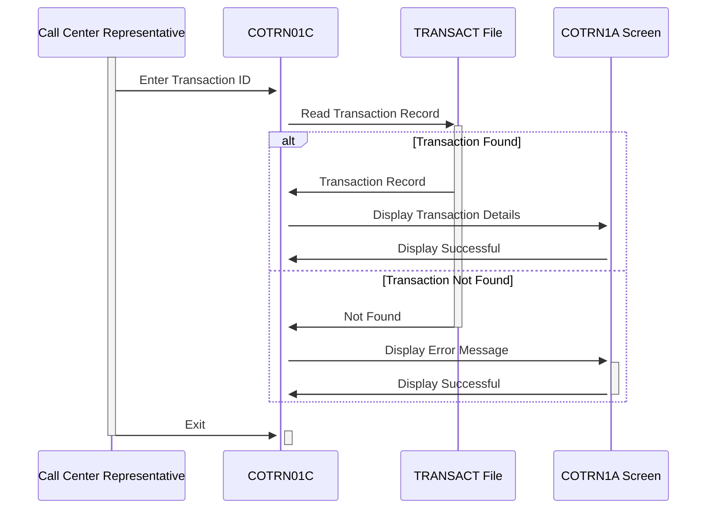

Gerado em: 2 de outubro de 2024

**Título do Documento:** CardDemo Recuperação de Detalhes de Transação - Especificação do Programa

**Descrição Resumida:**
Este documento descreve as especificações para o programa `COTRN01C`, parte do aplicativo CardDemo. Este programa permite que usuários, normalmente representantes de call center, visualizem informações detalhadas sobre transações específicas de cartão de crédito usando um ID de transação exclusivo.

**Histórias do Usuário:**
Como representante de call center, preciso acessar rapidamente os detalhes de uma transação específica para que eu possa responder às perguntas dos clientes e verificar as informações da transação com eficiência.

**Épico Relacionado:**
4 - Processamento de Transações

**Requisitos Técnicos:**
Este programa recupera e exibe detalhes para uma transação específica identificada por um ID de transação exclusivo.

- **Recuperação de Detalhes da Transação**: Esta função recupera e exibe os detalhes de uma transação específica com base no ID da transação fornecido.
  - Entrada: `TRAN-ID` `{Alphanumeric}`, um identificador exclusivo para a transação.
  - Processo:
    - O programa lê o arquivo `TRANSACT` usando `TRAN-ID` como chave.
    - Se o `TRAN-ID` for encontrado, o registro de transação correspondente será recuperado.
    - Se o `TRAN-ID` não for encontrado ou ocorrer um erro durante a operação de leitura, uma mensagem de erro será exibida.
  - Saída: Exibe os detalhes da transação recuperada, incluindo:
    - `TRAN-ID` `{Alphanumeric}`: O ID da transação.
    - `TRAN-CARD-NUM` `{Numeric}`: O número do cartão de crédito associado à transação.
    - `TRAN-TYPE-CD` `{Alphanumeric}`: O tipo de transação.
    - `TRAN-CAT-CD` `{Alphanumeric}`: A categoria da transação.
    - `TRAN-SOURCE` `{Alphanumeric}`: A origem da transação.
    - `TRAN-AMT` `{Numeric}`: O valor da transação.
    - `TRAN-DESC` `{Alphanumeric}`: Uma descrição da transação.
    - `TRAN-ORIG-TS` `{Timestamp}`: O registro de data e hora em que a transação foi originada.
    - `TRAN-PROC-TS` `{Timestamp}`: O registro de data e hora em que a transação foi processada.
    - `TRAN-MERCHANT-ID` `{Alphanumeric}`: Um identificador exclusivo para o comerciante.
    - `TRAN-MERCHANT-NAME` `{Alphanumeric}`: O nome do comerciante.
    - `TRAN-MERCHANT-CITY` `{Alphanumeric}`: A cidade do comerciante.
    - `TRAN-MERCHANT-ZIP` `{Alphanumeric}`: O código postal do comerciante.

**Modelos Relacionados**

- `TRAN-RECORD`
  - `TRAN-ID` `{Alphanumeric}`: Identificador exclusivo para cada transação
  - `TRAN-CARD-NUM` `{Numeric}`: Número do cartão de crédito associado à transação
  - `TRAN-TYPE-CD` `{Alphanumeric}`: Tipo de transação (por exemplo, compra, reembolso)
  - `TRAN-CAT-CD` `{Alphanumeric}`: Categoria da transação (por exemplo, mantimentos, combustível)
  - `TRAN-SOURCE` `{Alphanumeric}`: Origem da transação (por exemplo, online, em loja)
  - `TRAN-AMT` `{Numeric}`: Valor da transação
  - `TRAN-DESC` `{Alphanumeric}`: Descrição da transação
  - `TRAN-ORIG-TS` `{Timestamp}`: Registro de data e hora da origem da transação
  - `TRAN-PROC-TS` `{Timestamp}`: Registro de data e hora do processamento da transação
  - `TRAN-MERCHANT-ID` `{Alphanumeric}`: Identificador exclusivo para o comerciante
  - `TRAN-MERCHANT-NAME` `{Alphanumeric}`: Nome do comerciante
  - `TRAN-MERCHANT-CITY` `{Alphanumeric}`: Cidade do comerciante
  - `TRAN-MERCHANT-ZIP` `{Alphanumeric}`: Código postal do comerciante

**Configurações:**

- Valores constantes
  - `WS-TRANSACT-FILE`: `"TRANSACT"`
	- Descrição: O nome do arquivo de banco de dados que contém os detalhes da transação.
  - `WS-TRANID`: `"CT01"`
	- Descrição: O código de transação para o programa.
- `COTRN01C.cbl`
  - `PGMSIZE`: `"512K"`
	- Descrição: Configuração do tamanho do programa.

**Melhorias de Código:**

- Implementar um mecanismo de tratamento de erros mais robusto. Em vez de apenas exibir uma mensagem de erro, considere registrar os detalhes do erro para fins de depuração.
- Adicionar mensagens de erro mais específicas para fornecer aos usuários mais contexto e orientação.
- Otimizar a operação de leitura do banco de dados usando técnicas de indexação apropriadas.
- Considerar adicionar um recurso para permitir que os usuários pesquisem transações com base em outros critérios, como intervalo de datas ou número do cartão.
- Implementar validação de entrada para evitar que dados inválidos sejam inseridos.

**Melhorias de Segurança:**

- Implementar controle de acesso para restringir o acesso de usuários não autorizados aos detalhes da transação.
- Criptografar o arquivo `TRANSACT` para proteger informações confidenciais.
- Registrar todas as ações do usuário para criar um trilha de auditoria para fins de segurança e conformidade.

**Diagrama Conceitual:**

--Made by "Smart Engineering" (by Compass.UOL)--