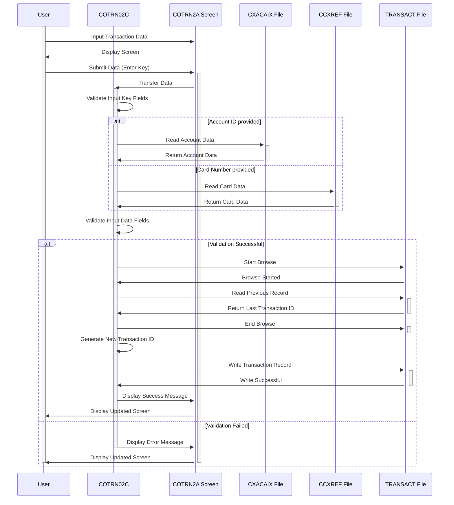

--CONTEÚDO TRADUZIDO--
Gerado em: 2 de outubro de 2024

**Título do Documento: CardDemo - Especificação do Programa Adicionar Nova Transação**

**Descrição Resumida:**
O programa `COTRN02C` é um programa CICS COBOL que permite que usuários autorizados adicionem novos registros de transações ao arquivo `TRANSACT` no aplicativo CardDemo. Isso envolve validar a entrada do usuário, interagir com vários arquivos de dados (`TRANSACT`, `ACCTDAT`, `CCXREF`, `CXACAIX`) e gerenciar transações usando comandos CICS.

**Histórias do Usuário:**
Como analista de dados, preciso ser capaz de adicionar novas transações ao sistema com precisão e eficiência para que eu possa rastrear e analisar a atividade do cartão de crédito.

**Épico Relacionado:**
4 - Processamento de Transações

**Requisitos Técnicos:**
- **Processar Tecla Enter**: Esta função é acionada quando o usuário pressiona a tecla Enter na tela. Ele organiza a validação e adição de um novo registro de transação com base na entrada do usuário.
  - Entrada: Entrada do usuário na tela de adição de transação (`COTRN2A`).
  - Validação: 
    - Verifique se o campo de confirmação (`CONFIRMI`) é 'Y' ou 'y'.
    - Validar ID da conta e número do cartão (`VALIDATE-INPUT-KEY-FIELDS`).
    - Validar todos os outros campos de dados (`VALIDATE-INPUT-DATA-FIELDS`).
  - Processamento Condicional: 
    - Se a confirmação for 'Y' ou 'y', adicione a transação (`ADD-TRANSACTION`).
    - Se a confirmação for 'N' ou 'n', ' ', ou valores baixos, solicite ao usuário que confirme a adição da transação.
    - Se a confirmação for qualquer outro valor, exiba uma mensagem de erro.
  - Saída: Dados de tela atualizados (`COTRN2AO`) e um novo registro de transação no arquivo `TRANSACT` se a transação for confirmada e adicionada com sucesso.
- **Validar Campos Chave de Entrada**: Esta função valida o ID da conta (`ACTIDINI`) e o número do cartão (`CARDNINI`) inseridos pelo usuário.
  - Entrada: ID da conta e número do cartão da entrada da tela (`COTRN2AI`).
  - Validação: 
    - Verifique se pelo menos um dos campos não está vazio.
    - Verifique se o valor inserido é numérico.
    - Leia e valide o ID da conta em relação ao arquivo `CXACAIX` (`READ-CXACAIX-FILE`).
    - Leia e valide o número do cartão em relação ao arquivo `CCXREF` (`READ-CCXREF-FILE`).
  - Saída: ID da conta e número do cartão validados e mensagens de erro se a validação falhar.
- **Validar Campos de Dados de Entrada**: Esta função valida todos os campos de dados além do ID da conta e número do cartão.
  - Entrada: Campos de dados de transação da entrada da tela (`COTRN2AI`).
  - Validação: 
    - Verifique se há campos vazios ou com valores baixos.
    - Verifique os campos numéricos para o formato correto e tipo de dados.
    - Validar campos de data (`TORIGDTI`, `TPROCDTI`) usando o utilitário `CSUTLDTC` para o formato `AAAA-MM-DD`.
    - Validar o formato do valor da transação (`TRNAMTI`) (`-99999999.99`).
  - Saída: Campos de dados de transação validados e mensagens de erro se a validação falhar.
- **Adicionar Transação**: Esta função adiciona um novo registro de transação ao arquivo `TRANSACT`.
  - Entrada: Dados de transação validados da entrada da tela (`COTRN2AI`).
  - Processamento: 
    - Gere um ID de transação exclusivo lendo o último ID de transação do arquivo `TRANSACT` e incrementando-o (`STARTBR-TRANSACT-FILE`, `READPREV-TRANSACT-FILE`, `ENDBR-TRANSACT-FILE`).
    - Preencha um novo `TRAN-RECORD` com os dados de transação validados.
    - Escreva o novo `TRAN-RECORD` no arquivo `TRANSACT` (`WRITE-TRANSACT-FILE`).
  - Saída: Um novo registro de transação no arquivo `TRANSACT`.
- **Copiar Dados da Última Transação**: Esta função copia dados da última transação adicionada para a tela atual, simplificando a entrada de dados para transações semelhantes.
  - Entrada: ID da conta e número do cartão da entrada da tela (`COTRN2AI`).
  - Processamento: 
    - Validar os campos chave de entrada (`VALIDATE-INPUT-KEY-FIELDS`).
    - Leia o último registro de transação do arquivo `TRANSACT` (`STARTBR-TRANSACT-FILE`, `READPREV-TRANSACT-FILE`, `ENDBR-TRANSACT-FILE`).
    - Preencha os campos da tela (`COTRN2AI`) com os dados do último registro de transação.
  - Saída: Dados de tela atualizados (`COTRN2AI`) com os detalhes da última transação.
- **Retornar à Tela Anterior**: Esta função navega o usuário de volta à tela anterior no fluxo do aplicativo.
  - Entrada: `CDEMO-FROM-PROGRAM` da área de comunicação (`CARDDEMO-COMMAREA`).
  - Processamento: 
    - Determine o programa para o qual retornar com base no `CDEMO-FROM-PROGRAM`. Se estiver vazio, o padrão é `COSGN00C`.
    - Defina `CDEMO-TO-PROGRAM`, `CDEMO-FROM-TRANID` e `CDEMO-FROM-PROGRAM` na área de comunicação.
    - Transfira o controle para o programa determinado usando o comando `XCTL`.
  - Saída: Navegação até a tela anterior.
- **Enviar Tela de Adição de Transação**: Esta função envia a tela de adição de transação (`COTRN2A`) para o terminal do usuário.
  - Entrada: Dados da tela (`COTRN2AO`), incluindo informações de cabeçalho e quaisquer mensagens de erro.
  - Processamento: 
    - Preencher informações do cabeçalho (`POPULATE-HEADER-INFO`).
    - Envie a tela usando o comando `SEND` com as opções `ERASE` e `CURSOR`.
  - Saída: A tela de adição de transação exibida no terminal do usuário.
- **Receber Tela de Adição de Transação**: Esta função recebe a entrada do usuário na tela de adição de transação.
  - Entrada: Entrada do usuário na tela de adição de transação (`COTRN2A`).
  - Processamento: Receba a entrada da tela usando o comando `RECEIVE`.
  - Saída: Dados de entrada do usuário armazenados na estrutura `COTRN2AI`.
- **Preencher Informações do Cabeçalho**: Esta função preenche as informações do cabeçalho na tela, incluindo o título, ID da transação, nome do programa, data atual e hora.
  - Entrada: Data e hora do sistema.
  - Processamento: 
    - Recupere a data e hora atuais.
    - Formate a data e hora para exibição.
    - Preencha os campos de cabeçalho na estrutura de saída da tela (`COTRN2AO`).
  - Saída: Dados de tela atualizados (`COTRN2AO`) com informações de cabeçalho.
- **Ler Arquivo CXACAIX**: Esta função lê dados do arquivo `CXACAIX` com base no ID da conta fornecido.
  - Entrada: ID da conta (`XREF-ACCT-ID`).
  - Processamento: 
    - Leia o arquivo `CXACAIX` usando o ID da conta como chave (comando `READ`).
    - Lidar com diferentes códigos de resposta:
      - `DFHRESP(NORMAL)`: Continue o processamento.
      - `DFHRESP(NOTFND)`: Exiba uma mensagem de erro indicando que o ID da conta não foi encontrado.
      - Outros códigos de resposta: Exiba uma mensagem de erro indicando um problema com o acesso ao arquivo.
  - Saída: `CARD-XREF-RECORD` se o ID da conta for encontrado, caso contrário, uma mensagem de erro.
- **Ler Arquivo CCXREF**: Esta função lê dados do arquivo `CCXREF` com base no número do cartão fornecido.
  - Entrada: Número do cartão (`XREF-CARD-NUM`).
  - Processamento: 
    - Leia o arquivo `CCXREF` usando o número do cartão como chave (comando `READ`).
    - Lidar com diferentes códigos de resposta:
      - `DFHRESP(NORMAL)`: Continue o processamento.
      - `DFHRESP(NOTFND)`: Exiba uma mensagem de erro indicando que o número do cartão não foi encontrado.
      - Outros códigos de resposta: Exiba uma mensagem de erro indicando um problema com o acesso ao arquivo.
  - Saída: `CARD-XREF-RECORD` se o número do cartão for encontrado, caso contrário, uma mensagem de erro.
- **Iniciar Navegação no Arquivo de Transação**: Esta função inicia uma operação de navegação no arquivo `TRANSACT` para recuperar o último ID de transação.
  - Entrada: Nenhum.
  - Processamento: Inicie uma operação de navegação no arquivo `TRANSACT` usando o comando `STARTBR` com `TRAN-ID` como chave.
  - Saída: Uma alça de operação de navegação para o arquivo `TRANSACT`.
- **Ler Arquivo de Transação Anterior**: Esta função lê o registro anterior durante a operação de navegação no arquivo `TRANSACT`.
  - Entrada: Alça de operação de navegação para o arquivo `TRANSACT`.
  - Processamento: 
    - Leia o registro anterior usando o comando `READPREV`.
    - Lidar com diferentes códigos de resposta:
      - `DFHRESP(NORMAL)`: Continue o processamento.
      - `DFHRESP(ENDFILE)`: Defina `TRAN-ID` como zeros, indicando que não há transações anteriores.
      - Outros códigos de resposta: Exiba uma mensagem de erro indicando um problema com o acesso ao arquivo.
  - Saída: `TRAN-RECORD` se um registro anterior for encontrado, caso contrário, zeros em `TRAN-ID`.
- **Finalizar Navegação no Arquivo de Transação**: Esta função termina a operação de navegação no arquivo `TRANSACT`.
  - Entrada: Alça de operação de navegação para o arquivo `TRANSACT`.
  - Processamento: Encerre a operação de navegação usando o comando `ENDBR`.
  - Saída: Nenhum.
- **Escrever Arquivo de Transação**: Esta função grava um novo registro de transação no arquivo `TRANSACT`.
  - Entrada: Novo registro de transação (`TRAN-RECORD`).
  - Processamento: 
    - Escreva o `TRAN-RECORD` no arquivo `TRANSACT` usando o comando `WRITE` com `TRAN-ID` como chave.
    - Lidar com diferentes códigos de resposta:
      - `DFHRESP(NORMAL)`: Exiba uma mensagem de sucesso.
      - `DFHRESP(DUPKEY)` ou `DFHRESP(DUPREC)`: Exiba uma mensagem de erro indicando um ID de transação duplicado.
      - Outros códigos de resposta: Exiba uma mensagem de erro indicando um problema com o acesso ao arquivo.
  - Saída: Um novo registro de transação no arquivo `TRANSACT` se a gravação for bem-sucedida, caso contrário, uma mensagem de erro.
- **Limpar Tela Atual**: Esta função limpa todos os campos de entrada na tela atual.
  - Entrada: Nenhum.
  - Processamento: 
    - Defina todos os campos de entrada na estrutura de saída da tela (`COTRN2AO`) como espaços.
    - Envie os dados de tela atualizados (`COTRN2AO`) para o terminal do usuário.
  - Saída: Uma tela de adição de transação limpa.
- **Inicializar Todos os Campos**: Esta função inicializa todos os campos de dados na tela para seus valores padrão ou espaços.
  - Entrada: Nenhum.
  - Processamento: 
    - Defina todos os campos de entrada na estrutura de entrada da tela (`COTRN2AI`) para seus valores padrão ou espaços.
    - Limpe a mensagem de erro (`WS-MESSAGE`).
  - Saída: Dados de entrada da tela inicializados (`COTRN2AI`).

**Modelos Relacionados**
- `TRAN-RECORD`
  - `TRAN-ID` `PIC 9(16)`: Identificador exclusivo para cada transação.
  - `TRAN-TYPE-CD` `PIC 9(02)`: Código que representa o tipo de transação.
  - `TRAN-CAT-CD` `PIC 9(04)`: Código que representa a categoria da transação.
  - `TRAN-SOURCE` `PIC X(10)`: Origem da transação.
  - `TRAN-DESC` `PIC X(60)`: Descrição da transação.
  - `TRAN-AMT` `PIC S9(9)V99`: Valor da transação.
  - `TRAN-CARD-NUM` `PIC 9(19)`: Número do cartão de crédito associado à transação.
  - `TRAN-MERCHANT-ID` `PIC 9(15)`: Identificador exclusivo para o comerciante.
  - `TRAN-MERCHANT-NAME` `PIC X(30)`: Nome do comerciante.
  - `TRAN-MERCHANT-CITY` `PIC X(20)`: Cidade do comerciante.
  - `TRAN-MERCHANT-ZIP` `PIC X(09)`: CEP do comerciante.
  - `TRAN-ORIG-TS` `PIC X(19)`: Carimbo de data/hora indicando quando a transação foi iniciada.
  - `TRAN-PROC-TS` `PIC X(19)`: Carimbo de data/hora indicando quando a transação foi processada.
- `CARD-XREF-RECORD`
  - `XREF-CARD-NUM` `PIC 9(19)`: O número do cartão de crédito.
  - `XREF-CUST-ID` `PIC 9(09)`: O ID do cliente associado ao cartão.
  - `XREF-ACCT-ID` `PIC 9(09)`: O ID da conta associado ao cartão.

**Configurações:**
- Valores Constantes
  - `WS-TRANSACT-FILE`: `"TRANSACT"`
	- Descrição: Nome do arquivo para o arquivo de dados `TRANSACT`.
  - `WS-ACCTDAT-FILE`: `"ACCTDAT"`
	- Descrição: Nome do arquivo para o arquivo de dados `ACCTDAT`.
  - `WS-CCXREF-FILE`: `"CCXREF"`
	- Descrição: Nome do arquivo para o arquivo de dados `CCXREF`.
  - `WS-CXACAIX-FILE`: `"CXACAIX"`
	- Descrição: Nome do arquivo para o arquivo de dados `CXACAIX`.
  - `WS-DATE-FORMAT`: `"AAAA-MM-DD"`
	- Descrição: Formato de data para a transação.
- COUSR01C.cbl
  - `USRTYPE`: `"R"`
	- Descrição: Tipo de usuário padrão.
- CBTRN02C.cbl
  - `REJECT-REASON-XREF-NOT-FOUND`: `"01"`
	- Descrição: Código de motivo de rejeição para referência cruzada não encontrada.
  - `REJECT-REASON-ACCT-NOT-FOUND`: `"02"`
	- Descrição: Código de motivo de rejeição para conta não encontrada.
  - `REJECT-REASON-ACCT-EXPIRED`: `"03"`
	- Descrição: Código de motivo de rejeição para conta expirada.
  - `REJECT-REASON-ACCT-OVERLIMIT`: `"04"`
	- Descrição: Código de motivo de rejeição para conta acima do limite.

**Melhorias de Código:**
- **Consolidar Tratamento de Erros**: Implemente uma rotina centralizada de tratamento de erros para reduzir a duplicação de código e melhorar a manutenção.
- **Aprimorar Validação de Dados**: Implemente verificações de validação de dados mais robustas, como verificações de intervalo para campos numéricos e correspondência de padrões para campos de texto, para garantir a integridade dos dados.
- **Melhorar Feedback do Usuário**: Forneça mensagens de erro mais informativas ao usuário, especificando a natureza exata do erro e como corrigi-lo.
- **Modularidade do Código**: Divida parágrafos grandes em seções menores e mais gerenciáveis com nomes significativos para melhorar a legibilidade e organização do código.
- **Documentação**: Adicione comentários para explicar a finalidade e a lógica de cada seção do código, tornando mais fácil para outros entenderem e manterem.

**Melhorias de Segurança:**
- **Autenticação e Autorização**: Implemente mecanismos robustos de autenticação para verificar a identidade do usuário e verificações de autorização para garantir que apenas usuários autorizados possam adicionar transações.
- **Limpeza de Entrada**: Limpe a entrada do usuário para evitar ataques de injeção, como injeção de SQL ou cross-site scripting (XSS).
- **Registro e Auditoria**: Registre todas as adições de transações, incluindo ID do usuário, carimbo de data/hora e detalhes da transação, para criar uma trilha de auditoria para segurança e responsabilidade.
- **Comunicação Segura**: Use protocolos seguros, como HTTPS, para qualquer comunicação entre o cliente e o servidor para proteger dados confidenciais durante a transmissão.

**Diagrama Conceitual:**

--Made by "Smart Engineering" (by Compass.UOL)--