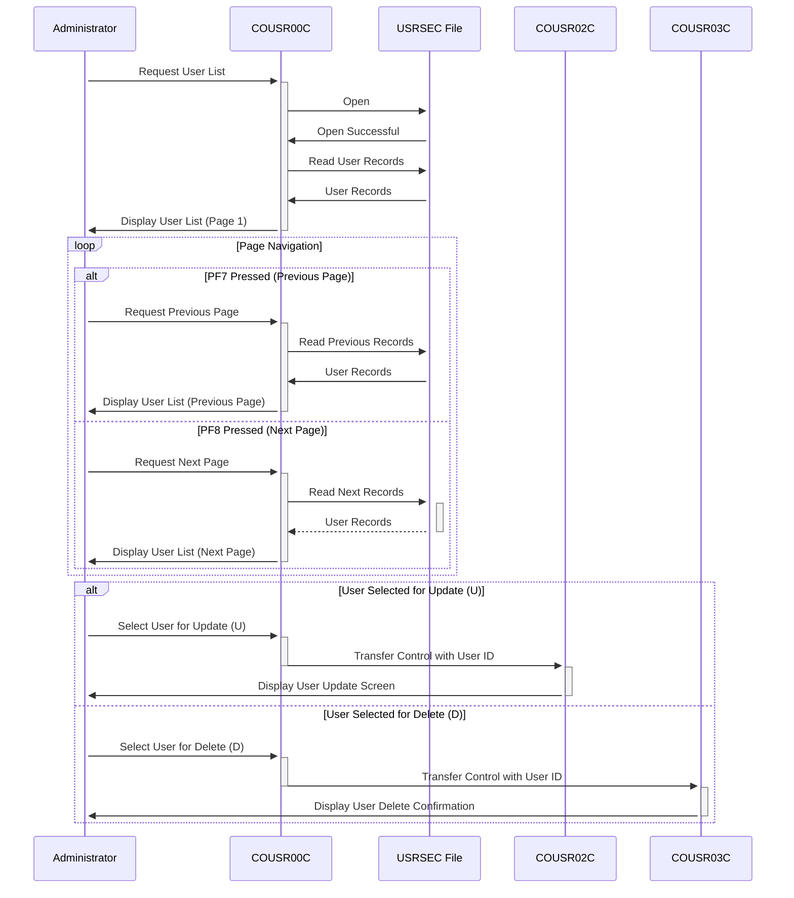

Gerado em: 2 de outubro de 2024

**Título do Documento: Especificação da Funcionalidade de Lista de Usuários da Aplicação CardDemo**

**Descrição Resumida:**
A funcionalidade de Lista de Usuários da aplicação CardDemo permite que os administradores visualizem e gerenciem contas de usuário dentro do sistema. Ela fornece uma lista paginada de usuários, permitindo a navegação pelos registros e a seleção de usuários específicos para ações de atualização ou exclusão.

**Histórias do Usuário:**
Como administrador do sistema, preciso visualizar uma lista de todos os usuários no sistema para gerenciar as contas de usuário de forma eficaz.

**Épico Relacionado:**
6 - Gerenciamento de Usuários e Segurança

**Requisitos Técnicos:**
- **Exibição da Lista de Usuários:** Este método exibe uma lista paginada de registros de usuários recuperados do arquivo `USRSEC`.
  - Entrada: ID do Usuário (opcional) para posicionamento inicial do registro.
  - Processamento: Recupera registros de usuários do arquivo `USRSEC`, começando pelo ID do Usuário especificado ou do início, se nenhum ID for fornecido. Ele preenche os campos de exibição com dados do usuário, incluindo ID do Usuário, Nome e Tipo.
  - Saída: Exibe uma página de registros de usuários (até 10 registros) com opções para ações de atualização (U) ou exclusão (D).
- **Navegação de Página:** Este método permite a navegação pela lista paginada de usuários.
  - Entrada: Ação do usuário (PF7 para a página anterior, PF8 para a próxima página).
  - Processamento: Com base na ação do usuário, ele busca a página apropriada de registros de usuários do arquivo `USRSEC`. Ele ajusta o `CDEMO-CU00-PAGE-NUM` para rastrear a página atual.
  - Saída: Exibe a página solicitada de registros de usuários.
- **Processamento de Ação do Usuário:** Este método processa a seleção do usuário para ações de atualização ou exclusão.
  - Entrada: Seleção do usuário (U/D) e o ID do Usuário correspondente.
  - Processamento: Valida a seleção do usuário e, se válida, transfere o controle para o programa apropriado (COUSR02C para atualização, COUSR03C para exclusão) junto com o ID do Usuário selecionado.
  - Saída: Redireciona o usuário para o programa selecionado (COUSR02C ou COUSR03C) com as informações do usuário selecionado.

**Modelos Relacionados**
- `SEC-USER-DATA`
  - `SEC-USR-ID` `String`: ID do Usuário.
  - `SEC-USR-FNAME` `String`: Primeiro Nome do Usuário.
  - `SEC-USR-LNAME` `String`: Sobrenome do Usuário.
  - `SEC-USR-TYPE` `String`: Tipo de Usuário (por exemplo, Administrador, Usuário).

**Configurações:**
- Valores Constantes
  - `WS-USRSEC-FILE`: `"USRSEC  "`
	- Descrição: Nome do arquivo para o arquivo de segurança do usuário.
- `COUSR00.CPY`
  - `CCDA-TRNNAMEI`: `"COUSR"`
	- Descrição: Nome da transação para um processo ou módulo relacionado a usuários.
  - `CCDA-TITLE01I`: `"CREDIT CARD DEMO APPLICATION"`
	- Descrição: Título principal da aplicação ou seção relacionada ao gerenciamento de usuários.
  - `CCDA-TITLE02I`: `"USER LISTING"`
	- Descrição: Subtítulo indicando que esta seção exibe uma lista de usuários.
  - `CCDA-PGMNAMEX`: `"COUSR00C"`
	- Descrição: Nome do programa ou módulo responsável por lidar com a listagem de usuários.
  - `CCDA-ERRMSGI`: `"ERROR MESSAGE"`
	- Descrição: Área na tela ou relatório onde as mensagens de erro são exibidas.
  - `CCDA-TRNNAMEO`: `"COUSR"`
	- Descrição: Nome da transação para um processo ou módulo relacionado a usuários.
  - `CCDA-TITLE01O`: `"CREDIT CARD DEMO APPLICATION"`
	- Descrição: Título principal da aplicação ou seção relacionada ao gerenciamento de usuários.
  - `CCDA-TITLE02O`: `"USER LISTING"`
	- Descrição: Subtítulo indicando que esta seção exibe uma lista de usuários.
  - `CCDA-PGMNAMEO`: `"COUSR00C"`
	- Descrição: Nome do programa ou módulo responsável por lidar com a listagem de usuários.
  - `CCDA-ERRMSGO`: `"ERROR MESSAGE"`
	- Descrição: Área na tela ou relatório onde as mensagens de erro são exibidas.

**Melhorias no Código:**
- Implementar um mecanismo de tratamento de erros mais robusto, incluindo mensagens de erro específicas e registro para facilitar a solução de problemas.
- Adicionar comentários detalhados explicando a lógica e o propósito de cada seção do código.
- Considerar o uso de uma estrutura de dados para representar os dados do usuário em vez de variáveis individuais para melhor organização e manutenção.

**Melhorias na Segurança:**
- Garantir que o acesso ao arquivo `USRSEC` seja devidamente restrito apenas ao pessoal autorizado.
- Implementar criptografia para dados confidenciais do usuário armazenados no arquivo `USRSEC`.
- Adicionar registro de auditoria para rastrear ações do usuário e alterações feitas nas contas de usuário.

**Diagrama Conceitual:**

--Made by "Smart Engineering" (by Compass.UOL)--