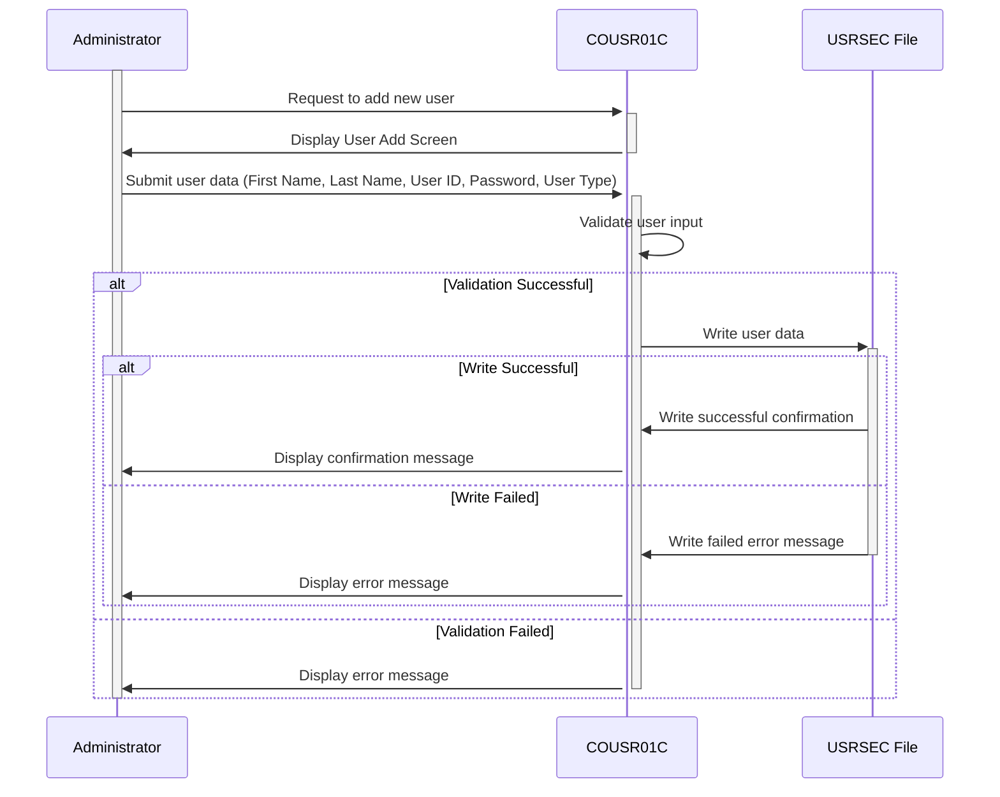

Gerado em: 2 de outubro de 2024

**Título do Documento: CardDemo Sistema de Gerenciamento de Usuários - Especificação para Adicionar Novo Usuário**

**Descrição Resumida:**
O programa CardDemo Sistema de Gerenciamento de Usuários - Adicionar Novo Usuário é um programa COBOL que permite que administradores adicionem novos usuários ao arquivo USRSEC. O programa valida as entradas do usuário para garantir a integridade dos dados, incluindo verificações de campos obrigatórios e IDs de usuário exclusivos. Após a validação bem-sucedida, as informações do novo usuário são gravadas no arquivo USRSEC e uma mensagem de confirmação é exibida.

**Histórias do Usuário:**
Como administrador do sistema, preciso poder adicionar novos usuários ao sistema para que eles possam acessar os aplicativos CardDemo e executar suas tarefas atribuídas.

**Épico Relacionado:**
6 - Gerenciamento de Usuários e Segurança

**Requisitos Técnicos:**

- **Exibir Tela de Adição de Usuário:** Este método envia a tela inicial "Adicionar Usuário" para o terminal.
  - Entrada: Nenhuma
  - Saída: Exibe a tela `COUSR1A` do conjunto de mapas `COUSR01`.

- **Capturar Entrada do Usuário:** Este método recebe a entrada do usuário da tela "Adicionar Usuário".
  - Entrada: O usuário insere dados nos campos exibidos na tela `COUSR1A`.
  - Saída: Os dados inseridos são armazenados na estrutura de dados `COUSR1AI`.

- **Processar Entrada do Usuário:** Este método processa os dados inseridos pelo usuário na tela "Adicionar Usuário".
  - Entrada: Dados de entrada do usuário da estrutura de dados `COUSR1AI`.
  - Validação: 
    - Verifique se todos os campos obrigatórios (`FNAMEI`, `LNAMEI`, `USERIDI`, `PASSWDI`, `USRTYPEI`) estão preenchidos.
    - Se algum campo obrigatório estiver faltando, defina `WS-ERR-FLG` como `'Y'`, mova uma mensagem de erro apropriada para `WS-MESSAGE`, mova `-1` para a variável de comprimento do campo correspondente em `COUSR1AI` para posicionar o cursor, e chame o método `SEND-USRADD-SCREEN` para exibir novamente a tela com a mensagem de erro.
    - Se todos os campos obrigatórios estiverem preenchidos, prossiga para a próxima validação.
  - Saída: Se todas as validações forem aprovadas, os dados do usuário serão movidos para o registro `SEC-USER-DATA`, e o método `WRITE-USER-SEC-FILE` será chamado. Se alguma validação falhar, o método `SEND-USRADD-SCREEN` será chamado para exibir novamente a tela com uma mensagem de erro.

- **Gravar Dados do Usuário no Arquivo:** Este método grava os dados do novo usuário no arquivo `USRSEC`.
  - Entrada: Dados do usuário do registro `SEC-USER-DATA`.
  - Processo: 
    - Grave o registro `SEC-USER-DATA` no arquivo `USRSEC` usando `SEC-USR-ID` como chave.
    - Verifique o código de resposta (`WS-RESP-CD`) da operação de gravação do arquivo.
  - Saída:
    - Se a gravação for bem-sucedida (`DFHRESP(NORMAL)`), chame o método `INITIALIZE-ALL-FIELDS` para limpar os campos de entrada, defina `WS-MESSAGE` como uma mensagem de sucesso, defina `ERRMSGC` de `COUSR1AO` como `DFHGREEN`, e chame o método `SEND-USRADD-SCREEN` para exibir a mensagem de confirmação.
    - Se ocorrer um erro de chave duplicada (`DFHRESP(DUPKEY)` ou `DFHRESP(DUPREC)`), defina `WS-ERR-FLG` como `'Y'`, defina `WS-MESSAGE` como uma mensagem de erro indicando o ID de usuário duplicado, mova `-1` para `USERIDL` de `COUSR1AI` para posicionar o cursor, e chame o método `SEND-USRADD-SCREEN`.
    - Para qualquer outro erro, defina `WS-ERR-FLG` como `'Y'`, defina `WS-MESSAGE` como uma mensagem de erro genérica, mova `-1` para `FNAMEL` de `COUSR1AI` para posicionar o cursor, e chame o método `SEND-USRADD-SCREEN`.

- **Limpar Tela Atual:** Este método limpa todos os campos de entrada na tela atual.
  - Entrada: Nenhuma.
  - Processo: Chama o método `INITIALIZE-ALL-FIELDS` para limpar os campos de entrada e, em seguida, chama o método `SEND-USRADD-SCREEN` para exibir novamente a tela com os campos limpos.
  - Saída: A tela "Adicionar Usuário" é exibida novamente com todos os campos de entrada limpos.

- **Preencher Informações do Cabeçalho:** Este método preenche as informações do cabeçalho na tela "Adicionar Usuário", incluindo a data atual, hora, ID da transação e nome do programa.
  - Entrada: Nenhuma.
  - Processo: Recupera a data e hora atuais usando a função `CURRENT-DATE`. Formata os valores de data e hora e os move para os campos correspondentes na estrutura de dados `COUSR1AO`.
  - Saída: A seção do cabeçalho da estrutura de dados da tela `COUSR1AO` é preenchida com a data atual, hora, ID da transação e nome do programa.

- **Inicializar Todos os Campos:** Este método inicializa todos os campos de dados para seus valores padrão.
  - Entrada: Nenhuma.
  - Processo: Define as variáveis de comprimento dos campos de entrada em `COUSR1AI` como `-1` e limpa o conteúdo dos campos de entrada e `WS-MESSAGE`.
  - Saída: Todos os campos de entrada e a área de mensagem são limpos.

- **Retornar à Tela Anterior:** Este método lida com a lógica para retornar à tela anterior no aplicativo.
  - Entrada: Nenhuma
  - Processo: 
    - Se `CDEMO-TO-PROGRAM` não estiver definido, ele assume o padrão `'COSGN00C'`.
    - Define `CDEMO-FROM-TRANID` como o ID da transação atual (`WS-TRANID`).
    - Define `CDEMO-FROM-PROGRAM` como o nome do programa atual (`WS-PGMNAME`).
    - Define `CDEMO-PGM-CONTEXT` como zeros.
    - Transfere o controle para o programa especificado em `CDEMO-TO-PROGRAM` usando um comando `XCTL`.
  - Saída: Transfere o controle para a tela anterior.

**Modelos Relacionados**

- `SEC-USER-DATA`
  - `SEC-USR-ID` `X(08)`: ID do usuário
  - `SEC-USR-FNAME` `X(20)`: Primeiro nome do usuário
  - `SEC-USR-LNAME` `X(20)`: Sobrenome do usuário
  - `SEC-USR-PWD` `X(08)`: Senha do usuário
  - `SEC-USR-TYPE` `X(01)`: Tipo de usuário ('R' para Regular, 'A' para Admin)

**Configurações:**

- Valores Constantes
  - `WS-USRSEC-FILE`: `"USRSEC  "`
	- Descrição: Nome do arquivo de segurança do usuário.
  - `WS-TRANID`: `"CU01"`
	- Descrição: ID da transação para o programa.
- `COUSR01.cpy`
  - `PGMSIZE`: `"512K"`
	- Descrição: Configuração do tamanho do programa.

**Melhorias de Código:**

- Tratamento de Erros: Implemente um mecanismo de tratamento de erros mais robusto, incluindo erros de registro em um arquivo ou banco de dados para fins de depuração e auditoria.
- Segurança de Senha: Não armazene senhas em texto simples. Use um algoritmo de hash forte para armazenar hashes de senha.
- Validação de Entrada: Implemente verificações de validação de entrada adicionais, como:
    - Impor regras de complexidade de senha (por exemplo, comprimento mínimo, combinação de maiúsculas/minúsculas/números/caracteres especiais).
    - Validar a entrada do tipo de usuário para garantir que seja 'R' ou 'A'.
- Documentação do Código: Adicione mais comentários para explicar a lógica e o propósito de diferentes seções do código.
- Modularidade: Divida o código em módulos ou sub-rotinas menores e mais gerenciáveis ​​para melhor organização e manutenção.
- Uso de Copybooks: Utilize copybooks de forma eficaz para definir estruturas de dados e variáveis ​​comuns, reduzindo a duplicação de código e melhorando a consistência.

**Melhorias de Segurança:**

- Armazenamento Seguro de Senha: Use um algoritmo de hash unidirecional forte para armazenar senhas em vez de texto simples. Considere usar um sal para aumentar ainda mais a segurança da senha.
- Controle de Acesso: Implemente o controle de acesso baseado em função para restringir o acesso à funcionalidade "Adicionar Novo Usuário" apenas ao pessoal autorizado.
- Limpeza de Entrada: Limpe as entradas do usuário para evitar ataques de injeção, como injeção de SQL ou cross-site scripting (XSS).
- Registro de Auditoria: Registre todos os eventos de criação de usuário, incluindo o usuário que executou a ação, a data e hora e os detalhes da nova conta de usuário.
- Comunicação Segura: Se o aplicativo se comunica com outros sistemas, garanta canais de comunicação seguros usando protocolos como HTTPS ou TLS.

**Diagrama Conceitual:**

--Made by "Smart Engineering" (by Compass.UOL)--