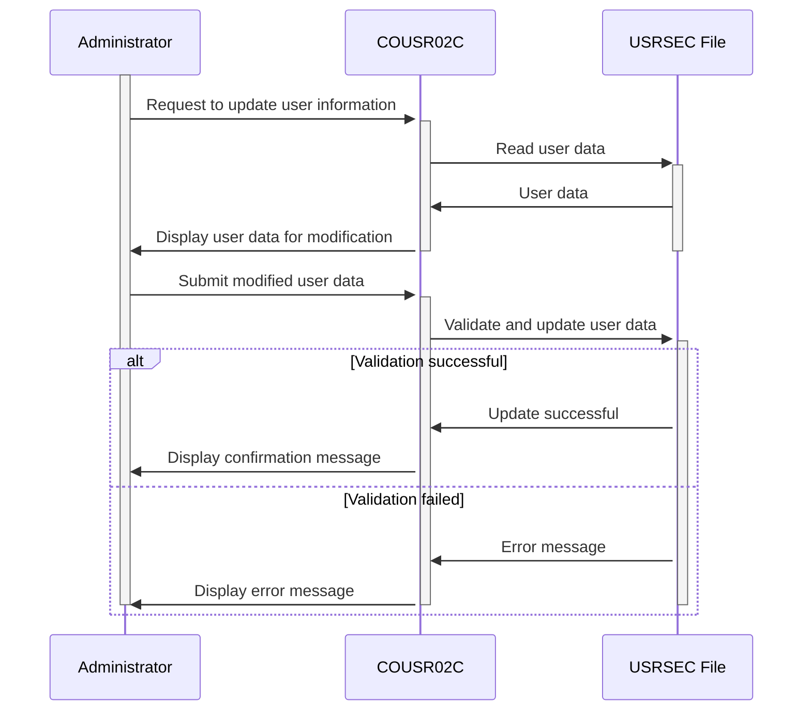

Gerado em: 2 de outubro de 2024

**Título do Documento: Especificação do Programa de Atualização de Usuário do CardDemo**

**Descrição Resumida:**
O programa COUSR02C no aplicativo CardDemo é responsável por atualizar as informações do usuário. Ele recupera dados do usuário do arquivo `USRSEC`, permite que administradores autorizados modifiquem campos específicos, valida a entrada e atualiza o arquivo com as alterações.

**Histórias do Usuário:**
Como administrador do sistema, preciso poder atualizar as informações existentes do usuário, como nome, senha ou tipo de usuário, para garantir que o sistema reflita dados precisos e atuais do usuário.

**Épico Relacionado:**
6 - Gerenciamento de Usuários e Segurança: Gerenciar o acesso, funções e permissões do usuário para garantir a segurança do sistema e a confidencialidade dos dados.

**Requisitos Técnicos:**

- **Entrada e Validação de ID do Usuário:** Este método lida com a entrada e validação do ID do usuário.
  - Entrada: ID do usuário do campo de entrada de tela `USRIDINI`.
  - Validação: Verifica se o ID do usuário está vazio. Se estiver vazio, define `WS-ERR-FLG` como `Y`, define `WS-MESSAGE` como `User ID can NOT be empty...` e define a posição do cursor para o campo `USRIDINI` (`USRIDINL`).
  - Resultado `Boolean`: Retorna `TRUE` se o ID do usuário for válido, `FALSE` caso contrário.

- **Recuperação de Dados do Usuário:** Este método recupera os dados do usuário do arquivo `USRSEC` com base no ID do usuário fornecido.
  - Entrada: ID do usuário de `SEC-USR-ID`.
  - Acesso ao arquivo: Lê o arquivo `USRSEC` usando o ID do usuário como chave.
  - Resultado `SEC-USER-DATA`: Retorna o registro de dados do usuário, se encontrado.

- **Atualização de Dados do Usuário:** Este método atualiza as informações do usuário no arquivo `USRSEC`.
  - Entrada: Dados do usuário atualizados dos campos de entrada da tela (`FNAMEI`, `LNAMEI`, `PASSWDI`, `USRTYPEI`).
  - Validação: Verifica se algum dos campos de entrada está vazio. Se estiver vazio, define `WS-ERR-FLG` como `Y`, define `WS-MESSAGE` com a mensagem de erro correspondente e define a posição do cursor para o campo correspondente. Além disso, verifica se algum dado foi modificado. Caso contrário, define `WS-MESSAGE` como `Please modify to update ...` e o exibe em vermelho.
  - Comparação: Compara os dados de entrada com os dados existentes em `SEC-USER-DATA`. Se alguma diferença for encontrada, define `USR-MODIFIED-YES` como `TRUE`.
  - Acesso ao arquivo: Atualiza o arquivo `USRSEC` com os dados modificados do usuário.
  - Resultado `Boolean`: Retorna `TRUE` se a atualização for bem-sucedida, `FALSE` caso contrário.

- **Gerenciamento de Exibição de Tela:** Este método gerencia a exibição da tela e a interação.
  - Entrada: Dados a serem exibidos na tela, incluindo informações de cabeçalho, mensagens e dados do usuário.
  - Tratamento de Tela: Envia a tela `COUSR2A` para o terminal do usuário usando o conjunto de mapas `COUSR02`.
  - Resultado `None`: Exibe a tela com os dados fornecidos.

- **Tratamento de Entrada de Tela:** Este método lida com a entrada do usuário na tela.
  - Entrada: Entrada do usuário na tela `COUSR2A`, incluindo teclas de função e dados inseridos nos campos.
  - Tratamento de Eventos: Processa a entrada do usuário com base na tecla pressionada (Enter, PF3, PF4, PF5, PF12).
  - Resultado `None`: Executa a ação correspondente com base na entrada do usuário.

- **Preenchimento de Informações de Cabeçalho:** Este método preenche as informações de cabeçalho na tela.
  - Entrada: Data e hora atuais do sistema.
  - Formatação de Dados: Formata a data e hora no formato de exibição necessário.
  - Resultado `None`: Define os campos de informações de cabeçalho na tela com a data, hora, nome do programa e ID da transação formatados.

- **Inicialização do Campo da Tela:** Este método inicializa todos os campos de entrada na tela.
  - Entrada: Nenhuma.
  - Inicialização de Campo: Define valores padrão para todos os campos de entrada, como espaços para campos de texto e -1 para campos numéricos.
  - Resultado `None`: Limpa todos os campos de entrada na tela.

**Modelos Relacionados**

- `SEC-USER-DATA`
  - `SEC-USR-ID` `String`: Identificador exclusivo para cada usuário.
  - `SEC-USR-FNAME` `String`: Primeiro nome do usuário.
  - `SEC-USR-LNAME` `String`: Sobrenome do usuário.
  - `SEC-USR-PWD` `String`: Senha do usuário para acesso ao sistema.
  - `SEC-USR-TYPE` `String`: Define a função e as permissões do usuário no aplicativo.

**Configurações:**

- `COUSR02C.cbl`
  - `WS-USRSEC-FILE`: `"USRSEC  "`
	- Descrição: Nome do arquivo para o arquivo de segurança do usuário.
- `COUSR01C.cbl`
  - `USRTYPE`: `"R"`
	- Descrição: O tipo de usuário padrão é definido como "R" (Regular).
  - `USRTYPE`: `"A"`
	- Descrição: Opção para definir o tipo de usuário como "A" (Admin).

**Melhorias de Código:**

- **Tratamento de Senha:** O programa deve implementar práticas seguras de tratamento de senha, como:
  - Regras de Complexidade de Senha: Imponha regras de complexidade de senha para garantir senhas fortes.
  - Confirmação de Senha: Solicite que o administrador insira a nova senha novamente para evitar erros de digitação.
  - Criptografia de Senha: Armazene senhas em um formato criptografado para proteger dados confidenciais.
- **Trilha de Auditoria:** O programa deve registrar todas as atualizações do usuário para fins de auditoria e segurança. A trilha de auditoria deve incluir:
  - ID do usuário do administrador que fez as alterações.
  - Carimbo de data/hora da atualização.
  - Campos que foram modificados.
  - Valores antigos e novos dos campos modificados.
- **Tratamento de Erros:** Implemente um tratamento de erros mais robusto, incluindo:
  - Mensagens de erro específicas para diferentes condições de erro.
  - Registro de erros para solução de problemas.
  - Tratamento adequado de erros inesperados para evitar o término do programa.
- **Documentação:** Melhore a documentação do código adicionando comentários para explicar a lógica e o propósito de diferentes seções do código.

**Melhorias de Segurança:**

- **Controle de Acesso:** Implemente o controle de acesso baseado em função para restringir a funcionalidade de atualização do usuário apenas a administradores autorizados.
- **Validação de Dados:** Aprimore a validação de dados para evitar ataques de injeção e outras vulnerabilidades de segurança.
- **Criptografia:** Criptografe dados confidenciais, como senhas, em trânsito e em repouso.
- **Auditorias de Segurança Regulares:** Realize auditorias de segurança regulares para identificar e solucionar possíveis vulnerabilidades.

**Diagrama Conceitual:**

--Made by "Smart Engineering" (by Compass.UOL)--