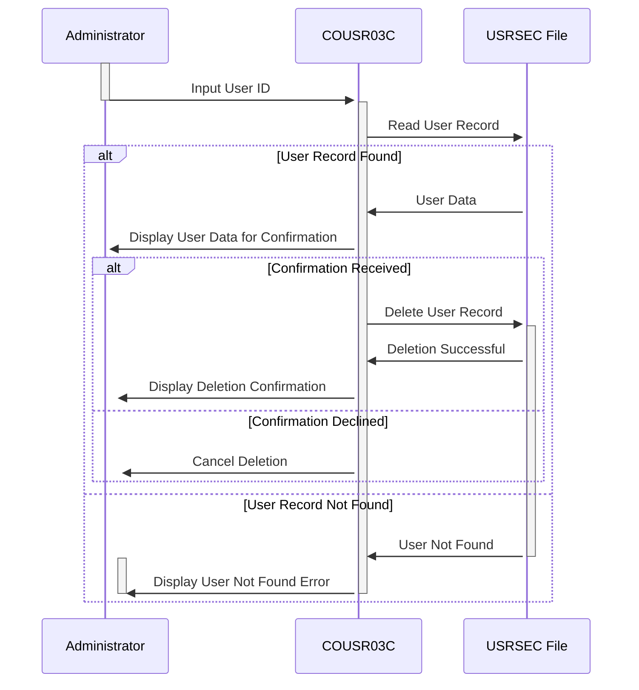

Gerado em: 2 de outubro de 2024

**Título do Documento:** Especificação do Processo de Exclusão de Usuário do CardDemo

**Descrição Resumida:**
Este documento detalha o processo de exclusão de um usuário do aplicativo `CardDemo`. Isso envolve receber um ID de usuário, recuperar as informações do usuário do arquivo `USRSEC`, exibir as informações para confirmação e excluir o registro do usuário após a confirmação.

**Histórias do Usuário:**
Como administrador, preciso excluir usuários do sistema para gerenciar o acesso do usuário e remover contas inativas.

**Épico Relacionado:**
6 - Gerenciamento e Segurança de Usuários

**Requisitos Técnicos:**

- Entrada de ID do Usuário: Este método recebe a entrada do ID do usuário do administrador.
  - Entrada: ID do usuário inserido pelo administrador.
  - Saída:  `USRIDINI OF COUSR3AI` `{String}`: O ID do usuário inserido.

- Ler Dados do Usuário: Este método lê o registro do usuário do arquivo `USRSEC` com base no ID do usuário fornecido.
  - Entrada:  `USRIDINI OF COUSR3AI` `{String}`: O ID do usuário a ser excluído.
  - Saída:  `SEC-USER-DATA` `{Estrutura de Dados}`: Os dados do usuário lidos do arquivo.

- Confirmar Exclusão do Usuário: Este método exibe as informações do usuário recuperadas para o administrador para confirmação antes da exclusão.
  - Entrada:  `SEC-USER-DATA` `{Estrutura de Dados}`: Os dados do usuário a serem exibidos.
  - Saída: Nenhuma. Os dados do usuário são exibidos na tela.

- Excluir Registro do Usuário: Este método exclui o registro do usuário do arquivo `USRSEC`.
  - Entrada: `SEC-USER-ID` `{String}`: O ID do usuário a ser excluído.
  - Saída: Nenhuma. O registro do usuário é excluído do arquivo.

- Exibir Confirmação de Exclusão: Este método exibe uma mensagem de sucesso confirmando a exclusão do usuário.
  - Entrada:  `SEC-USER-ID` `{String}`: O ID do usuário excluído.
  - Saída: Nenhuma. Uma mensagem de sucesso é exibida na tela.

- Lidar com Erros de Exclusão: Este método lida com erros encontrados durante o processo de exclusão, como um ID de usuário inexistente ou problemas de acesso a arquivos, e exibe mensagens de erro apropriadas.
  - Entrada: Códigos de erro dos comandos CICS.
  - Saída: Nenhuma. Uma mensagem de erro é exibida na tela.

**Modelos Relacionados**

- `SEC-USER-DATA`
  - `SEC-USR-ID` `{String}`: ID do usuário para identificar um usuário no sistema.
  - `SEC-USR-FNAME` `{String}`: Primeiro nome do usuário.
  - `SEC-USR-LNAME` `{String}`: Sobrenome do usuário.
  - `SEC-USR-TYPE` `{String}`: Tipo de usuário (por exemplo, Administrador, Usuário).

**Configurações:**

- `COUSR03C.cbl`
  - `WS-USRSEC-FILE`: `"USRSEC  "`
	- Descrição:  Nome do arquivo que contém os dados do usuário.

**Melhorias de Código:**

- Tratamento de Erros Aprimorado: Implemente rotinas de tratamento de erros mais específicas para diferentes tipos de erros, como erros de acesso a arquivos, IDs de usuário inválidos ou falhas de exclusão. Isso permite mensagens de erro mais precisas e possíveis mecanismos de recuperação.
- Registro em Log: Introduza o registro em log para todas as tentativas de exclusão de usuário, incluindo exclusões bem-sucedidas, tentativas malsucedidas e mensagens de erro associadas. Isso fornece um rastro de auditoria para fins de segurança e solução de problemas.
- Desativação do Usuário: Considere adicionar um sinalizador de "desativação" aos registros do usuário em vez de excluí-los permanentemente. Isso permite reter os dados do usuário enquanto impede o acesso ao sistema. 
- Validação de Entrada: Implemente rotinas de validação de dados para o ID do usuário inserido para evitar formatos ou valores de entrada inesperados.

**Melhorias de Segurança:**

- Autenticação e Autorização: Imponha verificações rígidas de autenticação e autorização antes de conceder acesso à funcionalidade de exclusão do usuário. Verifique se o usuário que está executando a exclusão tem as permissões necessárias.
- Registro em Log Seguro: Certifique-se de que os logs sejam armazenados com segurança e protegidos contra acesso não autorizado ou modificação.
- Proteção por Senha: Se o arquivo `USRSEC` contiver senhas, implemente mecanismos robustos de hashing e salga de senha para proteger dados confidenciais.

**Diagrama Conceitual:**

--Made by "Smart Engineering" (by Compass.UOL)--