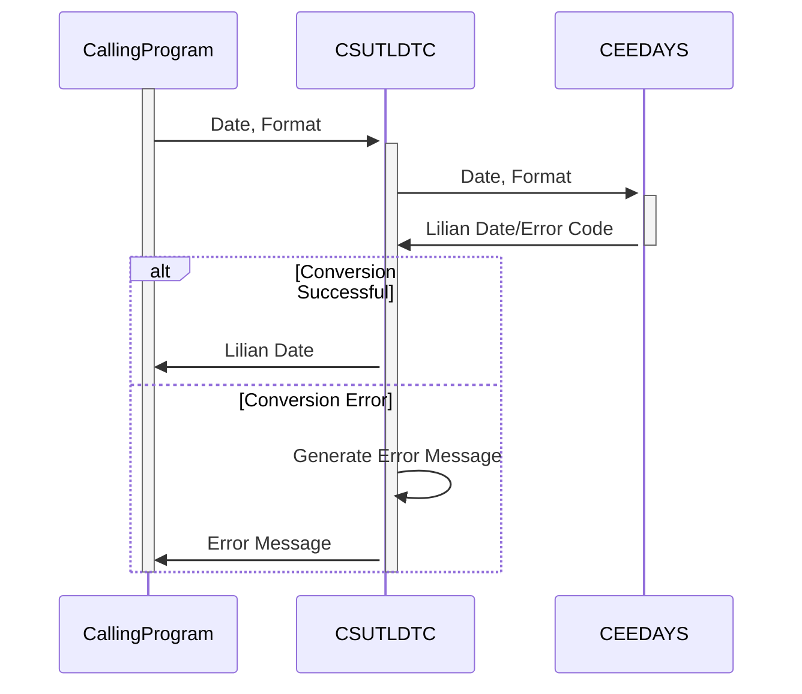

Gerado em: 2 de outubro de 2024

**Título do Documento: Aplicativo CardDemo - Especificação do Utilitário de Conversão de Data (CSUTLDTC)**

**Descrição Resumida:**
O Utilitário de Conversão de Data é um programa COBOL que converte datas de vários formatos para o formato Lilian. Ele usa a função do sistema `CEEDAYS` para realizar a conversão e fornece mensagens de erro detalhadas em caso de entrada inválida. Este utilitário é crucial para garantir cálculos precisos de data no aplicativo CardDemo.

**Histórias do Usuário:**
Como analista de dados, preciso garantir que todas as datas estejam em um formato consistente e legível por computador para que eu possa realizar cálculos e análises precisos.

**Épico Relacionado:**
9 - Utilitários do Sistema

**Requisitos Técnicos:**

- **Conversão de Data:** Este método converte uma data de um determinado formato para o formato Lilian.
  - Entrada: String de data e string de formato (por exemplo, "10-01-2024", "MM-DD-YYYY").
  - Cálculo: Invoca a função do sistema `CEEDAYS`, passando a data de entrada e o formato.
  - Resultado `Inteiro Binário`: Retorna a data Lilian se for bem-sucedido.
- **Tratamento de Erros:** Este método trata erros durante a conversão de data.
  - Entrada: Código de retorno da função `CEEDAYS` (`FEEDBACK-CODE`).
  - Validações:
    - `FC-INVALID-DATE`: Data é válida.
    - `FC-INSUFFICIENT-DATA`: Dados insuficientes fornecidos.
    - `FC-BAD-DATE-VALUE`: Valor de data inválido.
    - `FC-INVALID-ERA`: Era inválida.
    - `FC-UNSUPP-RANGE`: Intervalo de datas não suportado.
    - `FC-INVALID-MONTH`: Mês inválido.
    - `FC-BAD-PIC-STRING`: String de formato inválida.
    - `FC-NON-NUMERIC-DATA`: Dados não numéricos na data.
    - `FC-YEAR-IN-ERA-ZERO`: Ano na era é zero.
  - Saída `String`: Retorna uma mensagem de erro específica com base no código de retorno.

**Modelos Relacionados**
Nenhum modelo está diretamente relacionado a este utilitário.

**Configurações:**

- **CSUTLDTC.cbl**
  - `WS-DATE-RETURN-CODE`: `0`
	- Descrição: Código de Retorno da Conversão de Data (CEEDAYS).
  - `WS-DATE-IN-FORMAT`: `"YYYYMMDD"`
	- Descrição: Formato da Data de Entrada.
  - `WS-DATE-OUT-CCYY`: `"1900"`
	- Descrição: Século Padrão para Data de Saída.

**Melhorias de Código:**

- **Tratamento de Erros Centralizado:** Implemente uma rotina centralizada de tratamento de erros em vez de instruções `EVALUATE` dispersas para melhor manutenção.
- **Log:** Adicione log para conversões e erros bem-sucedidos, incluindo a data de entrada, formato e resultado. Isso ajudará na depuração e auditoria.
- **Validação de Formato:** Considere adicionar validação explícita para a string de formato de data de entrada para garantir que ela esteja em conformidade com os padrões esperados.
- **Documentação:** Adicione mais comentários em linha para explicar a lógica do programa, especialmente a seção de tratamento de erros.

**Melhorias de Segurança:**

- **Validação de Entrada:** Implemente validação de entrada rígida para as strings de data e formato para evitar possíveis vulnerabilidades de injeção.
- **Mensagens de Erro:** Evite revelar informações confidenciais em mensagens de erro. Mensagens genéricas são geralmente suficientes para os usuários entenderem o problema.

**Diagrama Conceitual:**

--Made by "Smart Engineering" (by Compass.UOL)--