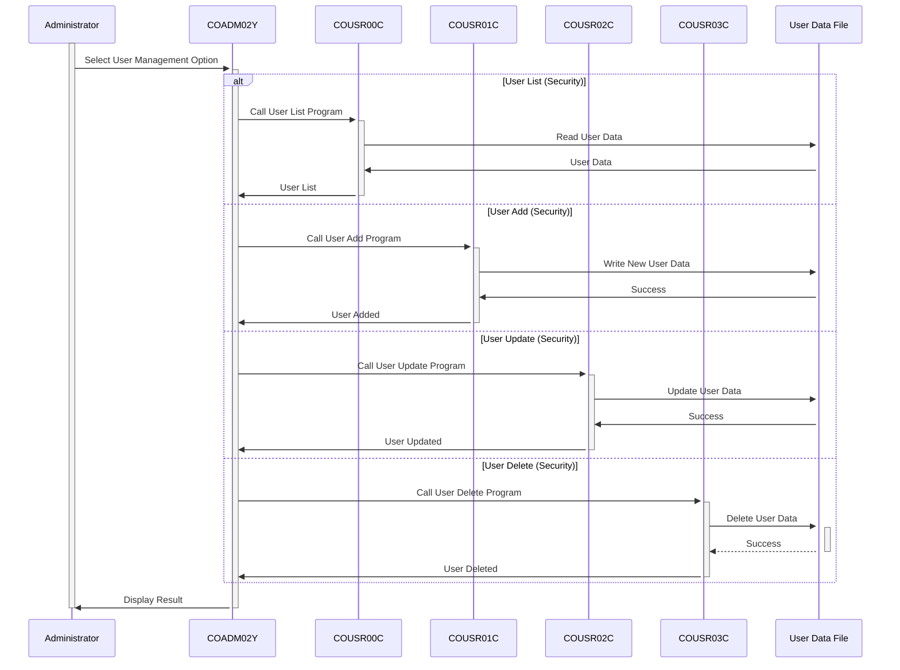

Gerado em: 2 de Outubro de 2024

**Título do Documento:** Aplicativo CardDemo - Especificação do Menu Administrativo de Gerenciamento de Usuários

**Descrição Resumida:**
Este documento descreve as especificações para o menu administrativo de Gerenciamento de Usuários dentro do aplicativo CardDemo. Este menu fornece ao pessoal autorizado ferramentas para gerenciar contas de usuário e suas permissões associadas.

**Histórias do Usuário:**
Como administrador do sistema, preciso ser capaz de gerenciar contas de usuário para controlar o acesso ao aplicativo CardDemo.

**Épico Relacionado:**
`6` - **Gerenciamento de Usuários e Segurança:** Gerenciar o acesso de usuários, funções e permissões para garantir a segurança do sistema e a confidencialidade dos dados.

**Requisitos Técnicos:**

- **Exibir Menu de Gerenciamento de Usuários:** Esta seção exibe o menu administrativo para gerenciar usuários.
  - Entrada: O administrador seleciona a opção de menu "User Management".
  - Processo: O programa exibe as seguintes opções:
    1.  `List Users (Security)`
    2.  `User Add (Security)`
    3.  `User Update (Security)`
    4.  `User Delete (Security)`
  - Saída: Exibe o menu da opção de gerenciamento de usuários selecionada.
- **Listar Usuários (Segurança):** Esta opção recupera e exibe uma lista de todos os usuários registrados, permitindo que os administradores revisem os usuários existentes.
  - Entrada: O administrador seleciona a opção "User List (Security)".
  - Processo: 
    1.  O programa lê os dados do usuário de um arquivo (provavelmente VSAM).
    2.  Formata os dados do usuário para exibição.
  - Saída: Apresenta uma lista de usuários, potencialmente incluindo `User ID`, `Username` e `User Type`.
- **Adicionar Usuário (Segurança):** Esta opção permite a criação de novas contas de usuário com os detalhes necessários e níveis de acesso.
  - Entrada: O administrador seleciona a opção "User Add (Security)".
  - Processo:
    1.  Solicita ao administrador que insira os detalhes do novo usuário, incluindo `Username`, `Password`, `First Name`, `Last Name` e `User Type`.
    2.  Valida os dados de entrada, incluindo verificações de nomes de usuário exclusivos, requisitos de senha forte.
    3.  Adiciona o novo registro de usuário ao arquivo de dados do usuário.
  - Saída: Confirma a criação bem-sucedida da nova conta de usuário.
- **Atualizar Usuário (Segurança):** Esta opção permite modificações nas informações existentes do usuário, como redefinir senhas ou alterar permissões de acesso.
  - Entrada: O administrador seleciona a opção "User Update (Security)".
  - Processo:
    1.  Solicita o `User ID` da conta a ser atualizada.
    2.  Recupera o registro do usuário do arquivo de dados do usuário.
    3.  Permite a modificação dos detalhes do usuário, como `Password`, `First Name`, `Last Name` e `User Type`.
    4.  Valida os dados atualizados.
    5.  Atualiza o registro do usuário no arquivo de dados.
  - Saída: Confirmação da atualização bem-sucedida das informações do usuário.
- **Excluir Usuário (Segurança):** Esta opção remove contas de usuário, revogando seu acesso ao sistema, normalmente realizada quando um usuário está inativo ou seu acesso precisa ser revogado.
  - Entrada: O administrador seleciona a opção "User Delete (Security)".
  - Processo:
    1.  Solicita o `User ID` da conta a ser excluída.
    2.  Recupera o registro do usuário para confirmar a exclusão.
    3.  Após a confirmação, remove o registro do usuário do arquivo de dados do usuário.
  - Saída: Confirmação da exclusão da conta do usuário.

**Modelos Relacionados**
- `CDEMO-ADMIN-OPT`: Representa uma opção no menu administrativo.
  - `CDEMO-ADMIN-OPT-NUM` `PIC 9(02)`: Um identificador numérico exclusivo para cada opção de menu.
  - `CDEMO-ADMIN-OPT-NAME` `PIC X(35)`: Um rótulo de texto descritivo para cada opção de menu.
  - `CDEMO-ADMIN-OPT-PGMNAME` `PIC X(08)`: O nome do programa COBOL associado a cada opção de menu.

**Configurações:**
- `COADM02Y.cpy`
  - `CDEMO-ADMIN-OPT-COUNT`: `4`
	- Descrição: Número total de opções disponíveis no menu Gerenciamento de Usuários.

**Melhorias de Código:**
- **Tratamento de Erros:** Implemente um tratamento de erros robusto para operações de arquivo (abrir, ler, gravar, fechar) e validações de dados. Exiba mensagens de erro específicas para o administrador.
- **Log:** Adicione um mecanismo de log para registrar todas as ações de gerenciamento de usuários, incluindo quem executou a ação, qual ação foi executada e a data e hora. Este log pode ser valioso para auditorias de segurança.
- **Complexidade da Senha:** Imponha regras de complexidade de senha mais fortes durante a criação do usuário e atualizações de senha.
- **Validação de Entrada:** Valide todas as entradas do usuário para evitar vulnerabilidades comuns, como injeção de SQL ou cross-site scripting (embora sejam menos relevantes em um contexto de mainframe, a validação de entrada é sempre uma boa prática).

**Melhorias de Segurança:**
- **Autenticação e Autorização:**  Implemente um mecanismo centralizado de autenticação e autorização para controlar o acesso ao aplicativo CardDemo e suas funções administrativas.
- **Armazenamento Seguro de Senha:** Nunca armazene senhas de usuário em texto simples. Use um algoritmo de hash forte para armazenar senhas com segurança.
- **Gerenciamento de Sessão:** Implemente práticas seguras de gerenciamento de sessão para proteger as sessões de usuário contra sequestro.

**Diagrama Conceitual:**

--Made by "Smart Engineering" (by Compass.UOL)--