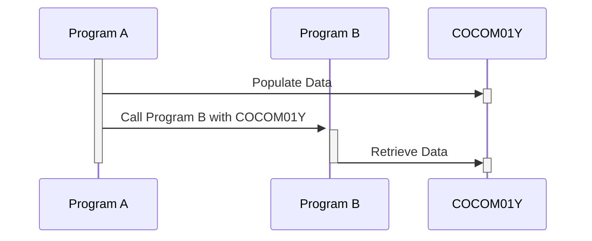

Gerado em: 2 de outubro de 2024

**Título do Documento: Especificação da Área de Comunicação da Aplicação CardDemo (COCOM01Y)**

**Descrição Resumida:**
Este documento descreve a estrutura e função do `CARDDEMO-COMMAREA`, uma estrutura de dados padronizada utilizada para comunicação entre diferentes programas dentro da aplicação CardDemo. Esta área de comunicação garante a troca de dados sem interrupções e mantém a integridade dos dados em todo o sistema de gerenciamento de cartão de crédito.

**Histórias do Usuário:**
Como desenvolvedor de software, preciso de uma maneira padronizada de trocar dados entre diferentes programas dentro da aplicação CardDemo para garantir a consistência e integridade dos dados.

**Épico Relacionado:** 9 - Utilitários do Sistema

**Requisitos Técnicos:**
- **Fluxo de Trabalho de Troca de Dados**: Este fluxo de trabalho define o processo de preenchimento e interpretação de dados no `CARDDEMO-COMMAREA`.
  - **Preenchimento de Dados**: O programa remetente preenche os campos relevantes do `CARDDEMO-COMMAREA` com os dados necessários.
  - **Transferência de Dados**: O `CARDDEMO-COMMAREA` é passado para o programa receptor, seja como um parâmetro em uma instrução CALL ou por meio de um mecanismo de memória compartilhada.
  - **Interpretação de Dados**: O programa receptor recupera os dados dos campos apropriados do `CARDDEMO-COMMAREA`.
  - Resultado: `CARDDEMO-COMMAREA`: Uma estrutura de dados preenchida contendo as informações a serem compartilhadas entre os programas.

**Modelos Relacionados:**
- `CARDDEMO-COMMAREA`
  - `CDEMO-FROM-TRANID` `PIC X(04)`: ID da transação do programa remetente.
  - `CDEMO-FROM-PROGRAM` `PIC X(08)`: Nome do programa remetente.
  - `CDEMO-TO-TRANID` `PIC X(04)`: ID da transação do programa receptor.
  - `CDEMO-TO-PROGRAM` `PIC X(08)`: Nome do programa receptor.
  - `CDEMO-USER-ID` `PIC X(08)`: ID do usuário que iniciou a transação.
  - `CDEMO-USER-TYPE` `PIC X(01)`: Tipo de usuário (Administrador ou Regular).
  - `CDEMO-PGM-CONTEXT` `PIC 9(01)`: Contexto de entrada/reentrada do programa.
  - `CDEMO-CUST-ID` `PIC 9(09)`: Identificador único do cliente.
  - `CDEMO-CUST-FNAME` `PIC X(25)`: Primeiro nome do cliente.
  - `CDEMO-CUST-MNAME` `PIC X(25)`: Nome do meio do cliente.
  - `CDEMO-CUST-LNAME` `PIC X(25)`: Sobrenome do cliente.
  - `CDEMO-ACCT-ID` `PIC 9(11)`: Identificador único da conta.
  - `CDEMO-ACCT-STATUS` `PIC X(01)`: Status atual da conta.
  - `CDEMO-CARD-NUM` `PIC 9(16)`: Número do cartão de crédito associado à conta.
  - `CDEMO-LAST-MAP` `PIC X(7)`: Nome do último mapa usado.
  - `CDEMO-LAST-MAPSET` `PIC X(7)`: Último conjunto de mapas usado.

**Configurações:**
- Nenhum valor de configuração específico é encontrado no trecho de código. No entanto, é importante observar que os tipos de dados e comprimentos definidos nas cláusulas `PIC` atuam como restrições e configurações para os dados que estão sendo trocados.

**Melhorias de Código:**
- **Adicionar Validação de Dados**: Implemente verificações para garantir que os dados que estão sendo preenchidos no `CARDDEMO-COMMAREA` estejam em conformidade com o formato e os tipos de dados esperados.
- **Documentar o Uso do Campo**: Forneça comentários claros para cada campo, especificando sua finalidade, valores permitidos e quaisquer dependências de outros campos.
- **Considerar Versionamento**: Se a estrutura da área de comunicação provavelmente mudar no futuro, implemente um mecanismo de versionamento para manter a compatibilidade com versões anteriores.

**Melhorias de Segurança:**
- **Proteger Dados Sensíveis**: Criptografe informações confidenciais como `CDEMO-CARD-NUM` durante a transmissão para evitar acesso não autorizado.
- **Implementar Controle de Acesso**: Restrinja o acesso aos campos com base em funções e permissões do usuário. Por exemplo, usuários regulares não devem ter acesso a `CDEMO-USER-TYPE`.
- **Registrar Acesso à Área de Comunicação**: Mantenha trilhas de auditoria para rastrear quais programas acessam e modificam o `CARDDEMO-COMMAREA` para fins de segurança e depuração.

**Diagrama Conceitual:**

--Made by "Smart Engineering" (by Compass.UOL)--