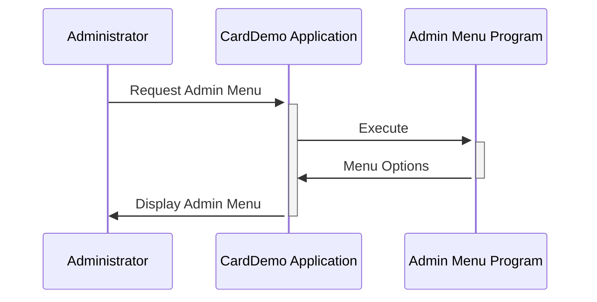

Gerado em: 2 de outubro de 2024

**Título do Documento:** CardDemo Application - Especificação do Menu Administrativo

**Descrição Resumida:**
Este documento descreve a funcionalidade do Menu Administrativo da Aplicação CardDemo, com foco específico nas opções disponíveis para usuários administrativos. Este menu serve como um hub central para os administradores gerenciarem vários aspectos do sistema de cartão de crédito.

**Histórias do Usuário:**
Como administrador, preciso de acesso a um menu dedicado com opções para gerenciar contas, cartões, transações e gerar relatórios para que eu possa administrar o sistema de cartão de crédito com eficácia.

**Épico Relacionado:** 6 - Gerenciamento de Usuários e Segurança

**Requisitos Técnicos:**
- **Exibição do Menu Administrativo:**
  - Descrição: Esta funcionalidade exibe as opções do menu administrativo para usuários autorizados.
  - Entrada: Função do usuário e status de autenticação.
  - Processamento: Após login bem-sucedido como um usuário administrador (`CDEMO-MENU-OPT-USRTYPE` = 'U'), o sistema apresenta um menu com uma lista de opções (`CDEMO-MENU-OPT-NAME`). Cada opção está associada a um programa correspondente (`CDEMO-MENU-OPT-PGMNAME`) a ser executado após a seleção. 
  - Saída: Exibe as opções do menu administrativo com seus números correspondentes (`CDEMO-MENU-OPT-NUM`) para seleção do usuário.

**Modelos Relacionados:**
- **`CARDDEMO-MAIN-MENU-OPTIONS`:** Uma estrutura de dados que contém as opções do menu administrativo.
  - `CDEMO-MENU-OPT-NUM` `Numeric(9(02))`: Número sequencial da opção do menu.
  - `CDEMO-MENU-OPT-NAME` `Alphanumeric(X(35))`: Nome de exibição da opção do menu.
  - `CDEMO-MENU-OPT-PGMNAME` `Alphanumeric(X(08))`: Nome do programa associado à opção do menu.
  - `CDEMO-MENU-OPT-USRTYPE` `Alphanumeric(X(01))`: Tipo de usuário autorizado a acessar a opção (sempre 'U' neste caso).

**Configurações:**
- **`COMEN02Y.cpy`**
  - `CDEMO-MENU-OPT-COUNT`: `10`
	- Descrição: Número total de opções de menu disponíveis para usuários administradores.

**Melhorias de Código:**
- **Geração Dinâmica de Menu:** Em vez de codificar as opções do menu, buscá-las de uma tabela de banco de dados. Isso permite maior flexibilidade no gerenciamento de opções de menu e sua visibilidade com base nas funções do usuário.
- **Tratamento de Erros:** Implementar verificações para seleções de opções de menu inválidas e exibir mensagens de erro adequadas ao usuário.
- **Registro:** Adicionar instruções de registro para rastrear o acesso ao menu e as seleções para fins de auditoria e solução de problemas.

**Melhorias de Segurança:**
- **Autorização:** Implementar controle de acesso baseado em função (RBAC) para restringir as opções do menu com base nas funções do usuário. Isso garante que apenas pessoal autorizado possa acessar funcionalidades confidenciais.
- **Gerenciamento de Sessão:** Implementar práticas seguras de gerenciamento de sessão para impedir o acesso não autorizado ao menu administrativo após a expiração da sessão do usuário.

**Diagrama Conceitual:**

--Made by "Smart Engineering" (by Compass.UOL)--