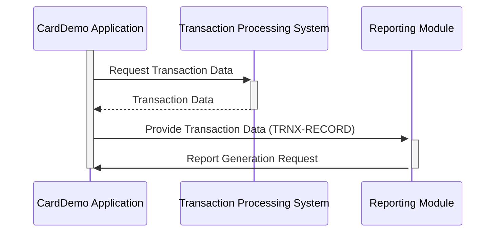

Gerado em: 2 de outubro de 2024

**Título do Documento: CardDemo - Estrutura de Relatório de Transações**

**Descrição Resumida:**

Este documento descreve uma estrutura de dados COBOL projetada para relatórios de transações com cartão de crédito/débito dentro do sistema CardDemo. Ele garante a organização consistente e estruturada dos dados para gerar vários relatórios.

**Histórias do Usuário:**

Como analista de dados, preciso de um formato padronizado para dados de transações para gerar relatórios precisos e consistentes sobre transações com cartão. Isso ajudará na análise de tendências de transações, identificação de padrões e tomada de decisões de negócios informadas.

**Épico Relacionado:**
5 - Relatórios e Análise

**Requisitos Técnicos:**

- **Estrutura de Dados de Transação:** Defina uma estrutura de dados COBOL chamada `TRNX-RECORD` para representar um único registro de transação. Essa estrutura conterá campos para armazenar detalhes importantes da transação, como número do cartão, ID da transação, tipo, categoria, valor, informações do comerciante e carimbos de data/hora.
  - **Entrada:** Nenhuma. A estrutura `TRNX-RECORD` não é preenchida a partir de um arquivo de entrada. Ela serve como um modelo para organizar dados de transações.
  - **Processamento:** Os aplicativos irão preencher instâncias dessa estrutura com dados de sistemas de processamento de transações.
  - **Resultado** `TRNX-RECORD`: Um registro de dados estruturado contendo todas as informações necessárias sobre uma única transação, pronto para ser usado para fins de relatório.

**Modelos Relacionados**

- **Transação (`TRNX-RECORD`)**
  - `TRNX-CARD-NUM` `Alphanumeric(16)`: O número do cartão de crédito/débito associado à transação.
  - `TRNX-ID` `Alphanumeric(16)`: Um identificador único para a transação.
  - `TRNX-TYPE-CD` `Code(2)`: Um código que significa o tipo de transação (por exemplo, "PR" para Compra, "RF" para Reembolso).
  - `TRNX-CAT-CD` `Code(4)`: Um código que categoriza a transação (por exemplo, "FOOD" para Mercearias, "TRVL" para Viagem).
  - `TRNX-SOURCE` `Alphanumeric(10)`: A origem da transação (por exemplo, "ONLINE", "POS", "ATM").
  - `TRNX-DESC` `Alphanumeric(100)`: Uma descrição da transação.
  - `TRNX-AMT` `Numeric(9,2)`: O valor da transação com duas casas decimais para centavos.
  - `TRNX-MERCHANT-ID` `Numeric(9)`: Um identificador único para o comerciante.
  - `TRNX-MERCHANT-NAME` `Alphanumeric(50)`: O nome do comerciante.
  - `TRNX-MERCHANT-CITY` `Alphanumeric(50)`: A cidade da localização do comerciante.
  - `TRNX-MERCHANT-ZIP` `Alphanumeric(10)`: O código postal da localização do comerciante.
  - `TRNX-ORIG-TS` `Timestamp`: A data e hora em que a transação foi iniciada.
  - `TRNX-PROC-TS` `Timestamp`: A data e hora em que a transação foi processada.

**Configurações:**

- Nenhum parâmetro de configuração externo foi encontrado no contexto fornecido.

**Melhorias de Código:**

- **Validação de Dados:** Implemente rotinas de validação de dados para garantir a precisão e consistência dos dados dentro da estrutura `TRNX-RECORD`. Isso inclui verificações para tipos de transações válidos, categorias, formatos de data/hora e intervalos de dados.
- **Tratamento de Erros:** Incorpore mecanismos de tratamento de erros para gerenciar normalmente os problemas encontrados durante o preenchimento de dados ou processamento da estrutura `TRNX-RECORD`. Isso pode envolver o registro de erros, a geração de alertas ou o fornecimento de mensagens informativas aos usuários.
- **Documentação:** Forneça documentação abrangente para a estrutura `TRNX-RECORD`, definindo claramente a finalidade de cada campo, os valores permitidos e quaisquer regras de validação aplicadas.

**Melhorias de Segurança:**

- **Criptografia de Dados:** Considere criptografar dados confidenciais dentro da estrutura `TRNX-RECORD`, especialmente ao armazenar ou transmitir informações como números de cartão e IDs de comerciante.
- **Controle de Acesso:** Implemente mecanismos de controle de acesso para restringir o acesso não autorizado aos dados de transações armazenados na estrutura `TRNX-RECORD`.

**Diagrama Conceitual:**

--Made by "Smart Engineering" (by Compass.UOL)--