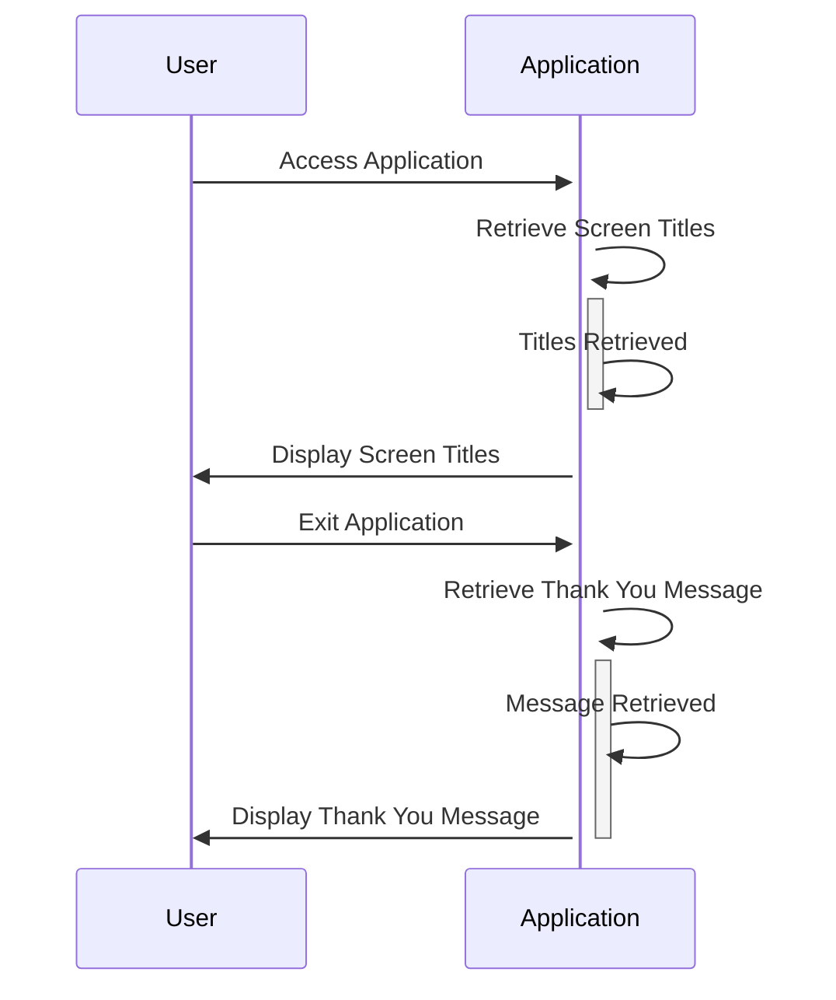

Gerado em: 2 de Outubro de 2024

**Título do Documento: Especificação de Títulos de Tela e Mensagens da Aplicação CardDemo**

**Descrição Resumida:**
Este documento descreve as especificações para a exibição de títulos e mensagens dentro da aplicação CardDemo, um sistema de gerenciamento de cartões de crédito baseado em COBOL. O objetivo principal é aprimorar a experiência do usuário apresentando uma marca consistente e mensagens amigáveis ao usuário em toda a aplicação.

**Histórias do Usuário:**
Como usuário, preciso ver títulos e mensagens claros e consistentes para que eu possa entender e navegar facilmente pela aplicação.

**Épico Relacionado:** 9 - Utilitários do Sistema

**Requisitos Técnicos:**

- Exibição de Títulos de Tela: Esta funcionalidade define e exibe os títulos nas telas da aplicação.
  - Definição: Os títulos são definidos como valores constantes dentro do copybook `COTTL01Y.cpy`. Cada título está associado a uma tela ou funcionalidade específica dentro da aplicação CardDemo.
  - Exibição: A aplicação recupera esses títulos e os exibe nas áreas designadas de cada tela, garantindo uma aparência uniforme.
  - Resultado `String`: Exibição de títulos como `AWS Mainframe Modernization` e `CardDemo` nas telas da aplicação.

- Exibir Mensagem de Agradecimento: Esta funcionalidade define e exibe uma mensagem de agradecimento ao usuário ao sair da aplicação.
  - Definição: A mensagem de agradecimento é definida como um valor constante dentro do copybook `COTTL01Y.cpy`.
  - Lógica de Exibição: A aplicação exibe esta mensagem quando o usuário aciona uma ação de saída ou logout.
  - Resultado `String`: Exibição da mensagem `Thank you for using CCDA application...` ao usuário sair.

**Modelos Relacionados**
N/A - Este componente não define nenhum modelo de dados específico. Ele fornece strings de texto para fins de exibição.

**Configurações:**

- `COTTL01Y.cpy`
  - `CCDA-TITLE01`: `'      AWS Mainframe Modernization       '`
	- Descrição: Primeira linha do título da aplicação.
  - `CCDA-TITLE02`: `'              CardDemo                  '`
	- Descrição: Segunda linha do título da aplicação.
  - `CCDA-THANK-YOU`: `'Thank you for using CCDA application... '`
	- Descrição: Mensagem de agradecimento exibida ao usuário ao sair da aplicação.

**Melhorias de Código:**

- Externalizar Strings: Mover os títulos e mensagens da tela para um arquivo de configuração externo ou tabela de banco de dados. Isso permitiria a modificação mais fácil desses elementos sem exigir a recompilação do código.
- Localização: Implementar suporte para vários idiomas carregando o conjunto apropriado de strings com base nas preferências do usuário ou configurações do sistema.

**Melhorias de Segurança:**
N/A - Este componente se concentra em elementos de interface do usuário e não envolve diretamente dados confidenciais ou funções de segurança.

**Diagrama Conceitual:**

--Made by "Smart Engineering" (by Compass.UOL)--