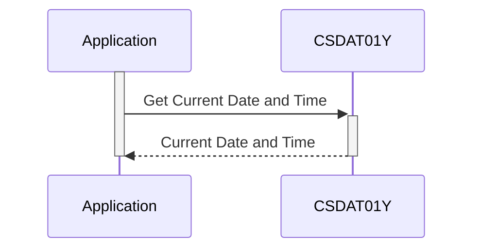

Gerado em: 2 de outubro de 2024

**Título do Documento: CardDemo Application - Especificação Padrão de Data e Hora**

**Descrição Resumida:**
Este documento define a estrutura padrão para representar informações de data e hora dentro da aplicação CardDemo. Ele garante consistência e precisão no registro, exibição e processamento de datas e horários em todas as funcionalidades do sistema.

**Histórias do Usuário:**
Como analista de dados, preciso de um formato consistente e confiável para dados de data e hora na aplicação CardDemo para garantir análises e relatórios precisos.

**Épico Relacionado:** 
9 - Utilitários do Sistema

**Requisitos Técnicos:**
- **Formatação de Data e Hora:**
  - Entrada: Dados brutos de data e hora de várias fontes.
  - Processamento: Formatar data como `YYYYMMDD` ou `MM/DD/YY` e hora como `HHMMSS` ou `HH:MM:SS`.
  - Resultado: `WS-CURDATE`, `WS-CURDATE-MM-DD-YY`, `WS-CURTIME`, e `WS-CURTIME-HH-MM-SS`.
- **Geração de Timestamp:**
  - Entrada: Dados de data e hora atuais.
  - Processamento: Combinar componentes de data e hora com milissegundos em uma única string de timestamp no formato `YYYY-MM-DD HH:MM:SS.SSSSSS`.
  - Resultado: `WS-TIMESTAMP`.
- **Decomposição de Timestamp:**
  - Entrada: `WS-TIMESTAMP`.
  - Processamento: Extrair os componentes de ano, mês, dia, hora, minuto, segundo e milissegundo da string de timestamp.
  - Resultado: `WS-TIMESTAMP-DT-YYYY`, `WS-TIMESTAMP-DT-MM`, `WS-TIMESTAMP-DT-DD`, `WS-TIMESTAMP-TM-HH`, `WS-TIMESTAMP-TM-MM`, `WS-TIMESTAMP-TM-SS`, `WS-TIMESTAMP-TM-MS6`.

**Modelos Relacionados:**
- **Estrutura de Data e Hora:**
  - `WS-CURDATE` `Integer`: Data atual no formato YYYYMMDD.
  - `WS-CURDATE-YEAR` `Integer`: Ano atual (YYYY).
  - `WS-CURDATE-MONTH` `Integer`: Mês atual (MM).
  - `WS-CURDATE-DAY` `Integer`: Dia atual (DD).
  - `WS-CURTIME` `Integer`: Hora atual no formato HHMMSS.
  - `WS-CURTIME-HOURS` `Integer`: Hora atual (HH).
  - `WS-CURTIME-MINUTE` `Integer`: Minuto atual (MM).
  - `WS-CURTIME-SECOND` `Integer`: Segundo atual (SS).
  - `WS-CURTIME-MILSEC` `Integer`: Milissegundo atual (centésimos de segundo).
  - `WS-CURDATE-MM-DD-YY` `String`: Data atual no formato MM/DD/YY.
  - `WS-CURTIME-HH-MM-SS` `String`: Hora atual no formato HH:MM:SS.
  - `WS-TIMESTAMP` `String`: Valor de timestamp combinando data e hora com milissegundos.
  - `WS-TIMESTAMP-DT-YYYY` `Integer`: Ano do timestamp (YYYY).
  - `WS-TIMESTAMP-DT-MM` `Integer`: Mês do timestamp (MM).
  - `WS-TIMESTAMP-DT-DD` `Integer`: Dia do timestamp (DD).
  - `WS-TIMESTAMP-TM-HH` `Integer`: Hora do timestamp (HH).
  - `WS-TIMESTAMP-TM-MM` `Integer`: Minuto do timestamp (MM).
  - `WS-TIMESTAMP-TM-SS` `Integer`: Segundo do timestamp (SS).
  - `WS-TIMESTAMP-TM-MS6` `Integer`: Milissegundos do timestamp (SSSSSS).

**Configurações:**
- N/A

**Melhorias de Código:**
- **Tratamento de Erros:** Implementar rotinas de tratamento de erros para gerenciar situações como entradas inválidas de data/hora ou erros de relógio do sistema.
- **Documentação:** Aprimorar os comentários do código para explicar claramente o propósito e o uso de cada estrutura de dados e função de formatação.
- **Reconhecimento de Fuso Horário:** Incorporar informações de fuso horário às estruturas de data e hora para oferecer suporte a aplicativos que operam em vários fusos horários.
- **Tratamento de Horário de Verão:** Incluir lógica para ajustar automaticamente as transições de horário de verão, garantindo a cronometragem precisa durante todo o ano.

**Melhorias de Segurança:**
- **Fonte de Tempo Segura:** Utilizar uma fonte de tempo segura e confiável, como um servidor de protocolo de tempo de rede (NTP), para evitar a manipulação de dados relacionados ao tempo.
- **Validação de Entrada:** Validar todas as entradas de data e hora para evitar ataques de injeção e garantir a integridade dos dados.

**Diagrama Conceitual:**

--Made by "Smart Engineering" (by Compass.UOL)--