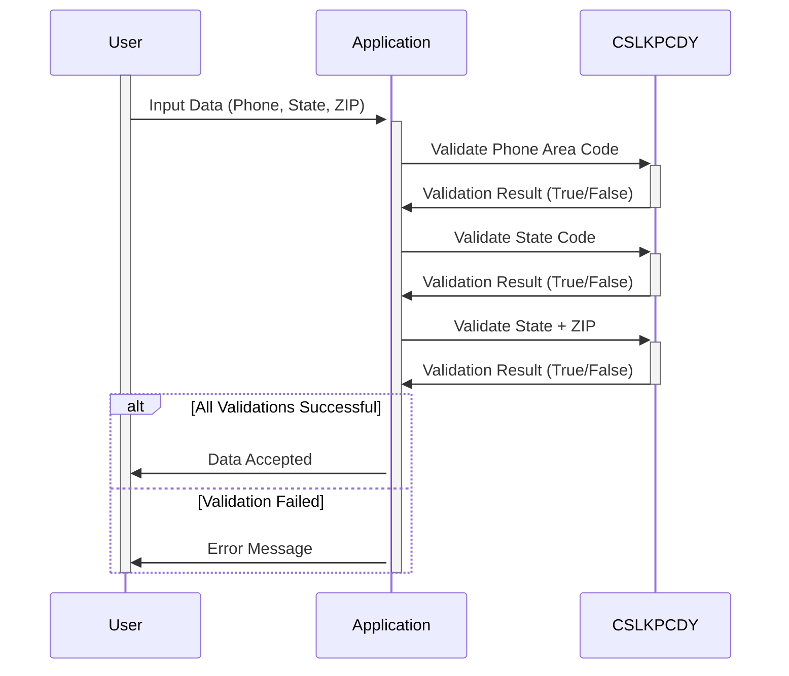

Gerado em: 2 de outubro de 2024

**Título do Documento:** Data Integrity Guardian - Especificação do Repositório de Códigos de Pesquisa

**Descrição Resumida:**
Este documento detalha as especificações para um programa COBOL que atua como um guardião da integridade de dados validando códigos de área de telefone, códigos de estado dos EUA e combinações de estado + CEP em relação a listas predefinidas. O programa garante que apenas dados válidos sejam aceitos, aumentando a precisão dos dados e a confiabilidade do sistema.

**Histórias do Usuário:**
Como analista de dados, preciso ter certeza de que os números de telefone, códigos de estado e CEPs usados em nossas análises sejam precisos e padronizados para que nossos relatórios e insights sejam confiáveis e estejam em conformidade com os requisitos regulamentares.

**Épico Relacionado:**
9 - Utilitários do Sistema

**Requisitos Técnicos:**

- **Validar Código de Área de Telefone:** Este método verifica se um determinado código de área de telefone é válido.
  - Entrada: `WS-US-PHONE-AREA-CODE-TO-EDIT` `{PIC XXX}`: Código de área de telefone a ser validado.
  - Validação: Verifica se `WS-US-PHONE-AREA-CODE-TO-EDIT` está presente na lista `VALID-PHONE-AREA-CODE`.
  - Resultado `Boolean`: Retorna `TRUE` se válido, `FALSE` caso contrário.

- **Validar Código de Estado dos EUA:** Este método verifica se um código de estado dos EUA fornecido é válido.
  - Entrada: `US-STATE-CODE-TO-EDIT` `{PIC X(2)}`: Código de estado dos EUA a ser validado.
  - Validação: Verifica se `US-STATE-CODE-TO-EDIT` está presente na lista `VALID-US-STATE-CODE`.
  - Resultado `Boolean`: Retorna `TRUE` se válido, `FALSE` caso contrário.

- **Validar Combinação de Estado dos EUA e CEP:** Este método garante que a combinação de um código de estado dos EUA e os primeiros dois dígitos de um CEP seja geograficamente válida.
  - Entrada: `US-STATE-AND-FIRST-ZIP2` `{PIC X(4)}`: Código de estado dos EUA concatenado com os primeiros dois dígitos do CEP.
  - Validação: Verifica se `US-STATE-AND-FIRST-ZIP2` está presente na lista `VALID-US-STATE-ZIP-CD2-COMBO`.
  - Resultado `Boolean`: Retorna `TRUE` se válido, `FALSE` caso contrário.

**Modelos Relacionados**

- **Código de Área de Telefone:**
  - `WS-US-PHONE-AREA-CODE-TO-EDIT` `{PIC XXX}`: Representa um código de área de telefone de três dígitos.

- **Código de Estado dos EUA:**
  - `US-STATE-CODE-TO-EDIT` `{PIC X(2)}`: Representa um código de estado dos EUA de duas letras.

- **Combinação de Estado dos EUA e CEP:**
  - `US-STATE-AND-FIRST-ZIP2` `{PIC X(4)}`: Representa uma combinação de quatro caracteres de um código de estado dos EUA de duas letras e os primeiros dois dígitos de um CEP.
  - `LAST-3-OF-ZIP` `{PIC X(3)}`: Representa os últimos três dígitos de um CEP (atualmente não utilizado).

**Configurações:**

- `CSLKPCDY.cpy`
  - `VALID-PHONE-AREA-CODE`: `{'201', '202', ..., '999'}`
	- Descrição: Lista de códigos de área de telefone válidos da América do Norte.
  - `VALID-US-STATE-CODE`: `{'AL', 'AK', ..., 'VI'}`
	- Descrição: Lista de códigos de estado dos EUA válidos.
  - `VALID-US-STATE-ZIP-CD2-COMBO`: `{'AA34', 'AE90', ..., 'WY83'}`
	- Descrição: Lista de combinações válidas de códigos de estado dos EUA e os primeiros dois dígitos de CEPs.

**Melhorias de Código:**

- **Registro de Erros:** Implemente um mecanismo para registrar erros de validação, incluindo os dados inválidos e a origem da entrada, para fins de auditoria e solução de problemas.
- **Documentação:** Aprimore o código com comentários explicando o propósito e a lógica de cada regra de validação e as estruturas de dados usadas.
- **Otimização de Desempenho:** Se as listas de validação forem extensas, considere usar pesquisa binária ou outros algoritmos de pesquisa eficientes para melhorar o desempenho.
- **Externalizar Listas de Validação:** Armazene as listas de validação em arquivos externos ou em um banco de dados para permitir atualizações e manutenção mais fáceis sem modificar o código do programa.
- **Carregamento Dinâmico da Lista de Validação:** Implemente um mecanismo para carregar as listas de validação dinamicamente na inicialização do programa, permitindo maior flexibilidade e reduzindo a necessidade de recompilação quando as listas mudam.

**Melhorias de Segurança:**

- **Controle de Acesso:** Restrinja o acesso ao arquivo `CSLKPCDY.cpy` e quaisquer arquivos externos ou bancos de dados contendo listas de validação apenas para pessoal autorizado.
- **Criptografia de Dados:** Criptografe dados confidenciais, como números de telefone e endereços de clientes, quando armazenados e transmitidos para proteger a privacidade do cliente.
- **Auditoria:** Implemente trilhas de auditoria para rastrear alterações nas listas de validação e quaisquer falhas de validação de dados, fornecendo um registro da atividade do sistema para fins de segurança e conformidade.

**Diagrama Conceitual:**

--Made by "Smart Engineering" (by Compass.UOL)--