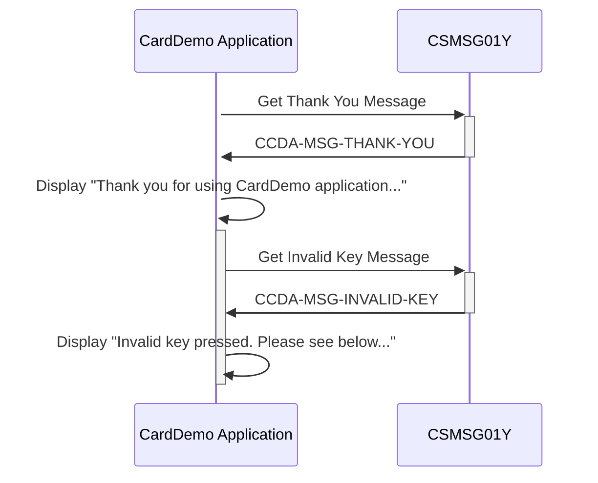

Gerado em: 2 de Outubro de 2024

**Título do Documento:** Aplicativo CardDemo - Especificação do Repositório de Mensagens Comuns

**Descrição Resumida:**
Este documento descreve a funcionalidade de um copybook COBOL (`CSMSG01Y.cpy`) dentro do aplicativo CardDemo. Este copybook serve como um repositório centralizado para mensagens comuns do usuário, garantindo consistência na comunicação com o usuário em todo o aplicativo.

**Histórias do Usuário:**
Como desenvolvedor, preciso de um repositório centralizado para mensagens comuns do usuário para que o aplicativo forneça uma experiência consistente e amigável.

**Épico Relacionado:**
9 - Utilitários do Sistema

**Requisitos Técnicos:**
- `Exibir Mensagem de Agradecimento`: Este método exibe uma mensagem de agradecimento ao usuário.
  - Entrada: Nenhuma.
  - Saída: Exibe a mensagem `Thank you for using CardDemo application...` na tela do usuário.
- `Exibir Mensagem de Tecla Inválida`: Este método informa o usuário sobre pressionar uma tecla inválida.
  - Entrada: Nenhuma.
  - Saída: Exibe a mensagem `Invalid key pressed. Please see below...` na tela do usuário.

**Modelos Relacionados**
- N/A

**Configurações:**
- `CSMSG01Y.cpy`
  - `CCDA-MSG-THANK-YOU`: `'Thank you for using CardDemo application...      '`
	- Descrição: Mensagem de agradecimento exibida ao usuário após a conclusão bem-sucedida de uma ação.
  - `CCDA-MSG-INVALID-KEY`: `'Invalid key pressed. Please see below...         '`
	- Descrição: Mensagem exibida quando o usuário pressiona uma tecla inválida, solicitando a entrada correta.

**Melhorias de Código:**
- **Externalizar Mensagens:** Considere armazenar essas mensagens em um arquivo externo ou tabela de banco de dados. Isso permitiria uma modificação mais fácil das mensagens sem exigir a recompilação do código.
- **Suporte Multilíngue:** Para aplicativos destinados a um público global, explore a incorporação de suporte multilíngue para mensagens. Isso envolveria definir mensagens em diferentes idiomas e exibir dinamicamente a mensagem apropriada com base nas preferências do usuário.

**Melhorias de Segurança:**
- N/A

**Diagrama Conceitual:**

--Made by "Smart Engineering" (by Compass.UOL)--