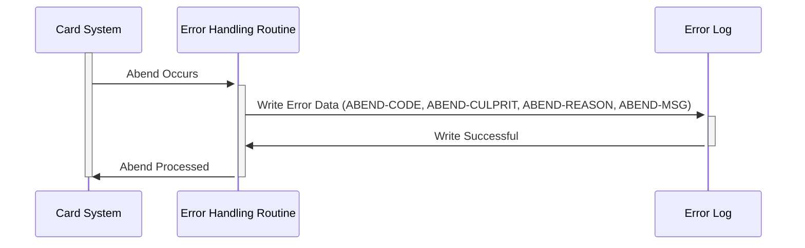

Gerado em: 2 de outubro de 2024

**Título do Documento: Especificação de Registro de Erros do Sistema de Cartões**

**Descrição Resumida:**
Esta especificação define uma estrutura padronizada para registrar erros dentro do Sistema de Cartões. Ela descreve as informações capturadas para cada erro e destaca sua importância para a estabilidade do sistema, resolução de problemas e rastreamento de erros.

**Histórias do Usuário:**
Como Administrador do Sistema, preciso de uma maneira de identificar e entender rapidamente os erros do sistema para que eu possa resolver os problemas com eficiência e minimizar o tempo de inatividade do sistema.

**Épico Relacionado:** 
9 - Utilitários do Sistema

**Requisitos Técnicos:**

- **Estrutura de Registro de Erros:**
  - Definição: Esta estrutura define um formato padronizado para armazenar informações de erro.
  - Propriedades:
    - `ABEND-CODE` (`String(4)`): Um código de quatro caracteres representando o tipo específico de erro.
    - `ABEND-CULPRIT` (`String(8)`): Um campo de oito caracteres armazenando o programa ou componente onde o erro se originou.
    - `ABEND-REASON` (`String(50)`): Um campo de cinquenta caracteres para uma explicação detalhada da causa do erro.
    - `ABEND-MSG` (`String(72)`): Um campo de setenta e dois caracteres para uma mensagem de erro geral e amigável ao usuário.

**Modelos Relacionados**
- N/A

**Configurações:**
- `CSMSG02Y.cpy`
  - `ABEND-CODE`: `""`
	  - Descrição: Inicializado com espaços, para ser preenchido com o código de erro específico quando ocorrer um abend.
  - `ABEND-CULPRIT`: `""`
	  - Descrição: Inicializado com espaços, para ser preenchido com o nome do programa ou módulo onde o abend se originou.
  - `ABEND-REASON`: `""`
	  - Descrição: Inicializado com espaços, para ser preenchido com uma explicação detalhada do motivo pelo qual o abend ocorreu.
  - `ABEND-MSG`: `""`
	  - Descrição: Inicializado com espaços, para ser preenchido com uma mensagem geral sobre o abend, adequada para exibição ou registro.

**Melhorias de Código:**
- **Padronização do Código de Erro:** Estabeleça um conjunto abrangente de códigos de erro com definições claras para garantir a consistência no relatório de erros.
- **Registro Centralizado:** Implemente um sistema de registro centralizado para agregar registros de erros de vários componentes do sistema para facilitar a análise e correlação.
- **Alertas Automatizados:** Configure alertas automatizados para erros críticos para notificar os administradores do sistema em tempo real, permitindo uma resposta e resolução mais rápidas.
- **Política de Retenção de Logs:** Defina uma política clara de retenção de logs com base em requisitos operacionais e regulatórios para gerenciar o armazenamento e arquivamento de logs.

**Melhorias de Segurança:**
- **Controle de Acesso:** Restrinja o acesso aos registros de erros apenas ao pessoal autorizado. Implemente o controle de acesso baseado em função para gerenciar permissões de forma eficaz.
- **Integridade do Log:** Empregue medidas para garantir a integridade dos registros de erros, evitando modificações ou exclusões não autorizadas. Considere o uso de assinaturas digitais ou checksums.
- **Práticas Seguras de Registro:** Evite registrar dados confidenciais, como credenciais de clientes ou informações financeiras, em texto simples dentro de mensagens de erro.

**Diagrama Conceitual:**

--Made by "Smart Engineering" (by Compass.UOL)--