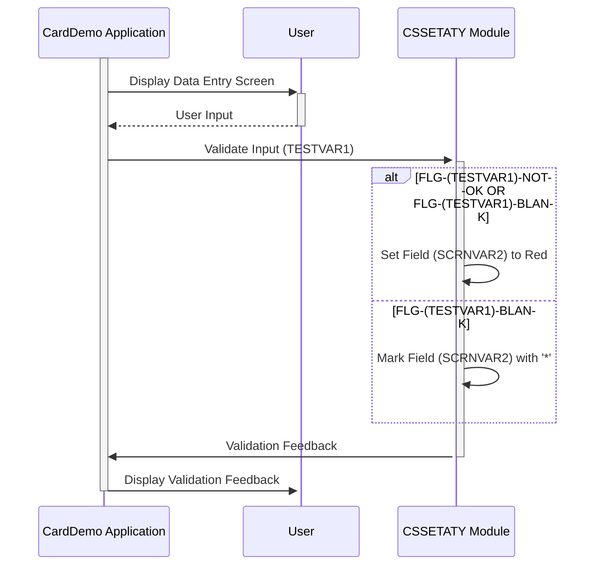

Gerado em: 2 de outubro de 2024

**Título do Documento:** Especificação de Validação de Campo CardDemo

**Descrição Resumida:**
Esta especificação detalha a funcionalidade de um trecho de código dentro da aplicação CardDemo. Ela se concentra em fornecer feedback visual aos usuários durante a entrada de dados, destacando especificamente possíveis erros e orientando os usuários a preencher campos obrigatórios. Isso garante a precisão dos dados e aprimora a experiência do usuário.

**Histórias do Usuário:**
Como representante de atendimento ao cliente, preciso de pistas visuais claras na tela para indicar erros ou informações ausentes nos dados do cliente, para que eu possa corrigi-los prontamente e garantir a precisão dos dados.

**Epic Relacionada:** 9 - Utilitários do Sistema

**Requisitos Técnicos:**

- **Destaque Condicional de Campo:**
  - Entrada: Valor `(TESTVAR1)` e status do sinalizador `CDEMO-PGM-REENTER`.
  - Condição: Se `(FLG-(TESTVAR1)-NOT-OK OR FLG-(TESTVAR1)-BLANK) AND CDEMO-PGM-REENTER` for verdadeiro.
  - Saída: Altere a cor do campo `(SCRNVAR2)` para vermelho (`DFHRED`) no mapa de tela `(MAPNAME3)O`.
- **Marcação de Campo em Branco:**
  - Entrada: Valor `(TESTVAR1)`.
  - Condição: Se `FLG-(TESTVAR1)-BLANK` for verdadeiro.
  - Saída: Exiba um asterisco (`*`) no campo `(SCRNVAR2)` no mapa de tela `(MAPNAME3)O`.

**Modelos Relacionados**
- N/A

**Configurações:**
- **CSSETATY.cpy**
  - `DFHRED`: Código de cor definido pelo sistema para vermelho.
	- Descrição: Usado para destacar o campo `(SCRNVAR2)` quando um erro é detectado.

**Melhorias de Código:**
- **Especificidade da Mensagem de Erro:** Em vez de apenas destacar o campo em vermelho, exiba uma mensagem de erro mais informativa perto do campo, explicando o motivo do erro. Isso forneceria um contexto melhor para o usuário.
- **Acessibilidade:** Garanta que o contraste de cor entre o destaque vermelho e a cor de fundo atenda aos padrões de acessibilidade. Considere fornecer indicadores de erro alternativos, como ícones ou bordas, para usuários com deficiência visual.
- **Registro de Erros:** Implemente um mecanismo para registrar os erros específicos encontrados durante a validação de campo. Isso pode ser útil para depurar e identificar áreas potenciais para melhoria nas regras de validação.

**Melhorias de Segurança:**
- N/A 

**Diagrama Conceitual:**

--Made by "Smart Engineering" (by Compass.UOL)--