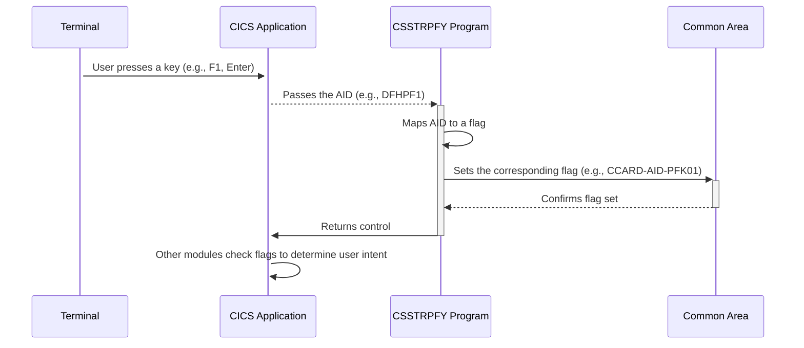

Gerado em: 2 de outubro de 2024

**Título do Documento: Especificação do Tradutor de Ação do Usuário CICS**

**Descrição Resumida:**
Este programa traduz ações do usuário, como teclas pressionadas em um terminal, em funções específicas do programa dentro de um aplicativo CICS. Ele atua como uma ponte entre a interface do usuário e a lógica do aplicativo.

**Histórias do Usuário:**
Como desenvolvedor de aplicativos CICS, preciso de uma maneira de traduzir consistentemente as ações do usuário de diferentes tipos de terminal em funções significativas do programa para garantir uma experiência consistente ao usuário e simplificar a manutenção do aplicativo.

**Epic Relacionado:** 9 - Utilitários do Sistema

**Requisitos Técnicos:**

- **Mapeamento de Ação do Usuário:** Este método captura a ação do usuário (AID) e a mapeia para um sinalizador de função do programa correspondente.
  - Entrada: `EIBAID` - Contém o AID da última ação do usuário.
  - Processamento: O código usa uma instrução `EVALUATE TRUE` para comparar o `EIBAID` com uma lista de AIDs predefinidos. Se uma correspondência for encontrada, o sinalizador correspondente será definido como `TRUE`. Por exemplo, se `EIBAID` for igual a `DFHPF1`, o sinalizador `CCARD-AID-PFK01` será definido como `TRUE`.
  - Saída: Define o sinalizador apropriado na área comum (`CCARD-AID-ENTER`, `CCARD-AID-CLEAR`, `CCARD-AID-PA1`, `CCARD-AID-PA2`, `CCARD-AID-PFK01` a `CCARD-AID-PFK12`) com base no `EIBAID` correspondente.

**Modelos Relacionados**
Não há modelos diretamente relacionados a este trecho de código. Este código se concentra no tratamento de eventos de interface do usuário e não interage diretamente com modelos de dados.

**Configurações:**
- **`CSSTRPFY.cpy`**: Este arquivo contém o mapeamento entre AIDs específicos (como `DFHPF1`, `DFHCLEAR`) e seus sinalizadores correspondentes na área comum.  
  - `DFHENTER`: Representa a tecla Enter.
  - `DFHCLEAR`: Representa a tecla Clear.
  - `DFHPA1`: Representa a tecla PA1.
  - `DFHPA2`: Representa a tecla PA2.
  - `DFHPF1` a `DFHPF12`: Representa as teclas de função de F1 a F12.
  - `DFHPF13` a `DFHPF24`: Representa as teclas de função de F13 a F24.

**Melhorias de Código:**
- **Tratamento de Erros:** Implemente o tratamento de erros para gerenciar casos em que um AID não suportado ou inesperado é encontrado. Isso pode envolver registrar o erro, exibir uma mensagem amigável ao usuário ou tomar outras ações apropriadas.
- **Log:** Aprimore o código para registrar as ações do usuário e suas traduções correspondentes. Isso seria benéfico para depuração, auditoria e compreensão do comportamento do usuário.
- **Documentação:** Forneça comentários claros e abrangentes para explicar o propósito do código, o significado de cada AID e as funções que eles acionam. Isso melhorará a legibilidade e a manutenção do código.
- **Configuração:** Considere mover o mapeamento AID-para-sinalizador para um arquivo de configuração externo. Isso permitiria a modificação e personalização mais fáceis dos mapeamentos sem alterar o código do programa.
- **Estrutura:**  Embora a instrução `EVALUATE TRUE` funcione, usar uma instrução `GO TO DEPENDING ON` ou uma abordagem orientada por tabela pode oferecer melhor desempenho e legibilidade, especialmente à medida que o número de AIDs aumenta.

**Melhorias de Segurança:**
As melhorias de segurança não se aplicam diretamente a este trecho de código específico, pois ele lida principalmente com a tradução de eventos de interface do usuário. No entanto, é crucial garantir que a área comum onde os sinalizadores são armazenados seja adequadamente protegida para evitar acesso ou modificação não autorizados.

**Diagrama Conceitual:**

--Made by "Smart Engineering" (by Compass.UOL)--