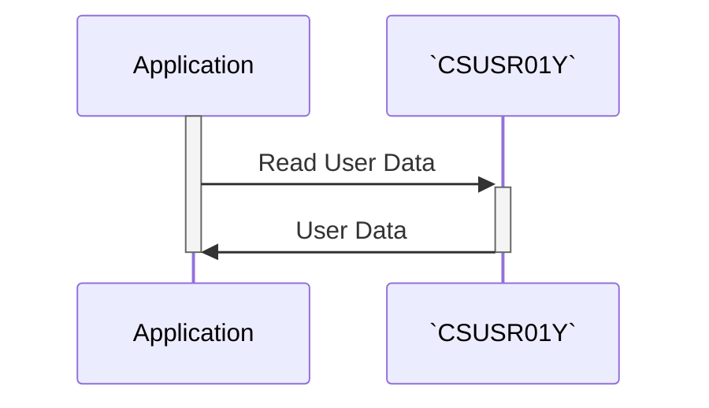

Gerado em: 2 de outubro de 2024

**Título do Documento: `CSUSR01Y.cpy` - Perfil de Segurança do Usuário - Especificação da Estrutura de Dados**

**Descrição Resumida:**
Este documento descreve a estrutura do arquivo `CSUSR01Y.cpy`, que define como os perfis de segurança do usuário são armazenados no aplicativo CardDemo. Este não é um programa, mas um blueprint que dita quais informações são armazenadas para cada usuário e como elas são organizadas. 

**Histórias do Usuário:**
Como administrador do sistema, preciso poder definir contas de usuário com diferentes funções e permissões para poder controlar o acesso a dados confidenciais e funcionalidades dentro do aplicativo CardDemo. 

**Épico Relacionado:**
6 - Gerenciamento de Usuários e Segurança

**Requisitos Técnicos:**
Este código define uma estrutura de dados COBOL que representa um perfil de segurança do usuário. É provável que essa estrutura seja usada para armazenar e recuperar informações do usuário de um banco de dados ou arquivo. 

- `User Security Profile Structure`: Esta estrutura define o layout das informações do usuário.
  - `SEC-USR-ID`: Um código exclusivo de 8 caracteres que identifica cada usuário.
  - `SEC-USR-FNAME`: O primeiro nome do usuário, armazenado como uma string de 20 caracteres.
  - `SEC-USR-LNAME`: O sobrenome do usuário, armazenado como uma string de 20 caracteres.
  - `SEC-USR-PWD`: A senha do usuário, armazenada como uma string de 8 caracteres. O método de criptografia ou hash não é especificado aqui.
  - `SEC-USR-TYPE`: Um código de 1 caractere que significa a função do usuário e o nível de acesso dentro do sistema.
  - `SEC-USR-FILLER`: Um espaço reservado de 23 caracteres para potencial expansão futura da estrutura de dados do usuário.

**Modelos Relacionados**
- `SEC-USER-DATA`: Representa o perfil de segurança do usuário.
  - `SEC-USR-ID` `X(08)`: ID de usuário exclusivo de 8 caracteres.
  - `SEC-USR-FNAME` `X(20)`: Primeiro nome do usuário (até 20 caracteres).
  - `SEC-USR-LNAME` `X(20)`: Sobrenome do usuário (até 20 caracteres).
  - `SEC-USR-PWD` `X(08)`: Senha do usuário (8 caracteres, método de criptografia/hash não especificado).
  - `SEC-USR-TYPE` `X(01)`: Código de tipo de usuário de caractere único (determina o nível de acesso).
  - `SEC-USR-FILLER` `X(23)`: Espaço reservado para expansão futura.

**Configurações:**
N/A

**Melhorias de Código:**
- **Segurança de Senha:** A estrutura atual armazena senhas como texto simples, o que é uma grande vulnerabilidade de segurança. Implemente um algoritmo forte de hash de senha (por exemplo, bcrypt, scrypt) para proteger as credenciais do usuário.
- **Validação de Dados:** Incorpore verificações de validação de dados para cada campo para evitar que dados inválidos ou maliciosos sejam armazenados. 
- **Documentação:** Adicione comentários para esclarecer o propósito de cada campo e da estrutura como um todo.

**Melhorias de Segurança:**
- **Armazenamento Seguro:** Não armazene dados confidenciais do usuário (especialmente senhas) em texto simples. Use criptografia ou hash para proteger essas informações.
- **Controle de Acesso:** Implemente medidas rígidas de controle de acesso para restringir o acesso aos dados do usuário. Somente pessoal e processos autorizados devem ser capazes de ler, modificar ou excluir essas informações.
- **Auditorias Regulares:** Realize auditorias de segurança regulares para garantir a confidencialidade, integridade e disponibilidade dos dados do usuário.

***IMPORTANTE: Qualquer nome ou valor no resultado precisa ser encapsulado por crases como `exemplo`.***

**Diagrama Conceitual:**

--Made by "Smart Engineering" (by Compass.UOL)--