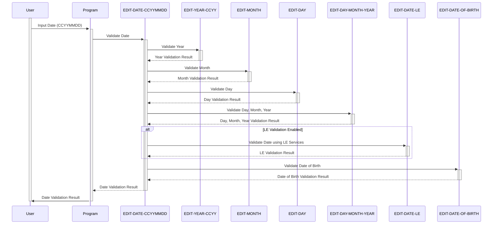

Gerado em: 2 de outubro de 2024

**Título do Documento:** Aplicativo CardDemo - Especificação do Módulo de Validação de Data

**Descrição Resumida:**
Este documento descreve as especificações para uma sub-rotina COBOL projetada para validar datas dentro do aplicativo CardDemo. O módulo funciona como um componente crítico, garantindo a integridade dos dados, evitando a entrada e o processamento de datas inválidas ou ilógicas. Isso suporta diretamente as operações comerciais principais relacionadas ao gerenciamento de cartão de crédito.

**Histórias do Usuário:**
Como analista de dados, preciso garantir que todas as datas inseridas no sistema sejam válidas para evitar problemas com cálculos, verificações de elegibilidade e geração de relatórios.

**Epic Relacionado:**
9 - Utilitários do Sistema

**Requisitos Técnicos:**

- Validar data no formato CCYYMMDD: este método organiza a validação de uma data fornecida no formato 'CCYYMMDD'.
  - Entrada: `WS-EDIT-DATE-CCYYMMDD` `{String}`: Data a ser validada.
  - Etapa 1: Definir `WS-EDIT-DATE-IS-INVALID` como `TRUE`.
  - Etapa 2: Executar `Validar ano no formato CCYY`.
  - Etapa 3: Executar `Validar mês`.
  - Etapa 4: Executar `Validar dia`.
  - Etapa 5: Executar `Validar combinação de dia, mês e ano`.
  - Etapa 6: Opcionalmente, execute `Validar data usando serviços LE`.
  - Etapa 7: Se todas as etapas anteriores forem bem-sucedidas, defina `WS-EDIT-DATE-IS-VALID` como `TRUE`.
  - Saída: `WS-EDIT-DATE-IS-VALID` `{Boolean}`: `TRUE` se a data for válida, `FALSE` caso contrário. `WS-RETURN-MSG` `{String}`: contém uma mensagem de erro se a validação falhar.
- Validar ano no formato CCYY: este método valida o componente de ano de uma data.
  - Entrada: `WS-EDIT-DATE-CCYY` `{String}`: Ano a ser validado.
  - Etapa 1: Definir `FLG-YEAR-NOT-OK` como `TRUE`.
  - Etapa 2: Verifique se o ano está em branco. Se estiver, defina `INPUT-ERROR` como `TRUE`, `FLG-YEAR-BLANK` como `TRUE` e, opcionalmente, defina `WS-RETURN-MSG`.
  - Etapa 3: Verifique se o ano é numérico. Caso contrário, defina `INPUT-ERROR` como `TRUE`, `FLG-YEAR-NOT-OK` como `TRUE` e, opcionalmente, defina `WS-RETURN-MSG`.
  - Etapa 4: Verifique se o século é razoável (19xx ou 20xx). Caso contrário, defina `INPUT-ERROR` como `TRUE`, `FLG-YEAR-NOT-OK` como `TRUE` e, opcionalmente, defina `WS-RETURN-MSG`.
  - Etapa 5: Se todas as etapas anteriores forem bem-sucedidas, defina `FLG-YEAR-ISVALID` como `TRUE`.
  - Saída: `FLG-YEAR-ISVALID` `{Boolean}`: `TRUE` se o ano for válido, `FALSE` caso contrário. `WS-RETURN-MSG` `{String}`: contém uma mensagem de erro se a validação falhar.
- Validar mês: este método valida o componente de mês de uma data.
  - Entrada: `WS-EDIT-DATE-MM` `{String}`: Mês a ser validado.
  - Etapa 1: Definir `FLG-MONTH-NOT-OK` como `TRUE`.
  - Etapa 2: Verifique se o mês está em branco. Se estiver, defina `INPUT-ERROR` como `TRUE`, `FLG-MONTH-BLANK` como `TRUE` e, opcionalmente, defina `WS-RETURN-MSG`.
  - Etapa 3: Verifique se o mês está dentro do intervalo válido (1-12). Caso contrário, defina `INPUT-ERROR` como `TRUE`, `FLG-MONTH-NOT-OK` como `TRUE` e, opcionalmente, defina `WS-RETURN-MSG`.
  - Etapa 4: Converta o mês em um valor numérico usando `FUNCTION NUMVAL`. Se a conversão falhar, defina `INPUT-ERROR` como `TRUE`, `FLG-MONTH-NOT-OK` como `TRUE` e, opcionalmente, defina `WS-RETURN-MSG`.
  - Etapa 5: Se todas as etapas anteriores forem bem-sucedidas, defina `FLG-MONTH-ISVALID` como `TRUE`.
  - Saída: `FLG-MONTH-ISVALID` `{Boolean}`: `TRUE` se o mês for válido, `FALSE` caso contrário. `WS-RETURN-MSG` `{String}`: contém uma mensagem de erro se a validação falhar.
- Validar dia: este método valida o componente de dia de uma data.
  - Entrada: `WS-EDIT-DATE-DD` `{String}`: Dia a ser validado.
  - Etapa 1: Definir `FLG-DAY-ISVALID` como `TRUE`.
  - Etapa 2: Verifique se o dia está em branco. Se estiver, defina `INPUT-ERROR` como `TRUE`, `FLG-DAY-BLANK` como `TRUE` e, opcionalmente, defina `WS-RETURN-MSG`.
  - Etapa 3: Converta o dia em um valor numérico usando `FUNCTION NUMVAL`. Se a conversão falhar, defina `INPUT-ERROR` como `TRUE`, `FLG-DAY-NOT-OK` como `TRUE` e, opcionalmente, defina `WS-RETURN-MSG`.
  - Etapa 4: Verifique se o dia está dentro do intervalo válido (1-31). Caso contrário, defina `INPUT-ERROR` como `TRUE`, `FLG-DAY-NOT-OK` como `TRUE` e, opcionalmente, defina `WS-RETURN-MSG`.
  - Etapa 5: Se todas as etapas anteriores forem bem-sucedidas, defina `FLG-DAY-ISVALID` como `TRUE`.
  - Saída: `FLG-DAY-ISVALID` `{Boolean}`: `TRUE` se o dia for válido, `FALSE` caso contrário. `WS-RETURN-MSG` `{String}`: contém uma mensagem de erro se a validação falhar.
- Validar combinação de dia, mês e ano: este método executa verificações adicionais na combinação de dia, mês e ano para garantir a consistência.
  - Entrada: `WS-EDIT-DATE-DD` `{String}`: Dia, `WS-EDIT-DATE-MM` `{String}`: Mês, `WS-EDIT-DATE-YY` `{String}`: Ano.
  - Etapa 1: Verifique se o mês tem 31 dias. Caso contrário, e o dia for 31, defina `INPUT-ERROR` como `TRUE`, `FLG-DAY-NOT-OK` como `TRUE`, `FLG-MONTH-NOT-OK` como `TRUE` e, opcionalmente, defina `WS-RETURN-MSG`.
  - Etapa 2: Verifique se o mês é fevereiro. Se for e o dia for 30, defina `INPUT-ERROR` como `TRUE`, `FLG-DAY-NOT-OK` como `TRUE`, `FLG-MONTH-NOT-OK` como `TRUE` e, opcionalmente, defina `WS-RETURN-MSG`.
  - Etapa 3: Verifique se o mês é fevereiro e o dia é 29. Se for, verifique se o ano é um ano bissexto. Se não for um ano bissexto, defina `INPUT-ERROR` como `TRUE`, `FLG-DAY-NOT-OK` como `TRUE`, `FLG-MONTH-NOT-OK` como `TRUE`, `FLG-YEAR-NOT-OK` como `TRUE` e, opcionalmente, defina `WS-RETURN-MSG`.
  - Etapa 4: Se todas as etapas anteriores forem bem-sucedidas e `WS-EDIT-DATE-IS-VALID` for `TRUE`, continue. Caso contrário, saia do método.
  - Saída: `WS-EDIT-DATE-IS-VALID` `{Boolean}`: `TRUE` se a combinação de dia, mês e ano for válida, `FALSE` caso contrário. `WS-RETURN-MSG` `{String}`: contém uma mensagem de erro se a validação falhar.
- Validar data usando serviços LE: este método executa validação de data adicional usando serviços externos do Language Environment (LE).
  - Entrada: `WS-EDIT-DATE-CCYYMMDD` `{String}`: Data a ser validada.
  - Etapa 1: Inicializar `WS-DATE-VALIDATION-RESULT`.
  - Etapa 2: Definir `WS-DATE-FORMAT` como `YYYYMMDD`.
  - Etapa 3: Chame o serviço externo `CSUTLDTC` com as variáveis ​​de data, formato e resultado.
  - Etapa 4: Verifique o código de severidade retornado por `CSUTLDTC`. Se não for 0, defina `INPUT-ERROR` como `TRUE`, `FLG-DAY-NOT-OK` como `TRUE`, `FLG-MONTH-NOT-OK` como `TRUE`, `FLG-YEAR-NOT-OK` como `TRUE` e, opcionalmente, defina `WS-RETURN-MSG`.
  - Etapa 5: Se `INPUT-ERROR` for `FALSE`, defina `FLG-DAY-ISVALID` como `TRUE`.
  - Saída: `FLG-DAY-ISVALID` `{Boolean}`: `TRUE` se a data for válida de acordo com os serviços LE, `FALSE` caso contrário. `WS-RETURN-MSG` `{String}`: contém uma mensagem de erro se a validação falhar.
- Validar data de nascimento: este método valida se uma data é uma data de nascimento razoável, verificando se ela é no futuro.
  - Entrada: `WS-EDIT-DATE-CCYYMMDD` `{String}`: Data a ser validada.
  - Etapa 1: Obtenha a data atual usando `FUNCTION CURRENT-DATE` e armazene-a em `WS-CURRENT-DATE-YYYYMMDD`.
  - Etapa 2: Converta a data de entrada e a data atual para o formato binário usando `FUNCTION INTEGER-OF-DATE` e armazene-as em `WS-EDIT-DATE-BINARY` e `WS-CURRENT-DATE-BINARY`, respectivamente.
  - Etapa 3: Compare as datas binárias. Se a data atual for maior que a data de entrada, a data de entrada é válida. Caso contrário, defina `INPUT-ERROR` como `TRUE`, `FLG-DAY-NOT-OK` como `TRUE`, `FLG-MONTH-NOT-OK` como `TRUE`, `FLG-YEAR-NOT-OK` como `TRUE` e, opcionalmente, defina `WS-RETURN-MSG`.
  - Saída: `INPUT-ERROR` `{Boolean}`: `TRUE` se a data for no futuro, `FALSE` caso contrário. `WS-RETURN-MSG` `{String}`: contém uma mensagem de erro se a validação falhar.

**Modelos Relacionados:**
Não há modelos específicos relacionados a esta execução, pois ela se concentra principalmente na lógica de validação de data. Os dados que estão sendo validados provavelmente pertencem a modelos como Cliente ou Conta, mas seus detalhes não são fornecidos no trecho de código fornecido.

**Configurações:**

- Valores constantes
  - `WS-EDIT-LEAP-YEAR-DAYS`: `29`
	- Descrição: Número de dias em fevereiro para um ano bissexto.
  - `WS-EDIT-VALID-DOB-YEARS`: `110`
	- Descrição: Idade máxima permitida para validação de Data de Nascimento.
- CSUTLDWY.cpy
  - `WS-EDIT-CCYY-CENTURY-START`: `19`
	- Descrição: Início do século para validação do ano do cartão de crédito.
  - `WS-EDIT-CCYY-CENTURY-END`: `20`
	- Descrição: Fim do século para validação do ano do cartão de crédito.

**Melhorias de Código:**

- **Tratamento de Erros:** O código depende muito das instruções `GO TO` para tratamento de erros, o que pode tornar a lógica difícil de seguir e manter. Implementar um mecanismo de tratamento de erros mais estruturado, como o uso de instruções `IF` aninhadas ou uma rotina dedicada de tratamento de erros, melhoraria a legibilidade e a manutenção do código.
- **Documentação:** O código inclui alguns comentários, mas uma documentação mais abrangente seria benéfica. Adicionar explicações detalhadas das regras de validação, variáveis ​​de entrada e saída e condições de erro potenciais tornaria o código mais fácil de entender e modificar.
- **Desempenho:** O código executa várias verificações nos mesmos dados, o que pode afetar potencialmente o desempenho. Considere otimizar a lógica de validação para reduzir verificações redundantes e melhorar a eficiência.
- **Modularidade:** O código pode se beneficiar de uma maior modularização. Separar a lógica de validação para cada componente de data em sub-rotinas distintas melhoraria a organização e a capacidade de reutilização do código.

**Melhorias de Segurança:**

- **Validação de Entrada:** Embora o código verifique se há erros básicos de tipo de dados, ele não implementa validação de entrada robusta para evitar vulnerabilidades de segurança potenciais, como estouros de buffer ou ataques de injeção. Desinfetar todas as entradas externas antes do processamento aumentaria a segurança do código.
- **Mascaramento de Dados:** O código lida com dados confidenciais, como datas de nascimento. Considere implementar técnicas de mascaramento de dados para proteger essas informações contra acesso não autorizado durante o processamento e exibição.
- **Log:** O código não inclui nenhum mecanismo de log. Implementar o log para validações bem-sucedidas e malsucedidas forneceria um rastro de auditoria para análise de segurança e solução de problemas.

**Diagrama Conceitual:**

--Made by "Smart Engineering" (by Compass.UOL)--