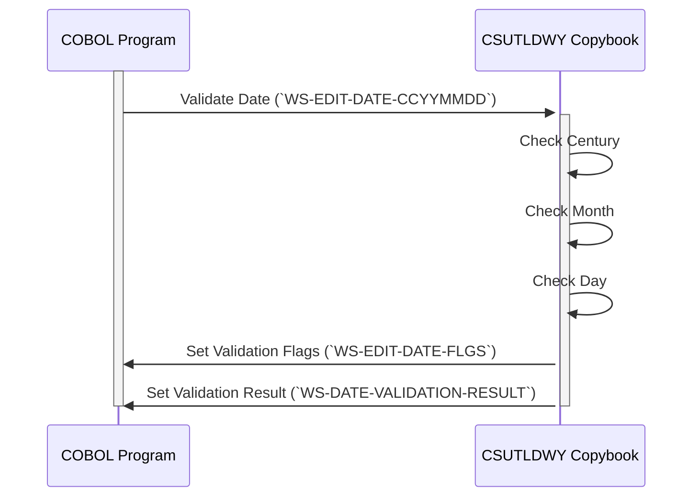

Gerado em: 2 de outubro de 2024

**Título do Documento: Kit de Ferramentas de Gerenciamento de Datas - Especificação do Copybook COBOL**

**Descrição Resumida:**
Este copybook COBOL define estruturas de dados e variáveis especificamente para manipulação e validação de datas. Inclui campos para armazenar componentes de data (ano, mês, dia) em vários formatos, sinalizadores para resultados de validação e campos para armazenar mensagens de erro. Este copybook foi projetado para ser incluído em outros programas COBOL que exigem manipulação de datas.

**Histórias do Usuário:**
Como analista de dados, quero garantir que apenas datas válidas sejam usadas em minha análise para manter a integridade dos dados e evitar resultados imprecisos.

**Épico Relacionado:** 9 - Utilitários do Sistema

**Requisitos Técnicos:**
- **Fluxo de Trabalho de Validação de Data:** Valida uma determinada data, considerando o século, ano bissexto e formato da data.
  - Entrada: Data no formato `CCYYMMDD` da variável `WS-EDIT-DATE-CCYYMMDD`.
  - Validação: 
    - Verifique se o século (`WS-EDIT-DATE-CC`) está dentro do intervalo aceitável.
    - Verifique se o mês (`WS-EDIT-DATE-MM`) está entre 1 e 12.
    - Verifique se o dia (`WS-EDIT-DATE-DD`) é válido para o mês fornecido, considerando anos bissextos.
  - Saída: 
    - Defina `WS-EDIT-DATE-FLGS` para indicar a validade de cada componente de data (ano, mês, dia).
    - Defina `WS-DATE-VALIDATION-RESULT` com uma mensagem indicando o resultado da validação e quaisquer erros encontrados.

**Modelos Relacionados:**
- N/A

**Configurações:**
- **Valores Constantes:**
  - `THIS-CENTURY`: `20`
	- Descrição: Representa o século atual (século XXI).
  - `LAST-CENTURY`: `19`
	- Descrição: Representa o século anterior (século XX).

**Melhorias de Código:**
- **Mensagens de Erro Detalhadas:** Aprimore o `WS-DATE-VALIDATION-RESULT` para incluir mensagens de erro específicas para cada regra de validação (por exemplo, "Século inválido", "Mês inválido", "Dia inválido").
- **Flexibilidade de Formato de Data:** Considere adicionar suporte para validar datas em formatos diferentes além de `CCYYMMDD`.

**Melhorias de Segurança:**
- N/A

--Made by "Smart Engineering" (by Compass.UOL)--