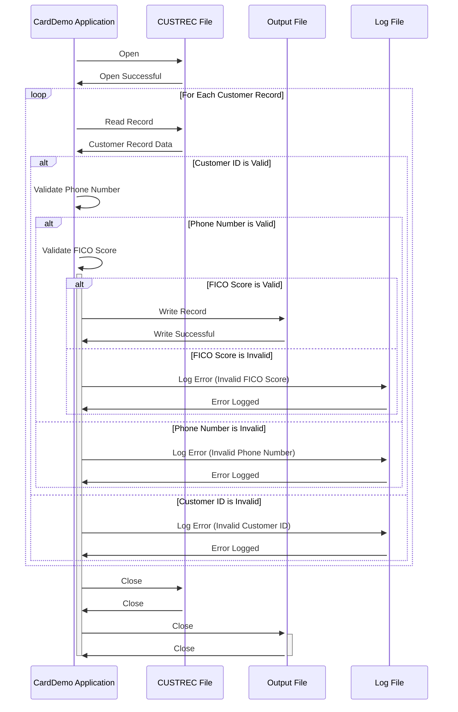

Gerado em: 2 de outubro de 2024

**Título do Documento:** CardDemo - Validação e Processamento de Dados do Cliente

**Descrição Resumida:**
Este documento descreve o processo de validação e processamento de dados do cliente dentro da aplicação CardDemo. O processo envolve a leitura de registros de clientes de um arquivo de entrada (`CUSTREC.cpy`), a execução da validação de dados e a gravação de registros válidos em um arquivo de saída.

**Histórias do Usuário:**
Como analista de dados, desejo garantir que apenas registros de clientes válidos sejam usados para análise e geração de relatórios. O sistema deve validar campos-chave como `CUST-ID`, `CUST-PHONE-NUM-1` e `CUST-FICO-CREDIT-SCORE` para manter a qualidade dos dados.

**Épico Relacionado:**
8 - Gestão de Dados do Cliente

**Requisitos Técnicos:**

- **Ler Registros do Cliente:** Este método lê os registros do cliente do arquivo de entrada (`CUSTREC.cpy`).
  - Entrada: Dados do cliente do arquivo `CUSTREC.cpy`.
  - Saída: Cada registro do arquivo de entrada.
- **Validar ID do Cliente:** Este método valida o ID do cliente (`CUST-ID`) para garantir que seja numérico e esteja dentro de um intervalo válido.
  - Entrada: `CUST-ID` do registro do cliente.
  - Validação: 
    - Verificar se `CUST-ID` é numérico.
    - Verificar se `CUST-ID` é maior que 0.
  - Saída: `True` se válido, `False` caso contrário.
- **Validar Número de Telefone:** Este método valida o número de telefone principal (`CUST-PHONE-NUM-1`) para garantir que esteja em conformidade com um formato padrão.
  - Entrada: `CUST-PHONE-NUM-1` do registro do cliente.
  - Validação:
    - Verificar se `CUST-PHONE-NUM-1` corresponde a um padrão predefinido (por exemplo, `(XXX) XXX-XXXX`).
  - Saída: `True` se válido, `False` caso contrário.
- **Validar Pontuação FICO:** Este método valida a pontuação de crédito FICO (`CUST-FICO-CREDIT-SCORE`) para garantir que esteja dentro do intervalo aceitável.
  - Entrada: `CUST-FICO-CREDIT-SCORE` do registro do cliente.
  - Validação:
    - Verificar se `CUST-FICO-CREDIT-SCORE` está entre `FICO-SCORE-LOW` e `FICO-SCORE-HIGH`, definido em `COACTUPC.cbl`.
  - Saída: `True` se válido, `False` caso contrário.
- **Gravar Registro Válido:** Este método grava um registro de cliente validado no arquivo de saída.
  - Entrada: Registro de cliente validado.
  - Saída: O registro gravado no arquivo de saída. 
- **Registrar Registro Inválido:** Este método registra detalhes de registros de clientes inválidos para rastreamento e resolução de erros.
  - Entrada: Registro de cliente inválido e motivo da invalidez.
  - Saída: Entrada de log com detalhes do registro inválido.

**Modelos Relacionados**

- **Cliente:** Representa um registro de cliente.
  - `CUST-ID` `Integer`: Identificador único do cliente.
  - `CUST-FIRST-NAME` `String`: Primeiro nome do cliente.
  - `CUST-MIDDLE-NAME` `String`: Nome do meio do cliente.
  - `CUST-LAST-NAME` `String`: Sobrenome do cliente.
  - `CUST-ADDR-LINE-1` `String`: Linha de endereço 1 do cliente.
  - `CUST-ADDR-LINE-2` `String`: Linha de endereço 2 do cliente.
  - `CUST-ADDR-LINE-3` `String`: Linha de endereço 3 do cliente.
  - `CUST-ADDR-STATE-CD` `String`: Código do estado do cliente.
  - `CUST-ADDR-COUNTRY-CD` `String`: Código do país do cliente.
  - `CUST-ADDR-ZIP` `String`: CEP do cliente.
  - `CUST-PHONE-NUM-1` `String`: Número de telefone principal do cliente.
  - `CUST-PHONE-NUM-2` `String`: Número de telefone secundário do cliente.
  - `CUST-SSN` `String`: Número de Segurança Social do cliente.
  - `CUST-GOVT-ISSUED-ID` `String`: ID emitido pelo governo do cliente.
  - `CUST-DOB-YYYYMMDD` `Date`: Data de nascimento do cliente.
  - `CUST-EFT-ACCOUNT-ID` `String`: ID da conta de Transferência Eletrônica de Fundos do cliente.
  - `CUST-PRI-CARD-HOLDER-IND` `Boolean`: Indicador se o cliente é o titular principal do cartão.
  - `CUST-FICO-CREDIT-SCORE` `Integer`: Pontuação de crédito FICO do cliente.

**Configurações:**

- `COACTUPC.cbl`
  - `FICO-SCORE-LOW`: `{Pontuação FICO mais baixa}`
	- Descrição: Pontuação FICO mínima aceitável.
  - `FICO-SCORE-HIGH`: `{Pontuação FICO mais alta}`
	- Descrição: Pontuação FICO máxima aceitável.

**Melhorias de Código:**

- **Tratamento de Erros:** Implementar um tratamento de erros mais robusto, incluindo códigos de erro específicos e mensagens para diferentes falhas de validação. Isso tornaria mais fácil identificar e solucionar problemas de dados.
- **Log:** Aprimorar o log para capturar detalhes de registros inválidos, incluindo as falhas de validação específicas. Isso ajudaria na limpeza de dados e nos esforços de melhoria da qualidade.
- **Configuração:** Externalizar regras de validação (por exemplo, formato de número de telefone, intervalos de ID válidos) para um arquivo de configuração para permitir modificações mais fáceis sem alterações de código.
- **Transformação de Dados:** Considere adicionar recursos de transformação de dados para padronizar formatos de dados (por exemplo, números de telefone, datas) para consistência.

**Melhorias de Segurança:**

- **Controle de Acesso:** Implementar controles de acesso rígidos para restringir o acesso aos dados do cliente com base em funções e permissões do usuário.
- **Criptografia de Dados:** Criptografar dados confidenciais do cliente em repouso e em trânsito para protegê-los de acesso não autorizado.
- **Trilhas de Auditoria:** Implementar trilhas de auditoria para rastrear todo o acesso e modificações de dados para fins de segurança e conformidade.
- **Mascaramento de Dados:** Considere o uso de técnicas de mascaramento de dados para proteger informações confidenciais do cliente durante atividades de teste e desenvolvimento. 

**Diagrama Conceitual:**

--Made by "Smart Engineering" (by Compass.UOL)--