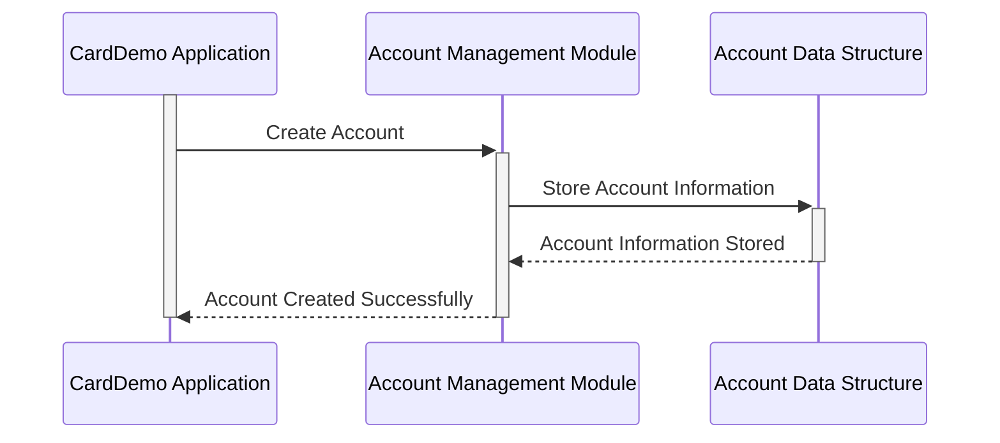

Gerado em: 2 de outubro de 2024

**Título do Documento:** Especificação da Estrutura de Dados da Conta CardDemo

**Descrição Resumida:**
Este documento detalha a estrutura de dados `ACCOUNT-RECORD` dentro do aplicativo CardDemo. Esta estrutura define o layout e os tipos de dados usados para armazenar informações sobre as contas dos clientes.

**Histórias do Usuário:**
Como administrador do sistema de cartão de crédito, preciso de uma maneira padronizada de armazenar e acessar as informações da conta do cliente para garantir o processamento preciso de transações, gerenciamento de contas e relatórios.

**Épico Relacionado:** 2 - Gerenciamento de Conta

**Requisitos Técnicos:**
- **Definição da Estrutura do Registro da Conta:** Define o layout da estrutura `ACCOUNT-RECORD`, especificando os campos de dados e seus tipos de dados correspondentes.

**Modelos Relacionados**
- **`ACCOUNT-RECORD`**
  - **`ACCT-ID`** `PIC 9(11)`: Identificador único para cada conta.
  - **`ACCT-ACTIVE-STATUS`** `PIC X(01)`: Indica se a conta está ativa ('Y'/'N').
  - **`ACCT-CURR-BAL`** `PIC S9(10)V99`: Saldo atual da conta.
  - **`ACCT-CREDIT-LIMIT`** `PIC S9(10)V99`: Crédito máximo permitido na conta.
  - **`ACCT-CASH-CREDIT-LIMIT`** `PIC S9(10)V99`: Limite máximo de saque em dinheiro.
  - **`ACCT-OPEN-DATE`** `PIC X(10)`: Data em que a conta foi aberta (AAAA-MM-DD).
  - **`ACCT-EXPIRAION-DATE`** `PIC X(10)`: Data de expiração da conta (AAAA-MM-DD).
  - **`ACCT-REISSUE-DATE`** `PIC X(10)`: Data da última renovação da conta (AAAA-MM-DD).
  - **`ACCT-CURR-CYC-CREDIT`** `PIC S9(10)V99`: Total de créditos no ciclo atual.
  - **`ACCT-CURR-CYC-DEBIT`** `PIC S9(10)V99`: Total de débitos no ciclo atual.
  - **`ACCT-ADDR-ZIP`** `PIC X(10)`: CEP associado à conta.
  - **`ACCT-GROUP-ID`** `PIC X(10)`: Afiliação de grupo da conta (se houver).
  - **`FILLER`** `PIC X(178)`: Espaço reservado para uso futuro.

**Configurações:**
- N/A

**Melhorias de Código:**
- **Adicionar verificações de validação de dados:** Implemente rotinas de validação de dados para garantir a precisão e integridade das informações da conta armazenadas na estrutura `ACCOUNT-RECORD`. Isso pode incluir verificações de intervalos de datas válidos, intervalos numéricos para saldo e limites de crédito e valores válidos para campos de status.
- **Implementar registro:** Incorpore mecanismos de registro para rastrear as alterações feitas nas informações da conta. Isso envolveria registrar a data e hora da alteração, o usuário que fez a alteração e os campos de dados específicos que foram modificados. 
- **Usar nomes de variáveis mais descritivos:** Embora os nomes das variáveis existentes sejam um tanto autoexplicativos, considere usar nomes mais detalhados e descritivos para aumentar a legibilidade e a manutenção do código. 

**Melhorias de Segurança:**
- **Implementar controle de acesso:** Garanta que o acesso à estrutura `ACCOUNT-RECORD` e seus campos de dados seja restrito a usuários e aplicativos autorizados. Isso pode envolver o uso de listas de controle de acesso (ACLs) ou mecanismos de controle de acesso baseado em função (RBAC) para aplicar políticas de segurança de dados.
- **Criptografar dados confidenciais:** Criptografe informações confidenciais da conta, como números de conta, saldos e limites de crédito, tanto em trânsito quanto em repouso. A criptografia ajuda a proteger a confidencialidade e integridade dos dados, reduzindo o risco de acesso não autorizado e violações de dados.

**Diagrama Conceitual:**

--Made by "Smart Engineering" (by Compass.UOL)--