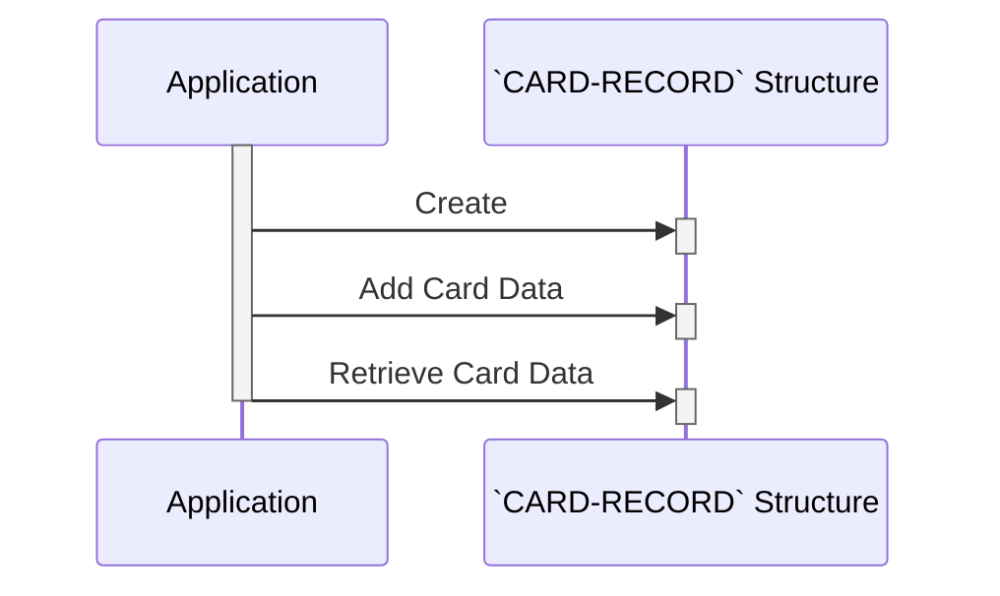

Gerado em: 2 de outubro de 2024

**Título do Documento:** Aplicativo CardDemo - Estrutura de Dados do Cartão de Crédito

**Descrição Resumida:**
Este documento descreve a estrutura de dados do cartão de crédito dentro do aplicativo CardDemo. Ele define o layout e os tipos de dados usados ​​para armazenar informações do cartão de crédito, incluindo o número do cartão, ID da conta, CVV, nome do titular do cartão, data de validade e status ativo. Essa estrutura garante o armazenamento consistente e organizado de dados confidenciais do cartão.

**Histórias do Usuário:**
Como administrador do sistema de cartão de crédito, preciso de uma maneira padronizada de armazenar informações do cartão de crédito, para que o sistema possa processar transações com segurança e confiabilidade, gerenciar contas e gerar relatórios.

**Epic Relacionado:** 3 - Gestão de Cartão de Crédito

**Requisitos Técnicos:**
Este código define uma estrutura de dados COBOL chamada `CARD-RECORD` para representar as informações do cartão de crédito. Cada campo de dados dentro da estrutura possui um comprimento e tipo de dados específicos, garantindo uniformidade no armazenamento de dados e facilitando o processamento de dados.

- **Definição da Estrutura de Dados do Cartão de Crédito:** Este código define a estrutura de um registro de cartão de crédito.
  - Entrada: Nenhuma. Esta estrutura é definida internamente.
  - Processamento: Define uma estrutura de dados chamada `CARD-RECORD` com campos para `CARD-NUM`, `CARD-ACCT-ID`, `CARD-CVV-CD`, `CARD-EMBOSSED-NAME`, `CARD-EXPIRAION-DATE`, `CARD-ACTIVE-STATUS` e `FILLER`.
  - Resultado: Estrutura de dados `CARD-RECORD` definindo o layout das informações do cartão de crédito.

**Modelos Relacionados**
Esta seção lista os modelos de dados relacionados ao arquivo `CVACT02Y.cpy`.

- `CARD-RECORD`
  - `CARD-NUM` `PIC X(16)`: O número do cartão de crédito de 16 dígitos.
  - `CARD-ACCT-ID` `PIC 9(11)`: Um identificador exclusivo de 11 dígitos que vincula o cartão a uma conta específica.
  - `CARD-CVV-CD` `PIC 9(03)`: O Valor de Verificação do Cartão de 3 dígitos, um código de segurança no cartão.
  - `CARD-EMBOSSED-NAME` `PIC X(50)`: O nome do titular do cartão como está gravado no cartão (até 50 caracteres).
  - `CARD-EXPIRAION-DATE` `PIC X(10)`: A data de validade do cartão de crédito.
  - `CARD-ACTIVE-STATUS` `PIC X(01)`: Um código indicando se o cartão está ativo e utilizável.
  - `FILLER` `PIC X(59)`: Um espaço reservado para garantir um comprimento de registro consistente.

**Configurações:**
Nenhuma configuração encontrada.

**Melhorias de Código:**
- **Adicionar validação de dados:** Implemente verificações de validação de dados para cada campo para garantir a integridade dos dados. Por exemplo:
    - Validar o comprimento de `CARD-NUM` para ter 16 dígitos.
    - Validar se `CARD-ACCT-ID` contém apenas valores numéricos.
    - Validar o formato de data de `CARD-EXPIRAION-DATE`.
- **Considere o mascaramento ou criptografia de dados:** Para segurança aprimorada, explore o mascaramento ou criptografia de dados confidenciais como `CARD-NUM` e `CARD-CVV-CD`, especialmente se esses dados forem armazenados em um banco de dados ou transmitidos por uma rede.
- **Adicionar comentários ao campo `FILLER`:** Explique a finalidade do campo `FILLER` e se ele se destina a uso futuro ou simplesmente preenchimento.

**Melhorias de Segurança:**
- **Implementar controle de acesso:** Restrinja o acesso à estrutura de dados do cartão de crédito e a quaisquer programas que a utilizem apenas para pessoal autorizado.
- **Armazenamento seguro de dados:** Se os dados do cartão de crédito forem persistidos em um arquivo ou banco de dados, certifique-se de que medidas de segurança adequadas estejam em vigor para proteger os dados em repouso, como criptografia e controles de acesso.
- **Registrar acesso a dados:** Implemente mecanismos de registro para rastrear quem acessa os dados do cartão de crédito e para qual finalidade. Isso pode ajudar com auditoria e resposta a incidentes.

**Diagrama Conceitual:**

--Made by "Smart Engineering" (by Compass.UOL)--