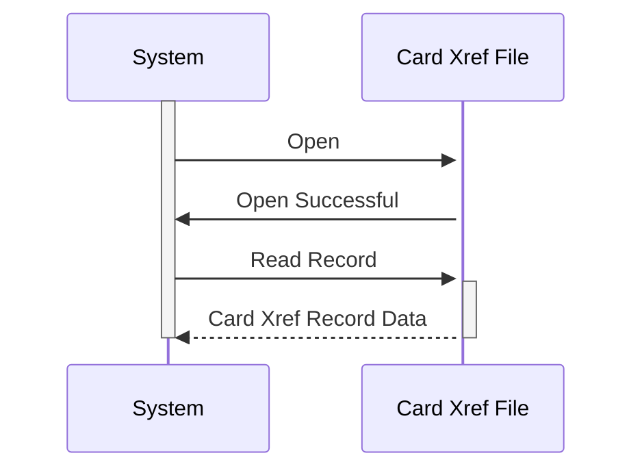

Gerado em: 2 de outubro de 2024

**Título do Documento: Especificação da Estrutura de Dados de Referência Cruzada de Cartão**

**Descrição Resumida:** Este documento descreve a estrutura de uma estrutura de dados COBOL usada para referenciar cruzadamente números de cartão de crédito com informações de clientes e contas. Ele descreve os campos dentro do registro e seus propósitos, servindo como uma especificação técnica.

**Histórias do Usuário:**
Como administrador do sistema, preciso de uma maneira confiável de vincular números de cartão de crédito a dados de clientes e contas para que as transações sejam processadas com precisão.

**Épico Relacionado:** 3 - Gerenciamento de Cartão de Crédito

**Requisitos Técnicos:**

- **Definição da Estrutura de Dados:**

  - `CARD-XREF-RECORD`: Define uma estrutura de dados para representar o relacionamento entre um cartão de crédito, seu cliente associado e a conta.
    - `XREF-CARD-NUM`: Um campo para armazenar o número do cartão de crédito, definido como PIC X(16), o que significa que ele contém 16 caracteres de qualquer tipo.
    - `XREF-CUST-ID`: Um campo para armazenar o ID do cliente, definido como PIC 9(09), o que significa que ele contém um valor numérico de 9 dígitos.
    - `XREF-ACCT-ID`: Um campo para armazenar o ID da conta, definido como PIC 9(11), o que significa que ele contém um valor numérico de 11 dígitos.
    - `FILLER`: Um campo não utilizado, definido como PIC X(14), potencialmente reservado para uso futuro ou preenchimento.

**Modelos Relacionados:**

- **`CARD-XREF-RECORD`**
  - `XREF-CARD-NUM` `PIC X(16)`: Número do cartão de crédito.
  - `XREF-CUST-ID` `PIC 9(09)`: Identificador do cliente.
  - `XREF-ACCT-ID` `PIC 9(11)`: Identificador da conta.

**Configurações:**
Nenhuma configuração encontrada.

**Melhorias de Código:**

- **Nomenclatura Significativa:** Embora `XREF-` seja um prefixo comum, considere usar nomes mais descritivos como `CARD-NUMBER`, `CUSTOMER-ID` e `ACCOUNT-ID` para melhor legibilidade.
- **Aplicação de Tipo de Dados:** Use tipos de dados apropriados para garantir a integridade dos dados. Por exemplo, defina números de cartão como strings e IDs como campos numéricos para evitar entrada de dados inválidos.
- **Documentação Inline:** Adicione comentários para explicar o propósito e o uso da estrutura de dados e seus campos.

**Melhorias de Segurança:**

- **Criptografia de Dados:** Considere criptografar dados confidenciais dentro do registro, como o número do cartão, para protegê-lo de acesso não autorizado.
- **Controle de Acesso:** Implemente mecanismos de controle de acesso para restringir quem pode visualizar e modificar os dados de referência cruzada.
- **Log e Auditoria:** Registre todos os acessos e alterações feitas nos dados de referência cruzada para fins de auditoria de segurança.

**Diagrama Conceitual:**

--Made by "Smart Engineering" (by Compass.UOL)--