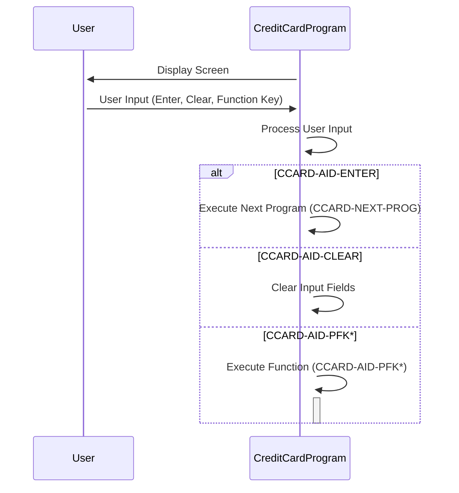

Gerado em: 2 de outubro de 2024

**Título do Documento: Sistema de Cartão de Crédito - Especificação da Estrutura de Dados para Operações de Cartão de Crédito (CVCRD01Y)**

**Descrição Resumida:**
Este documento descreve a estrutura de dados utilizada em um sistema de gerenciamento de cartão de crédito, com foco específico nas informações manipuladas pelo copybook `CVCRD01Y` em COBOL. Esta estrutura define como o sistema armazena e acessa elementos de dados cruciais relacionados a contas de cartão de crédito, informações do cliente e interações do usuário.

**Histórias do Usuário:**
Como administrador do sistema de cartão de crédito, preciso de uma estrutura de dados padronizada para garantir o tratamento consistente e confiável das informações do cartão de crédito em várias funções do sistema.

**Épico Relacionado:** 3 - Gestão de Cartão de Crédito

**Requisitos Técnicos:**

- Definição da Estrutura de Dados:
  - Entrada: O arquivo `CVCRD01Y.cpy` é usado como entrada para definir a estrutura de dados.
  - Processamento: O compilador COBOL usa a cláusula `PIC` para definir itens de dados e seus comprimentos e tipos de dados associados.
  - Resultado: Uma estrutura de dados é criada na memória, fornecendo um modelo para armazenar e acessar informações de cartão de crédito. 
- Processamento de Entrada do Usuário:
  - Entrada: As ações do usuário, como teclas pressionadas (por exemplo, Enter, Clear, teclas de função), são capturadas pelo sistema.
  - Processamento: O sistema usa nomes de condição (itens de nível 88) para mapear ações do usuário para valores específicos dentro da estrutura de dados.
  - Resultado: As ações do usuário são traduzidas em comandos significativos e manipulações de dados dentro do sistema de cartão de crédito.
- Controle de Fluxo do Programa:
  - Entrada: Nomes de programas armazenados em itens de dados como `CCARD-LAST-PROG` e `CCARD-NEXT-PROG`
  - Processamento: O sistema usa esses nomes de programa para determinar o fluxo de execução entre diferentes módulos ou telas.
  - Resultado:  O sistema navega por várias funções (por exemplo, visualização de conta, lista de transações, gerenciamento de usuários) com base nas escolhas do usuário e na lógica de programação predefinida.

**Modelos Relacionados:**

- Conta de Cartão de Crédito: Representa uma conta de cartão de crédito.
  - `CC-ACCT-ID` `String`: Identificador único para uma conta de cartão de crédito.
  - `CC-CARD-NUM` `String`: Número do cartão de crédito.
  - `CC-CUST-ID` `String`: Identificador único para o cliente associado ao cartão de crédito.

**Configurações:**

- `CVCRD01Y.cpy`
  - `CCARD-AID-ENTER`: `'ENTER'`
	- Descrição:  Valor que representa a tecla "Enter".
  - `CCARD-AID-CLEAR`: `'CLEAR'`
	- Descrição:  Valor que representa a tecla "Clear".

**Melhorias de Código:**
- Adicione comentários para esclarecer o propósito e o uso de cada item de dados, especialmente aqueles relacionados ao controle de fluxo do programa.
- Implemente rotinas de validação de dados para garantir a integridade dos dados para campos confidenciais, como números de cartão de crédito e IDs de cliente.

**Melhorias de Segurança:**
- Criptografe itens de dados confidenciais como `CC-CARD-NUM` para proteger as informações do cliente.
- Implemente mecanismos de controle de acesso para restringir o acesso não autorizado aos dados do cartão de crédito.

**Diagrama Conceitual:**

--Made by "Smart Engineering" (by Compass.UOL)--